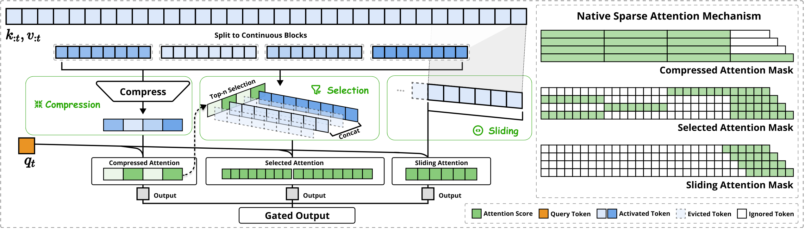

# Native Sparse Attention (NSA)

## 结构  

- 采用**Casual**掩码

2.  一种可能的细节实现方式  

## Compression

- 通过 **平均池化** 和 **MLP** 来实现

$$
\begin{equation}
\begin{aligned}
q(b,l,h,d), k(b, l_{comp}, h, d) &\rightarrow attn_{comp}(b,h,l,l_{comp}) \\
v(b, l_{comp}, h,d) &\rightarrow out_{comp} (b,l,h,d)
\end{aligned}
\end{equation}
$$

## Selection

- 根据$attn_{comp}$注意力矩阵来选取$S$个注意力分数最高的

$$
\begin{equation}
\begin{aligned}
q(b,l,h,d) , k(b,l_{selection} \cdot bsz_{selection}, h, d) &\rightarrow attn(b,h,l,l_{selection} \cdot bsz_{selection}) \\ 
v(b, l_{selection} \cdot bsz_{selection}, h,d) &\rightarrow out_{seletion} (b,l,h,d)
\end{aligned}
\end{equation}
$$

## Sliding
    
- 最开始几个序列被缩短了(从0递增到window size)，这样就不用打pad  

- **q的每一行乘的都是一个对应滑块的k**

$$
\begin{equation}
\begin{aligned}
q(b,l,h,d) &, k(b,l_{sliding}, h, d) \rightarrow attn(b,h,l,l_{sliding}) \\
v(b, l_{sliding}, h,d) &\rightarrow out_{sliding} (b,l,h,d) \\
l_{sliding} &= 
\begin{cases} 
[0, window \ size - 1] & 0 \le l_i \lt window \ size \\ 
0 &,  l_i \ge window \ size 
\end{cases}
\end{aligned}
\end{equation}
$$
    
- 这些**gate score**作为**每个token**的加权系数依次和3类输出的attn相乘 

- $inp(b,h,l,d) \rightarrow MLP \rightarrow g(b,h,l,3)$
    
#  **Insights**  

- Compression有很多更好的实现方式  

- 放到**视觉任务**中要重新考虑**分组方式和打码方式**

# Multi-head Latent Attention (MLA)
