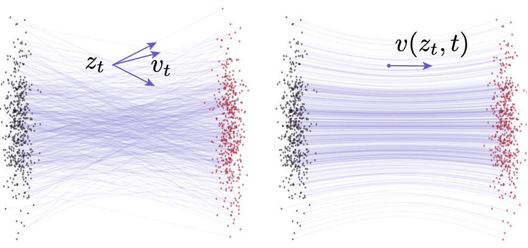

# Continuous Normalizing Flow Matching

## 问题描述

### 变量声明

| 变量 | 描述 |
|---|---|
| $x$ | 噪声 |
| $x_1$ | 数据 |
| $t$ | 归一化时间, $t \in [0,1]$ |
| $p_t(x)$ | 噪声分布, $[0,1] \times \mathcal{R}^d \xrightarrow{}  R_{>0}$ |
| $q_t(x_1)$ | 数据分布 |
| $\phi_t(x)$ | 从$p$到$q$的**Unconditional Flow**, $[0,1] \times \mathcal{R}^d \xrightarrow{} \mathcal{R}^d$ |
| $v_t(x; \theta)$ | 整个**理论分布**的Unconditional Flow的速度向量场 |
| $\psi_t(x)$ | 从$p_0(x \| x_1)$ 到 $p_1(x \| x_1)$, 即$q(x)$的逼近的**Conditional Flow** |
| $u_t(x\|x_1)$ | 整个**理论分布**的Conditional Flow的速度向量场 |
| $u_t(x)$ | 从$p$到$q$的目标向量场|

### 问题描述

1. 将初始概率密度$p_0(x)$通过向量场$v_t(x)$塑造成$p_t(x)$

$$
\begin{equation}
\begin{aligned}
\int_{x \in A_t} p_t(x) \,dx &= \int_{x_0 \in A_0} p_0(x_0) \,dx_0 \\
&= \int_{x \in A_t} p_0\left(\Phi_t^{-1}(x)\right) \left|\det\left(\frac{\partial \Phi_t^{-1}(x)}{\partial x}\right)\right| \,dx \\
\implies p_t(x) &= p_0\left(\Phi_t^{-1}(x)\right) \left|\det\left(\frac{\partial \Phi_t^{-1}(x)}{\partial x}\right)\right|
\end{aligned}
\end{equation}
$$

2. 向量场和流的关系

- **Flow**是轨迹形状，**向量场**是轨迹变化方向(即梯度)

$$
\begin{equation}
\begin{aligned}
\frac{d \phi_t(x)}{dx} &= v_t( \phi_t(x)) \\
\phi_0(x) &= x
\end{aligned}
\end{equation}
$$

## 定理

### Continuity Equation 及其Log形式

- [[../Calculus & Linear Algebra/Continuity_Equations.md]]

### 无条件向量场得到条件概率路径
    
- **条件概率路径** $p_t(x)$**可以由无条件向量场**$u_t(x)$**得到**

$$
\begin{equation}
\begin{aligned}
\frac{d}{dt}p_t(x) &= \int \left(\frac{d}{dt}p_t(x|x_1)\right)q(x_1)dx_1 \\
&= -\int \text{div}\left(u_t(x|x_1)p_t(x|x_1)\right)q(x_1)dx_1 \\
&= -\text{div}\left(\int u_t(x|x_1)p_t(x|x_1)q(x_1)dx_1\right) \\
&= -\text{div}\left(u_t(x)p_t(x)\right) \\
\therefore u_t(x) &= \frac{\int u_t(x|x_1)p_t(x|x_1)q(x_1)dx_1}{p_t(x)} 
\end{aligned}
\end{equation}
$$

### 条件损失函数和无条件损失函数等效

1. 描述

- $\mathcal L_{FM} || v_t(x; \theta) -u_t(x) ||$**和**$\mathcal L_{CFM} || v_t(x; \theta) - u_t(x | x_1) ||$的梯度相等

- 注意到，最终的Loss是以上公式(**每个数据点的Loss**)的期望

2. 证明

- $u_t(x)$是和$\theta$无关的量

$$
\begin{equation}
\begin{aligned}
\|v_t(x) - u_t(x)\|^2 &= \|v_t(x)\|^2 - 2\langle v_t(x), u_t(x)\rangle + \|u_t(x)\|^2 \\
\|v_t(x) - u_t(x|x_1)\|^2 &= \|v_t(x)\|^2 - 2\langle v_t(x), u_t(x|x_1)\rangle + \|u_t(x|x_1)\|^2
\end{aligned}
\end{equation}
$$

- 2种边缘概率积分下的第一项相等

$$
\begin{equation}
\begin{aligned}
\mathbb{E}_{p_t(x)}\|v_t(x)\|^2 &= \int \|v_t(x)\|^2 p_t(x)dx \\
&= \iint \|v_t(x)\|^2 p_t(x|x_1)q(x_1)dx_1dx \\
&= \mathbb{E}_{q(x_1), p_t(x|x_1)}\|v_t(x)\|^2
\end{aligned}
\end{equation}
$$

- 2种边缘概率积分下的第二项相等

$$
\begin{equation}
\begin{aligned}
\mathbb{E}_{p_t(x)}\left\langle v_t(x), u_t(x)\right\rangle &= \int \left\langle v_t(x), \frac{\int u_t(x|x_1)p_t(x|x_1)q(x_1)dx_1}{p_t(x)} \right\rangle p_t(x)dx \\
&= \int \left\langle v_t(x), \int u_t(x|x_1)p_t(x|x_1)q(x_1)dx_1 \right\rangle dx \\
&= \int \left\langle v_t(x), u_t(x|x_1)\right\rangle p_t(x|x_1)q(x_1)dx_1 dx \\
&= \mathbb{E}_{q(x_1),p_t(x|x_1)} \left\langle v_t(x), u_t(x|x_1)\right\rangle
\end{aligned}
\end{equation}
$$

- $L_{FM}$ 和 $L_{CFM}$ 只差一个与$\theta$无关的常数，因此关于$\theta$的梯度相等

### 条件向量场计算公式

- **注意**: 以下公式中的求导符号$'$是**对时间求导**

$$
\begin{equation}
\begin{aligned}
\frac{d}{dt}\psi_t(x) &= u_t(\psi_t(x) | x_1) \\
\psi_t'(x) &= u_t(y | x_1) \\
x &= \frac{y - \mu_t(x_1)}{\sigma_t(x_1)} \\
\psi_t'(x) &= \sigma_t'(x_1)x + \mu_t'(x_1) \\
u_t( y | x_1) &= \frac{\sigma_t'(x_1)}{\sigma_t(x_1)}(y - \mu_t(x_1)) + \mu_t'(x_1) \\
u_t(x | x_1) &= \frac{\sigma_t'(x_1)}{\sigma_t(x_1)}(x - \mu_t(x_1)) + \mu_t'(x_1)
\end{aligned}
\end{equation}
$$

## 3种Flow设计

### Diffusion VE(Variance Exploding) Path

$$
\begin{equation}
\begin{aligned}
p_t(x) &= \mathcal{N}(x|x_1, \sigma_{1-t}^2 I)  \\
u_t(x|x_1) &= \frac{\sigma'_{1-t}}{\sigma_{1-t}}(x-x_1)
\end{aligned}
\end{equation}
$$

### Diffusion VP(Variance Preserving) Path

$$
\begin{equation}
\begin{aligned}
p_t(x|x_1) &= \mathcal{N}(x|\alpha_{1-t}x_1, (1-\alpha_{1-t}^2)I), \text{ where } \alpha_t = e^{-\frac{1}{2} \int_0^t \beta(s)ds},  \\
u_t(x|x_1) &= \frac{\alpha'_{1-t}}{1-\alpha_{1-t}^2}(\alpha_{1-t}x - x_1) = -\frac{T'(1-t)}{2}\frac{e^{-\frac{1}{2}T(1-t)}x - e^{\frac{1}{2}T(1-t)}x_1}{1 - e^{-T(1-t)}}
\end{aligned}
\end{equation}
$$

### Optimal Tract

- 由于**Flow**表示从初始分布到最终分布的**轨迹**

- 两点之间直线最短，所以线性的**Flow**显然是最省力的

- 实验结果也证明 Optimal Tract 的效果最好

$$
\begin{equation}
\begin{aligned}
\mu_t(x) &= tx_1 \\ 
\sigma_t(x) &= 1 - (1-\sigma_{\min})t.  \\
u_t(x|x_1) &= \frac{x_1 - (1-\sigma_{\min})x}{1-(1-\sigma_{\min})t},  \\
\psi_t(x) &= (1 - (1 - \sigma_{\min})t)x + tx_1,  \\
\mathcal{L}_{\text{CFM}}(\theta) &= \mathbb{E}_{t,q(x_1), p(x_0)} \left\| v_t(\psi_t(x_0)) - (x_1 - (1-\sigma_{\min})x_0) \right\|^2
\end{aligned}
\end{equation}
$$

# Mean Flows

## Conditional Velocity to Marginal Velocity



$$
\begin{equation}
\begin{aligned}
v(z_t, t) &\triangleq \mathbb{E}_{p_t(v_t|z_t)}[v_t] \\
\frac{d}{dt} z_t &= v(z_t, t)
\end{aligned}
\end{equation}
$$

## MeanFlow Identity

$$
\begin{equation}
\begin{aligned}
u(z_t, r, t) &\triangleq \frac{1}{t-r} \int_r^t v(z_\tau, \tau) d\tau. \\
(t-r)u(z_t, r, t) &= \int_r^t v(z_\tau, \tau) d\tau. \\
\frac{d}{dt} (t-r)u(z_t, r, t) &= v(z_t, t) \\
u(z_t, r, t) &= v(z_t, t) - (t-r)\frac{d}{dt}u(z_t, r, t)
\end{aligned}
\end{equation}
$$

## Loss Function

### 等量代换

$$
\begin{equation}
\begin{aligned}
\frac{d}{dt} u(z_t, r, t) &= \frac{dz_t}{dt} \partial_z u + \frac{dr}{dt} \partial_r u + \frac{dt}{dt} \partial_t u \\
\frac{d}{dt} u(z_t, r, t) &= v(z_t, t)\partial_z u + \partial_t u \\

\end{aligned}
\end{equation}
$$

### Loss 函数

- 使用**FM**中证明的**无条件损失函数和条件损失函数等效**

$$
\begin{equation}
\begin{aligned}
\mathcal{L}(\theta) &= \mathbb{E} \| u_\theta(z_t, r, t) - \text{sg}(u_{\text{tgt}}) \|_2^2 \\
u_{\text{tgt}} &= v(z_t, t) - (t-r)(v(z_t, t)\partial_z u_\theta + \partial_t u_\theta) \\
&= v_t - (t-r)(v_t \partial_z u_\theta + \partial_t u_\theta)
\end{aligned}
\end{equation}
$$

### Adaptive Weight Loss

$$
\begin{equation}
\begin{aligned}
L_{\gamma} &= || \Delta ||_2^{2 \gamma} \\
\frac{d L_{\gamma}}{d \theta}  &= \gamma (||\Delta||_2^2)^{\gamma -1} \cdot \frac{d || \Delta ||_2^2 }{d \theta} \\
\omega &= \frac{1}{(||\Delta ||_2^2 + c)^p} \\
p &= 1 - \gamma
\end{aligned}
\end{equation}
$$

- $\gamma =0.5, c = 1 \times 10^{-3}$是比较好的方式

- 以上$\omega$来源于对公式$L = \sqrt{||\Delta ||^2_2 + \epsilon} - \epsilon$ 的修改

## Training Algorithm

```py
# fn(z, r, t): function to predict u 
# x: training batch 
t, r = sample_t_r() 
e = randn_like(x) 
z = (1 - t) * x + t * e 
v = e - x 
u, dudt = jvp(fn, (z, r, t), (v, 0, 1)) 
u_tgt = v - (t - r) * dudt 
error = u - stopgrad(u_tgt) 
loss = metric(error)
```

## CFG Training

$$
\begin{equation}
\begin{aligned}
v^{\text{cfg}}(z_t, t | c) &\triangleq w v(z_t, t | c) + (1-w)v(z_t, t), \\
v(z_t, t|c) &\triangleq \mathbb{E}_{p_t(v_t|z_t, c)}[v_t] \quad \text{and} \quad v(z_t, t) \triangleq \mathbb{E}_{c}[v(z_t, t|c)], \\
u^{\text{cfg}}(z_t, r, t | c) &= v^{\text{cfg}}(z_t, t | c) - (t-r)\frac{d}{dt}u^{\text{cfg}}(z_t, r, t | c). \\
v^{\text{cfg}}(z_t, t | c) &= w v(z_t, t | c) + (1-w) u^{\text{cfg}}(z_t, t, t), \\
\mathcal{L}(\theta) &= \mathbb{E} \| u_\theta^{\text{cfg}}(z_t, r, t | c) - \text{sg}(u_{\text{tgt}}^{\text{cfg}}) \|_2^2 \\
1u_{\text{tgt}}^{\text{cfg}} &= \tilde{v}_t - (t-r)(\tilde{v}_t \partial_z u_\theta^{\text{cfg}} + \partial_t u_\theta^{\text{cfg}}). \\
\tilde{v}_t &\equiv w v_t + (1-w)u_\theta^{\text{cfg}}(z_t, t, t)
\end{aligned}
\end{equation}
$$

## Sampling

- 这样计算避免了使用积分

$$
\begin{equation}
\begin{aligned}
z_r &= z_t - (t-r)u_{\theta}(z_t, r, t)
\end{aligned}
\end{equation}
$$
