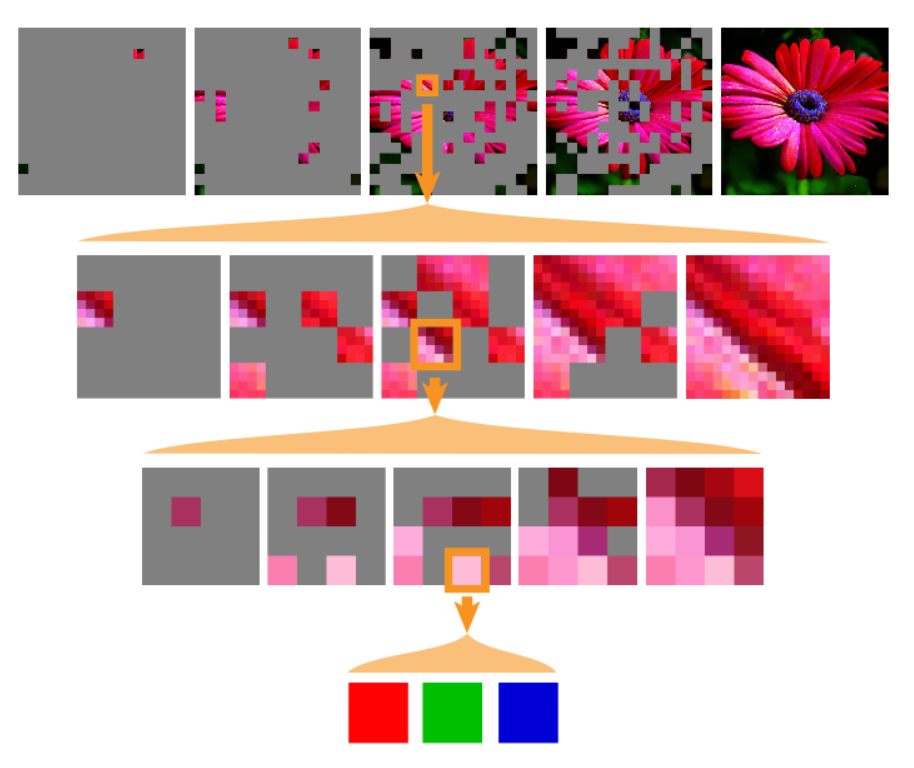

# FractalGen

## Training Stage of FractalGen

1. **PixelLoss**  

- 将$Guiding Pixel((bl,3)$ **(每个 图像 / patch 的均值)** 从3个Codebook中分别取值$(bl,3,w)$

- 再将预测图像$(bl,1,ed) \rightarrow MLP \rightarrow (bl,1,w)$ **前置拼接** 得到$(bl,4,w)$, 经过 **Causual Attention** 得到$x(bl,4,w)$  

- 再用$x(bl,4,w)$的前3个和**codebook的weight**$(w,256)$相乘 + bias 得到$logits((b,3,256)$  

- 最后用logits和Guiding Pixel在RGB通道上**分别做交叉熵Loss**, 再**加权求和**  

2. **MAR**  

- 将图像**随机打码**(码率从截断正态分布中取得)  

- 和$cond list((5,) \cdot (b,ed)$以及 **guiding pixel** 拼接后输入Transformer  

- **输出图像为新的Middle Condition**，**上下左右分别打一行/列码**，获得新的Cond List $(5,) \cdot (bl,d)$  

- 返回 **打码后的原图像和Cond List** 以及 Loss  
      
3. **Fractalgen**  

- 输入图像的类别$cond \ list \rightarrow MLP \rightarrow class \ embedding$, **复制5次**得到新的cond list  

- 使用多层MAR迭代生成 cond list 和 loss, 最后一个middle condition变形后就是预测的图像  
    
## Sample Stage of FractalGen

1. **Pixel Loss**  

- 将**初始化为0的pixel values**和cond list丢入训练阶段的网络(不算Loss)，获得logits  
      
- 如果不是**Classifier-Free Guidance(CFG)**, 将logits砍成cond和uncond两个batch, **将uncond logits概率过小的部分的概率加大一点$uncond - max(uncond) + max(cond)$
      
- 从logits构成的**概率分布中取值**，然后用**采样定理归一化**到浮点数, 作为输出的pixel values  
    
2. **FractalGen + MAR**  
    将本身就使用迭代(图中的**纵向**)的FractalGen模型多次使用(图中的**横向**)，根据掩码一次只生成一部分图像  
    掩码率使用余弦调度减小  
    
# MAR

1. **Training Stage**  
    
- 采用**MAE的网络**，输入输出都是**VAE**的**Encoder输出(latent gt)**和**Decoder输入(latent condition)**  

- 将latent gt, latent condition 和 time 丢入**Diffusion(MLP作为主网络)**, 计算Loss  
      
2. **Sample Stage**
