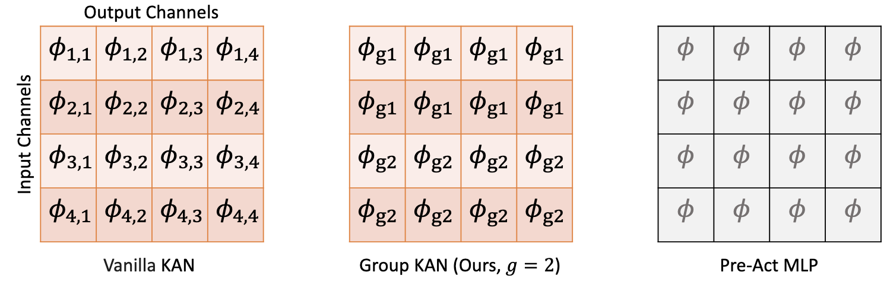
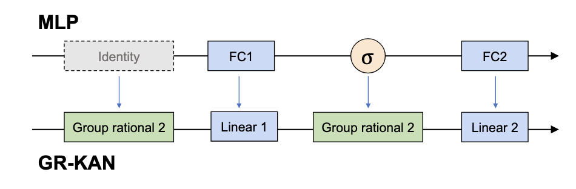

# GR-KAN (Group-Rational KAN)

## 内容

- Kan的缺点: 不并行，参数量大，初始化方式会导致方差不稳定, 每个参数都只能影响局部

- 改进1: 使用**rational polynomials**, 每个参数可以影响全局，而且支持并行, 使用CUDA对求导进行优化

$$
\begin{equation}
\begin{aligned}
F(x) &= \frac{\sum_{m = 0}^{M} a_m x^m }{1 + |\sum_{n = 1}^{N} a_n x^n|}  \\
m &= 5, n = 4
\end{aligned}
\end{equation}
$$

- 改进2: Group KAN 共享参数

- 改进3: MLP层改成了以下形式

- 改进4: 方差稳定的初始化方式(先确定$a,b$, 再根据**Gain**确定$w$)

## 结论

- 效果: 用在**ViT**上略有提升，用在**语义分割任务上不如ConvNext**

- 有理多项式的效果提升似乎并不大
