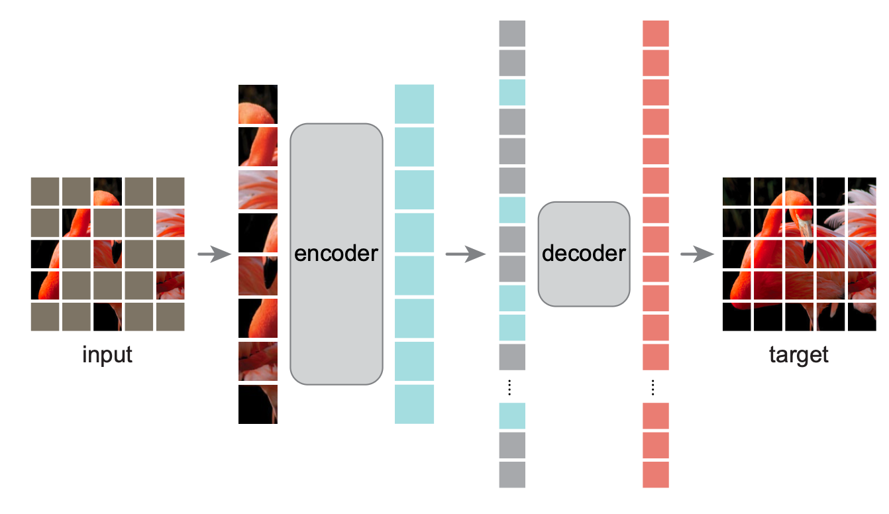

# 结构

$$
\begin{equation}
\begin{aligned}
img(b,c,h,w) & \xrightarrow{reshape + MLP} x(b,l,d) \xrightarrow{+embed_{pos} \xrightarrow{} mask_{random \ sample} } x_{mask}\[b,l \cdot r,d] \\ & \xrightarrow{cat(class \ token+embed_{pos}, x)} x\[b, l\cdot r + 1, d] \xrightarrow{attn} x\[b, l \cdot r + 1, d] \\ &\xrightarrow{MLP} x\[b, l \cdot r + 1, d_{de}] \xrightarrow{cat\[mask_{add}(b,l \cdot(1-r), d_{de}), x\[:, 1:, :]]} \\ x\[b,l,d] &\xrightarrow{unshuffle} x\[b,l,d] \xrightarrow{cat(class \ token,x)} x\[b, l +1, d] \xrightarrow{attn \xrightarrow{} norm \xrightarrow{} MLP } \\ x\[b,l,d] &\xleftrightarrow{Loss} img \xRightarrow{} Loss
\end{aligned}
\end{equation}
$$

- $mask_{add}$全是1，1为remove, 0为remain  

- 最终的**Loss**只取打了mask的部分  
      

# Insights

1.  Encoder只学习没打码的部分, Decoder学习打码的部分, Loss也只学习打码的部分  
    
2.  Encoder 的dim更大, 深度更深; 所以Docoder是辅助，**主要学习Encoder**  
    
3.  后续改进工作: **Mask Ratio**从一个正半轴的正态分布里取  
      
4.  从encoder的输出到decoder的输入, **dim转换直接使用MLP投影,损失很大**
      
5.  MAE的Mask有一个**unshuffle**过程, 后续工作把这一步删除了
