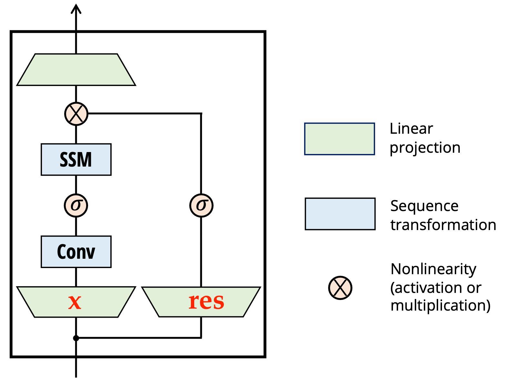

# Mamba, Mamba Variants

## Mamba

## Mamba Block

> Components

| Component/Variable | Description/Operation |
|---|---|
| Parameters | `b`: batch size, `l`: sequence length, `d`: Model Dimension (channels for CV), `e`: expansion factor, `dt`: hidden dim of delta, `n`: Hidden dim |
| Input Transformation | `x(b, l, d)` passes through `[Linear]` layer, resulting in `x(b, l, de)` and `res(b, l, de)` |
| Residual Activation | `res(b,l,de)` passes through `[SiLu]` activation, resulting in `res(b, l, de)` |
| Main Path Transformation | `x(b, l, de)` passes through `[Conv1d]`, then `[SiLu]`, then `[SSM]` block to produce `y`. The final output is `y = y * res`, resulting in `y(b, l, de)` |
      
> SSM Block

$$
\begin{equation}
\begin{aligned}
x & \rightarrow [FC] \rightarrow \Delta (b, l, dt), B(b,l,n), C(b,l,n) \\
\Delta (b, l,dt) &\rightarrow [FC] \rightarrow \Delta(b, l, de) \\
A(de, n), D(de,) &: one-init \\
Selective Scan (\Delta, x, A, B, C, D) &\rightarrow y \\
\end{aligned}
\end{equation}
$$

> Selective Scan

- 把上面的$x$改成$u$, $x$另外初始化  

$$
\begin{equation}
\begin{aligned}
\Delta A &= e^{\Delta A}: (b,l,de) \times (de,n) \rightarrow (b,l,de,n) \\
\Delta B &= \Delta B u: (b,l,de) \times (b,l,n) \times (b,l,de) \rightarrow (b,l,de,n) \\ 
for \ i = 0:l:& \\ 
x(b,de,n) &= x(b,de,n) \times \Delta A[:,i] (b, de, n) + \Delta B [:,i] (b,de, n) u \\ 
y_i &= x \times C (b, de)
\end{aligned}
\end{equation}
$$

> Final

- 然后把所有$y$拼起来再$y = y + Du$，得到$y(b,l,de)$
