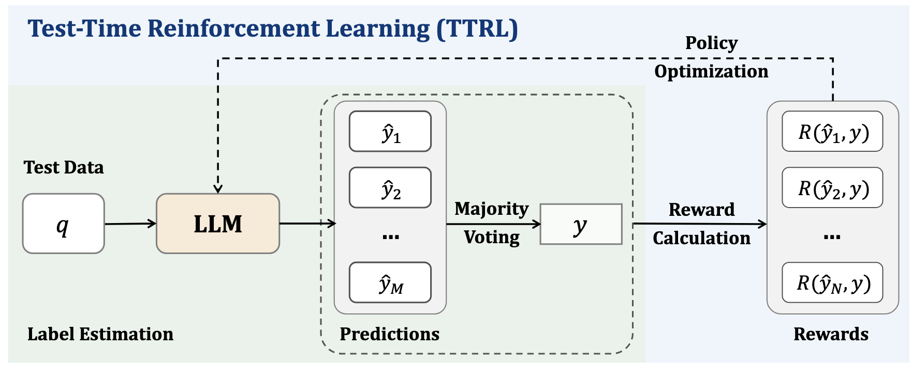

# Test Time RL (TTRL)

## 架构

1. 总体设计



- **Majority Voting** (Pesudo-Code)

```py
from collections import Counter

def majority-voting_reward_fn (outputs)：

answers = [extract_answer (output) for output in outputs]
counts = Counter(answers)
majority-answer，_ = counts.most_common(1)
rewards = [1 if ans == majority-answer else 0 for ans in answers]

return rewards

outputs = llm.generate (problem,n=N)
rewards = majority-voting_reward_fn (outputs)
```

2. 更新公式

$$
\begin{equation}
\begin{aligned}
\max_{\theta} \mathbb{E}_{y \sim \pi_{\theta}(x)} [r(y, y^*)]
\end{aligned}
\end{equation}
$$

$$
\begin{equation}
\begin{aligned}
\theta \leftarrow \theta + \eta\nabla_{\theta}\mathbb{E}_{y \sim \pi_{\theta}(\cdot|x)}[r(y, y^*)] \\
\nabla_{\theta}\mathbb{E}[r] = \mathbb{E}[r \cdot \nabla_{\theta} \log \pi_{\theta}(y|x)]
\end{aligned}
\end{equation}
$$

$$
\begin{equation}
\begin{aligned}
R(\hat{y}_i, y) = 
\begin{cases} 
1, & \text{if } \hat{y}_i = y, \\
0, & \text{otherwise.} 
\end{cases}
\end{aligned}
\end{equation}
$$

## 总结

1. Reward 和 Policy 设计过于简单

2. 效果提升是巨大的
