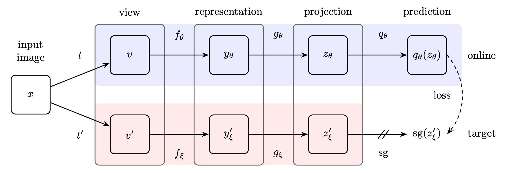
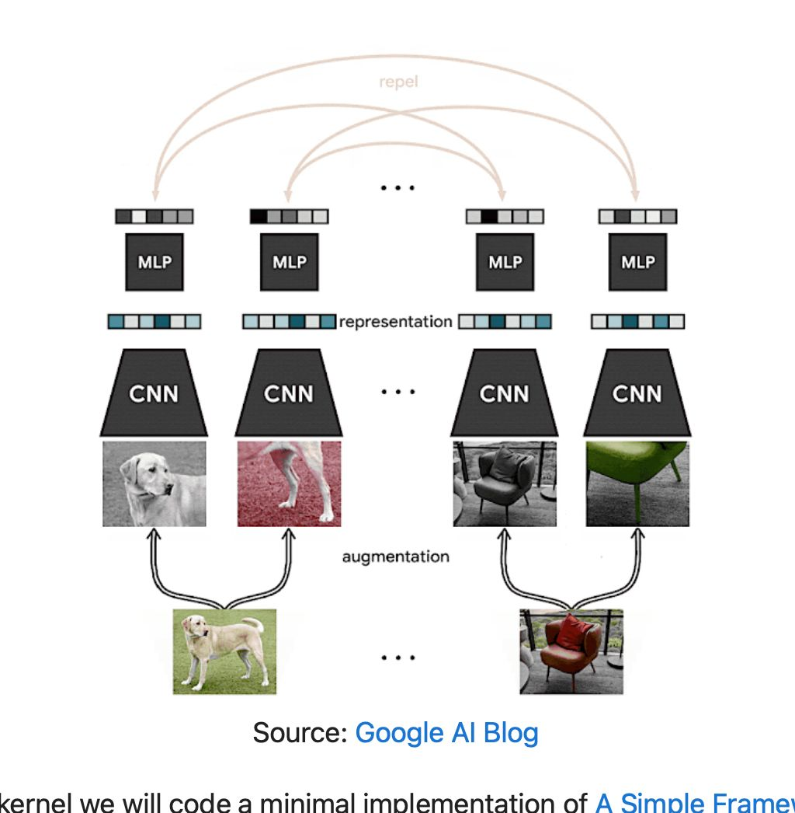
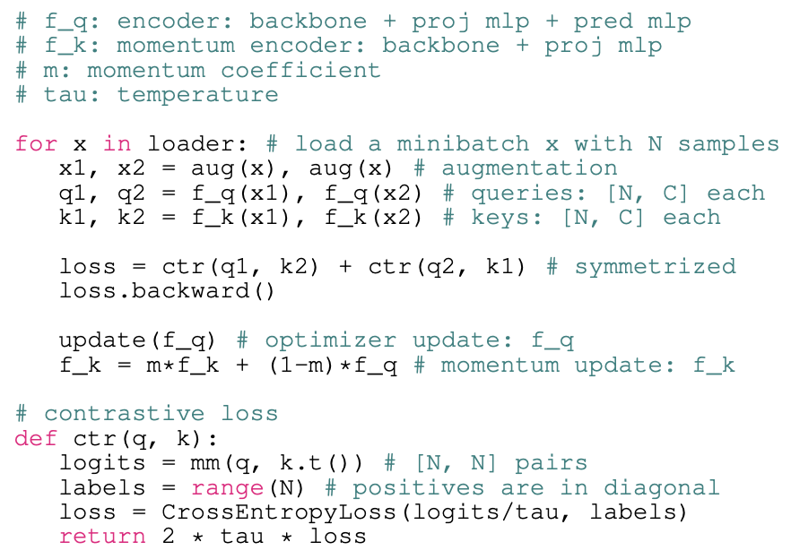
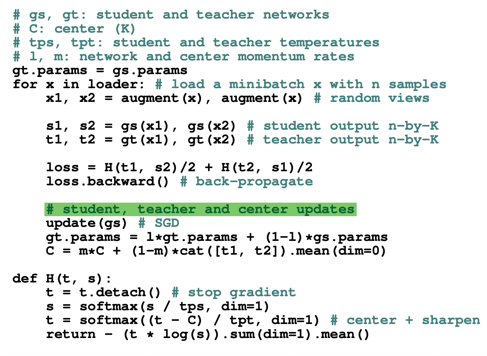
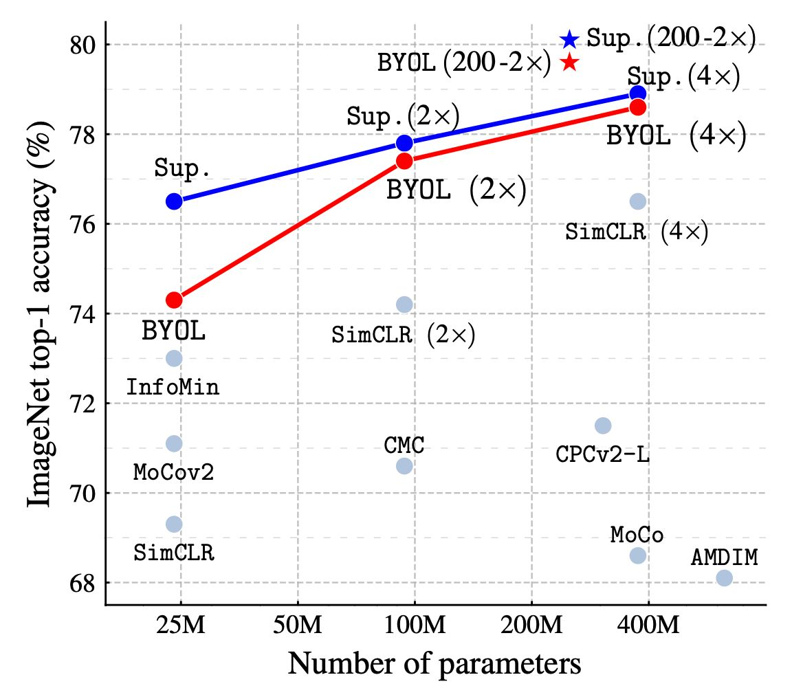
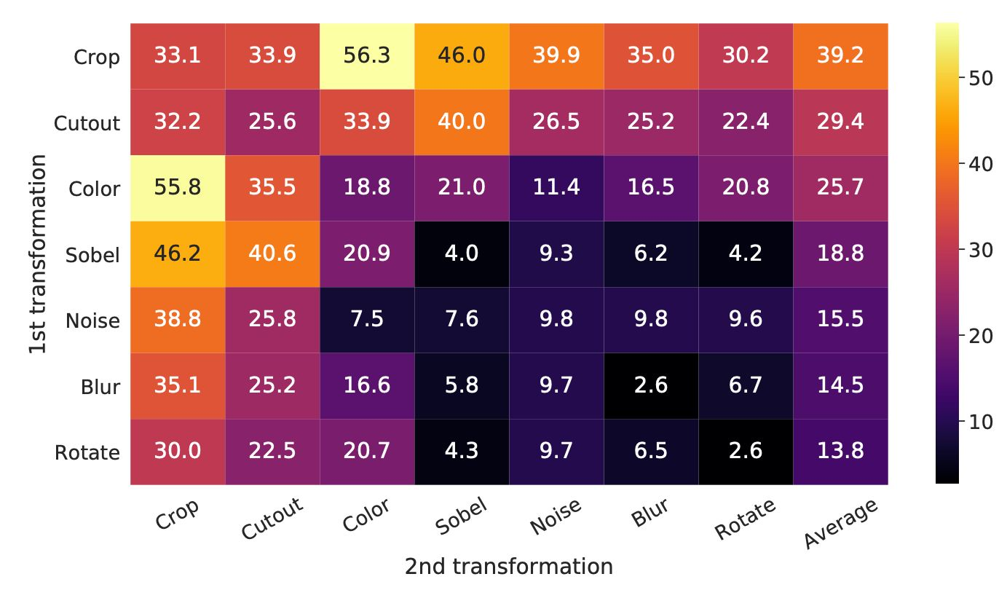
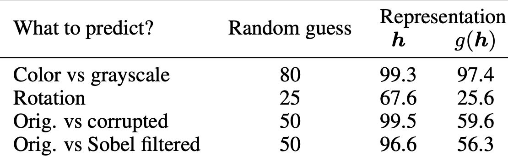

# Self-Supervised Model Summary & Comparison

*   **Contrast Learning** Series  
    
1.  BYOL  

$$
\begin{equation}
\begin{aligned}
x &\rightarrow Augment_{random} \rightarrow x_1, x_2 \\ x_1 &\rightarrow Encoder_{ipnut} \rightarrow Predictor_{input} \rightarrow p_1 \\ x_2 &\rightarrow Encoder_{ipnut} \rightarrow Predictor_{input} \rightarrow p_2 \\ x_1 &\rightarrow Encoder_{target} \rightarrow z_1 \\ x_2 &\rightarrow Encoder_{target} \rightarrow z_2 \\ Loss &= \frac{L(p_1, z_2) + L(p_2, z_1)}{2} \\ L(x,y) &= 2 - 2 \frac{\pmb{x} \cdot \pmb y_{detach}}{ |x| \cdot |y_{detach}|} \\ Encoder_{target} &= \tau \times Encoder_{input} + (1 - \tau) Encoder_{target} \\ \tau &= 1 - \eta_0 \frac{\cos(\dfrac{\pi}{t} T) + 1}{2}, \tau \in \[1 \rightarrow 0]
\end{aligned}
\end{equation}
$$

2.  SimCLR  

$$
\begin{equation}
\begin{aligned}
x &\rightarrow Augment_{random} \rightarrow x_1, x_2 \\ 
x_1 &\rightarrow Encoder \rightarrow z_1 \\ 
x_2 &\rightarrow Encoder \rightarrow z_2 \\ 
L &= Loss(z_1, z_2) \\ l_{i,j} &= - \log \frac{e^{z_i, z_j}}{\sum_{k=1}^{2N}\mathcal{1}_{k\neq i} e^{z_i, z_k}} \\ 
Loss &= \sum l_{i,j}
\end{aligned}
\end{equation}
$$

3.  MoCo (v3)  

    
4.  SimSiam  

$$
\begin{equation}
\begin{aligned}
x &\rightarrow Augment_{random} \rightarrow x_1, x_2 \\ 
x_1 &\rightarrow Encoder_{input} \rightarrow z_1 \rightarrow Predictor_{input} \rightarrow p_1 \\ 
x_2 &\rightarrow Encoder_{input} \rightarrow z_2 \rightarrow Predictor_{input} \rightarrow p_2 \\ 
Loss &= \frac{L(p_1, z_2) + L(p_2, z_1)}{2} \\ L(x,y) &= -\frac{\pmb{x} \cdot \pmb y_{detach}}{ |x| \cdot |y_{detach}|}
\end{aligned}
\end{equation}
$$
    
5. DiNo  

- Student只学习**Multi-Crop后的Image**  

- Teacher学习**全局Image  
      
6. **DiNoV2** 工程上做了优化  
    
- 采用了新的Loss

7. Comparison

    
# 结论

1. 组合使用数据增强比单独使用要好得多     

- 并且，如图，Crop + Color Distortion 的效果是最好的  
    
2.  Random Color Distortion 对Unsupervised Learning 有很大好处，但对 Supervised Learning 无益甚至有害  
      
3.  不使用 **Projection Head** 的情况下，分类任务的准确率要高一些  

*   **思考**

1. 数据增强的方法还有待探索  
      
2. 半监督学习和自监督学习可以进一步结合  
      
3. 提高负样本采样效率，即从大量负样本中快速提取中少量最具代表性的样本  
      
4. $p_1, z_2$相互做Loss的原因:   

- **防止两个encoder学到一样的内容,导致模型崩塌**
    
- 让同样的输入**在不同的增强(噪声)下也可以学到相同的特征空间**让同样的输入**在不同的增强(噪声)下也可以学到相同的特征空间**
