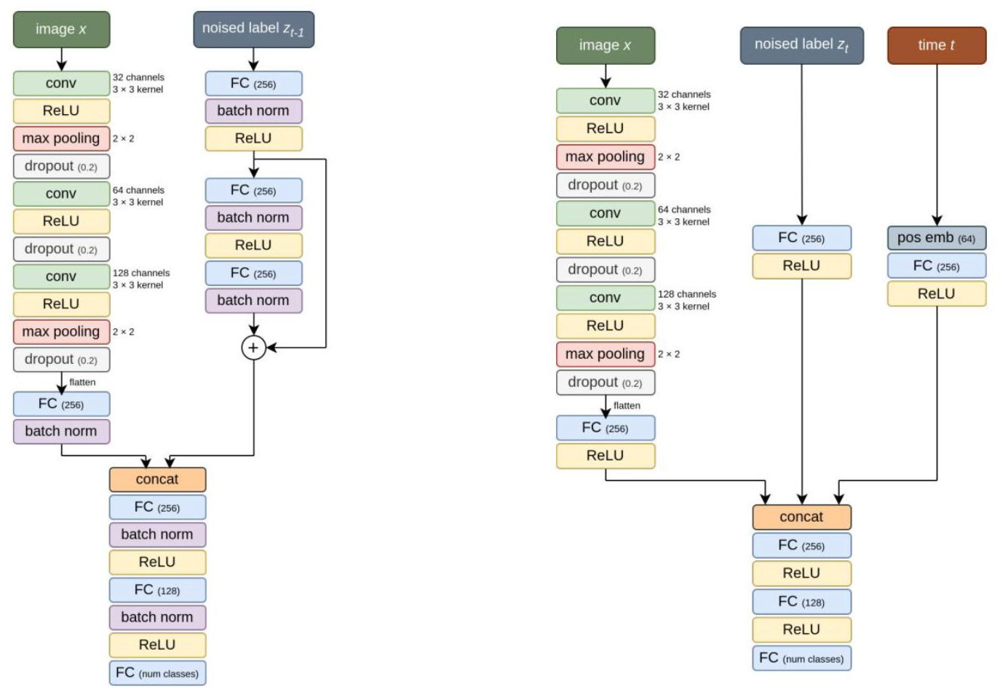
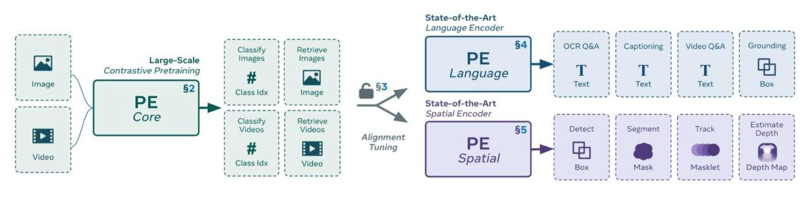
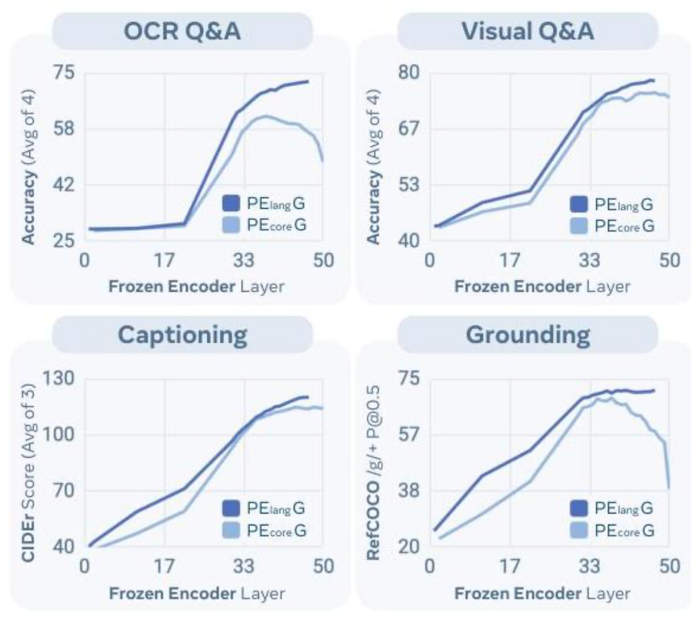
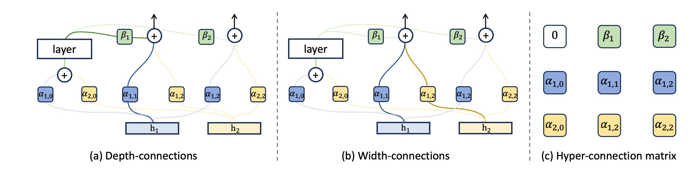
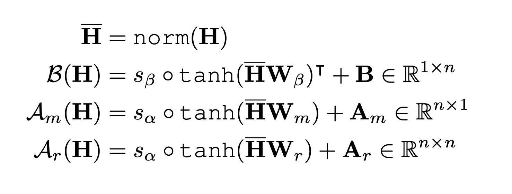
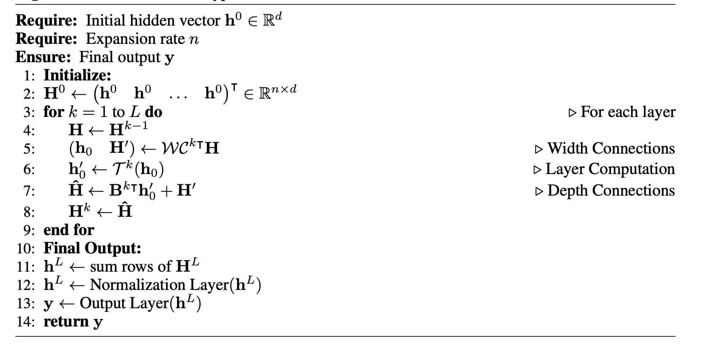

# No Prop (25.3)

1. 模型结构  
  

- 左边是Discrete-Time, 右边是Continuous-Time  

2. 结构解释  

- 本质: Diffusion的翻版  

3. **Training**  
- 输入: 标签 $z_t$用和Diffusion一样的加噪方式处理, $z_0 \sim \mathcal N(0, I)$ , 时间 $t\rightarrow 编码 \rightarrow  MLP, 图像 \rightarrow 提取特征$  

- 输出: 图像类别预测(num_classes)  

4. **Inference的区别**  

- 输入: 标签$z_t$改成了上一层的输出  

5. Insights  
    暂时只能作用于分类任务，如果换成生成任务，标签怎么搞呢  
    可以用特征提取器来提取做标签, 但这样会大大增加训练时间，还不如不用NoProps  

# Perception Encoder (25.3)

1. Architecture  

      
2. 改进

- 加了**LAMB**(Layer-Wise Moments Optimizer for Large Batch Training): **每层学习率都有缩放** 

- 加了**RoPE**  

- 加了**数据增强和Masked Regularization**(每个batch取一部分打码，然后丢进去把输出的特征靠齐)  

- 多分辨率训练  

- 统一图形模型和视频模型  

3.  Insights  

- 特征学习的中间层是比输出层更好的特征表示  

# Hyper-Connection (24.9)

1. 结构  

    
2. Dynamic Update

    
3. 流程 $h^0 \in R^{B \times N \times d}$, ($N$: Number of patches / Length of a sentence, $dC \times P^2 / Word \ Dim$

