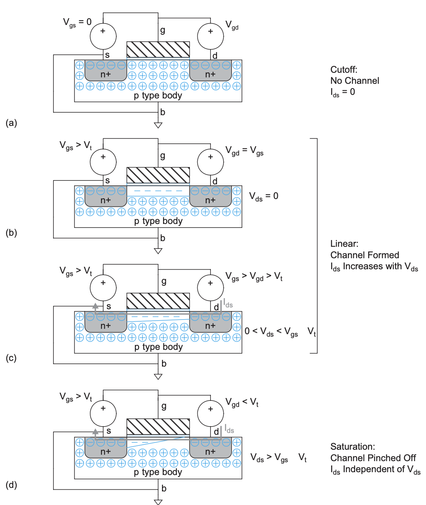
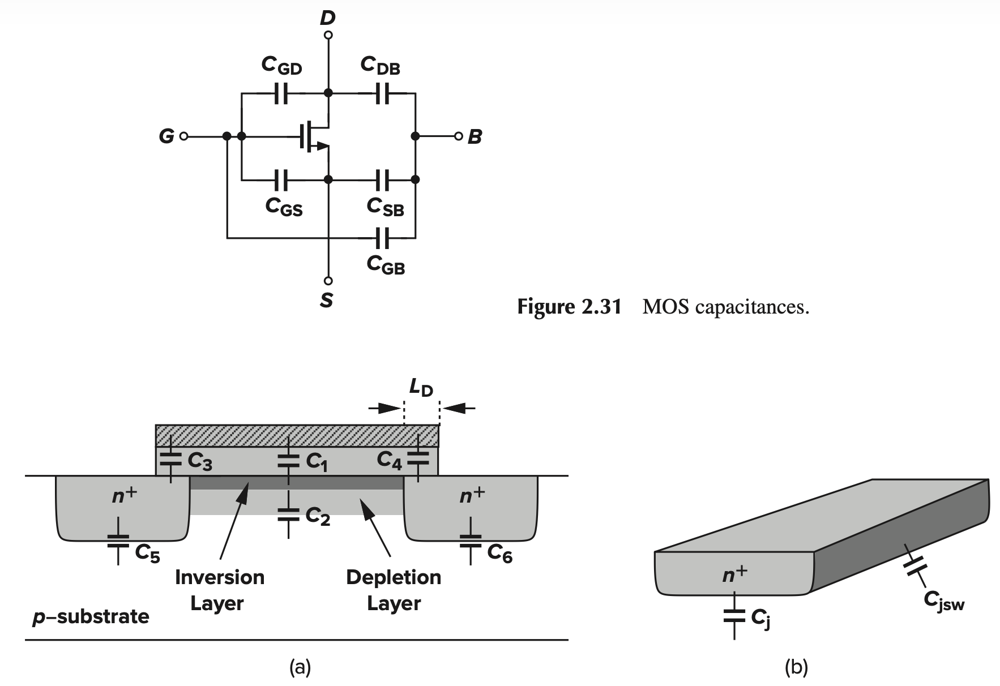
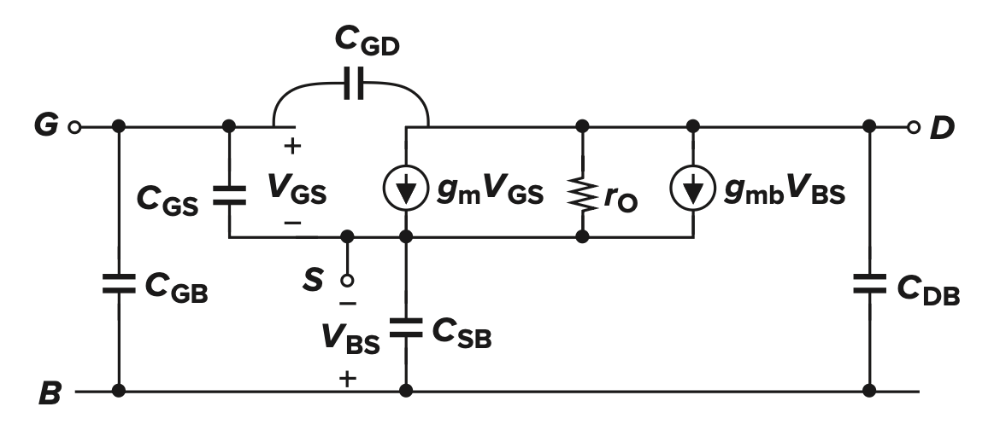
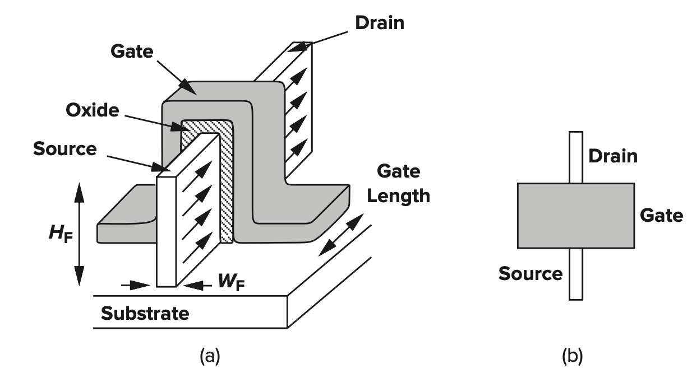
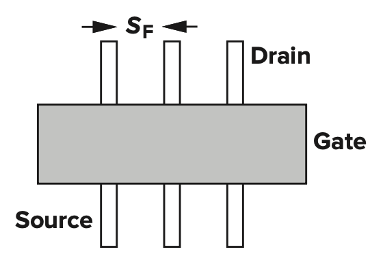

# RLC Circuits

> Suppose $V(t) = V e^{j \omega t}$

## Capacitance

$$
\begin{equation}
\begin{aligned}
C &= \frac{Q}{v} = \frac{\epsilon  A}{d} \\
i(t) &= C \dfrac{dv(t)}{dt} \\
&= Cj \omega v(t) \\
Z_c &= \frac{v(t)}{i(t)}  \\
&= \frac{1}{j \omega C} 
\end{aligned}
\end{equation}
$$

> Inductors

$$
\begin{equation}
\begin{aligned}
v(t) &= L \frac{di(t)}{dt}  \\
&= L i(t) j \omega \\
Z_L &= \frac{v(t)}{i(t)} \\
&= j \omega  L 
\end{aligned}
\end{equation}
$$

# CMOS

## Structure

### 3D View of a **NMOS**

### Top View & Cross-Section of Inverter

> Formation of the inversion layer: From above to bottom (Metal -> Oxide -> Inversion layer/channel -> depletion region -> substrate)

## Current

### Inference of Current Formula

$$
\begin{equation}
\begin{aligned}
Q (x) &= C_{ox} W (V_G - V_{th} - V(x)), Unit: Q/m \\
v &= \mu E = - \mu \frac{dV}{dx} \\
I_D &= Q(x) v \\
\int_{0}^{L} I_D dx &= \int_{V_S}^{V_D} -C_{ox} W (V_G - V_{th} - V(x)) \mu dV \\
\therefore I_D &= \mu C_{ox} \frac{W}{L} (V_{GS}- V_{th} - \frac{1}{2} V_{DS} ) V_{DS}
\end{aligned}
\end{equation}
$$

### Current Formula

$$
\begin{equation}
\begin{aligned}
I_{ds} &=
\begin{cases}
0 & V_{gs}<V_t \quad \text{Cutoff} \\
I_{dsat}\dfrac{V_{ds}}{V_{dsat}} = \beta(V_{GT} - \dfrac{V_{ds}}{2}) V_{ds} & V_{ds}<V_{dsat} \quad \text{Linear} \\
I_{dsat} = \dfrac{\beta}{2} V_{GT}^2  & V_{ds}>V_{dsat} \quad \text{Saturation}
\end{cases} \\
V_{dsat} &= V_{gs} - V_{th}
\end{aligned}
\end{equation}
$$

## Operation Regions

> Specifically, when $V_{DS} \ll 2(V_{GS} - V_{th})$, which we call **deep triode region**, it works as a **linear resistor**

$$
\begin{equation}
\begin{aligned}
R_{on} &= 1 / \frac{\partial I_D}{\partial V_{DS}}  \\
&= \frac{1}{\mu C_{ox} \dfrac{W}{L} (V_{GS} - V_{th})} 
\end{aligned}
\end{equation}
$$

## Capacitance

### Capacitance Schematic & Structure Model

| Capacitor | Definition                       |
| :-------- | :------------------------------- |
| $C_1$     | $C_{g-depletion}$                |
| $C_2$     | $C_{depletion-b}$                |
| $C_3$     | $C_{gd-overlap}$                 |
| $C_4$     | $C_{gs-overlap}$                 |
| $C_5$     | $C_{db}$                         |
| $C_6$     | $C_{sb}$                         |
| $C_j$     | $C_{junction}$                   |
| $C_{jsw}$ | $C_{\text{junction side wall} }$ |

### $C_{gs}$ & $C_{gd}$

> In **Saturation Region**, $C_{gs} > V_{gd}$

- Current remains unchanged

$$
\begin{equation}
\begin{aligned}
I_D &= \frac{Q}{t} = \frac{Q}{L} v = Q(x) \mu_n (-\frac{d[V_{ov} - V(x)]}{dx}) \\
&= C_{ox} W [V_{ov} - V(x)] \mu_n \frac{dV(x)}{dx} \\
&= \frac{1}{2} \mu_n C_{ox} \frac{W}{L} V_{ov}^2 \\
\therefore dx &= \frac{2L(V_{ov} - V(x))}{V_{ov}^2} dV(x)
\end{aligned}
\end{equation}
$$

- Charge Calculations

$$
\begin{equation}
\begin{aligned}
Q_{inv} &= \int_{}^{} Q(x) dx \\
&= \int_{0}^{V_{ov}}  C_{ox} W [V_{ov} - V] \frac{2L(V_{ov} - V)}{V_{ov}^2} dV \\
&= \frac{2}{3} C_{ox} W L (V_{GS} - V_{th}) \\
\therefore C_{gs-non-overlap} &= \frac{\partial Q_{inv}}{\partial V_{GS}} \\
&= \frac{2}{3}  C_{ox} WL
\end{aligned}
\end{equation}
$$

## Transconductance

### Gate-Source Transconductance

$$
\begin{equation}
\begin{aligned}
g_m &= \frac{\partial I_D}{\partial V_{GS}} \\
&= \begin{cases}
k_n V_{DS} & Triode \\
k_n V_{OV} = \sqrt{2 k_n I_D} = \dfrac{2I_D}{V_{OV}} & Saturation
\end{cases}
\end{aligned}
\end{equation}
$$

### Bulk-Source Transconductance in Saturation Region

$$
\begin{equation}
\begin{aligned}
g_{mb} &= \frac{\partial I_D}{\partial V_{BS}} \\
&= \frac{\partial I_D}{\partial V_{th}}  \times \frac{\partial V_{th}}{\partial V_{BS}} \\
&= (- \frac{\partial V_{th}}{\partial V_{BS}} ) g_m \\
&= \eta g_m
\end{aligned}
\end{equation}
$$

## Small Signal Model

> **Small-Signal Model Derivation Procedure**

1. **Biasing**: Apply DC voltages to establish the quiescent operating point.

2. **Perturbation**: Introduce a small incremental voltage change to one terminal while keeping others constant.

3. **Characterization**: Measure the resulting current variation to extract small-signal parameters.

> Current Changes modeled by  VCCS

> Linear Resistance due to **Channel Length Modulation**

$$
\begin{equation}
\begin{aligned}
r_O &= \frac{\partial V_{DS}}{\partial I_D}  \\
&= \frac{\partial V_{DS}}{\partial (\dfrac{1}{2} \mu_n C_{ox} \dfrac{W}{L} (V_{GS} - V_{th})^2 (1 + \lambda V_{DS}) ) }  \\
&= \frac{1}{ \partial I_D / \partial V_{DS}}  \\
&= \frac{1}{\dfrac{1}{2} \mu_n C_{ox} (W/L) (V_{GS} - V_{th})^2 \lambda } \\
&= \frac{1 + \lambda V_{DS}}{\lambda I_D}  \\
&\approx \frac{1}{\lambda V_D} , \lambda V_{DS} \ll1
\end{aligned}
\end{equation}
$$

# FinFET

> In FinFET, $H_F, W_F, S_F$ are **fixed** for any process

$$
\begin{equation}
\begin{aligned}
S_F &: \text{Spacing} \\
W &= W_F + 2 H_F \\
\end{aligned}
\end{equation}
$$

# Non-Ideal I-V Characteristics of CMOS

## Mobility Degradation & Velocity Saturation

### Explanation

| Phenomenon             | Description                                                                                                                                                                                               |
| :--------------------- | :-------------------------------------------------------------------------------------------------------------------------------------------------------------------------------------------------------- |
| Mobility Degradation   | When fields are very large, more carriers collide with $SiO_2$ because of quantum mechanics, reducing mobility.                                                                                             |
| Velocity Saturation    | When velocity is very high, more carriers hit **silicon atoms**, reducing velocity.                                                                                                                                 |

### Empirical Formula for **effective mobility**

$$
\begin{equation}
\begin{aligned}
\mu_{\mathrm{eff}}^n &= \frac{540 \dfrac{\mathrm{cm}^2}{\mathrm{V} \cdot \mathrm{s}}}{1 + \left(\dfrac{V_{gs} + V_t}{0.54 \dfrac{V}{\mathrm{nm}} t_{\mathrm{ox}}}\right)^{1.85}} \\
\mu_{\mathrm{eff}}^p &= \frac{185 \dfrac{\mathrm{cm}^2}{\mathrm{V} \cdot \mathrm{s}}}{1 + \left(\dfrac{\left|V_{gs}\right| + 1.5\left|V_t\right|}{0.338 \dfrac{V}{\mathrm{nm}} t_{\mathrm{ox}}}\right)}
\end{aligned}
\end{equation}
$$

### Velocity formulas

$$
\begin{equation}
\begin{aligned}
v &= \begin{cases}
\dfrac{\mu_{eff} E}{1 + \dfrac{E}{E_c} } & E \le E_c \\
v_{sat} & E \gt E_c 
\end{cases} \\
E_c &= \frac{2v_{sat}}{\mu_{eff}} 
\end{aligned}
\end{equation}
$$

### New Corrected Formulas for Current

$$
\begin{equation}
\begin{aligned}
I_{ds} &= \begin{cases} \dfrac{\mu_{eff} \frac{W}{L} C_{ox} (V_{GT} - V_{ds}/2) V_{ds}}{1 + \dfrac{V_{ds}}{V_{c}}} & V_{ds} < V_{sat} \quad \text{Linear} \\ 
C_{ox} W (V_{GT} - V_{dsat}) v_{sat} & V_{ds} > V_{dsat} \quad \text{Saturation} \end{cases} \\
I_{ds} &= \begin{cases} 0 & V_{gs} < V_t \quad \text{Cutoff} \\ I_{dsat} \frac{V_{ds}}{V_{dsat}} & V_{ds} < V_{dsat} \quad \text{Linear} \\ I_{dsat} & V_{ds} > V_{dsat} \quad \text{Saturation} \end{cases}
\end{aligned}
\end{equation}
$$

$$
\begin{equation}
\begin{aligned}
V_{dsat} &= \frac{V_{GT} V_C}{V_{GT} + V_C} \\
&= \frac{V_{GT} E_C L}{V_{GT} + E_C L} \\
I_{dsat} &= \begin{cases}
W C_{ox} V_{sat} \dfrac{V_{GT}^2}{V_{GT} + V_{sat}} & V_{ds} > V_c \\
W C_{ox} V_{sat} V_{GT} & V_{GT} \gg V_c \\
\end{cases}
\end{aligned}
\end{equation}
$$

- $\alpha$-Power Model is between this one and Long-Channel Model

$$
\begin{equation}
\begin{aligned}
I_{dsat} &= P_c \frac{\beta}{2} V_{GT}^\alpha \\
V_{dsat} &= P_v V_{GT}^{\alpha /2}
\end{aligned}
\end{equation}
$$

## Channel-Length Modulation

- It only happens in **saturaion region**

$$
\begin{equation}
\begin{aligned}
L_{eff} &= L - L_{shorten} \\
I_{ds} &= \frac{1}{2} \beta V_{GT}^2(1 + \lambda V_{DS} ) \\
\lambda &\propto \frac{1}{L} 
\end{aligned}
\end{equation}
$$

## Threshold Voltage Effects

### Body Effects

$$
\begin{equation}
\begin{aligned}
V_t &= V_{t0} + \gamma (\sqrt{\phi_s + V_{sb}} - \sqrt{\phi_s}) \\
&=  V_{t0} + k_{\gamma} V_{sb} , V_{sb} \ \text{is very small} \\
k_{\gamma} &= \frac{\gamma}{2 \sqrt{\phi_s}} \\
\phi_s &= 2 v_T \frac{\ln N_A}{n_i} \\
\gamma &= \frac{\sqrt{2q \epsilon_{si} N_A}}{C_{ox}} 
\end{aligned}
\end{equation}
$$

### Drain-Induced Barrier Lowering (DIBL)

$$
\begin{equation}
\begin{aligned}
V_t &= V_{t0} - \eta V_{ds}
\end{aligned}
\end{equation}
$$

| Phenomenon            | Description                                                                                       |
| :-------------------- | :------------------------------------------------------------------------------------------------ |
| Drain-Induced Barrier Lowering (DIBL) | $V_t = V_{t0} - \eta V_{ds}$                                                                      |
| Short-Channel Effect  | When $L$ is too small, depletion region of diffusion capacitance might **extend into the channel** |

## Leakage

### Category

| Phenomenon             | Description                                                                                       |
| :--------------------- | :------------------------------------------------------------------------------------------------ |
| Subthreshold Conduction | $I_{ds-off}$ caused by thermal carrier movements                                                 |
| Gate Leakage           | Leakage caused by quantum tunneling when the oxide is too thin                                    |
| Junction Leakage       | Leakage between source/drain and body because of diffusion in p-n junction (reverse-biased diode leakage)                        |

### Subthreshold Current

$$
\begin{equation}
\begin{aligned}
I_{ds} &= I_{ds0} e^{\dfrac{V_{GS} - V_{t0} + \eta V_{ds} -k_{\gamma} V_{sb}}{nV_T} } (1 - e^{-\dfrac{V_{ds}}{V_T} }) \\
&= I_{\text{off}} 10^{\dfrac{V_{gs} + \eta (V_{ds} - V_{dd}) - k_{\gamma} V_{sb}}{S}} \left( 1 - e^{\dfrac{-V_{ds}}{v_T}} \right) \\
I_{ds0} &= \beta V_T^2 e^{1.8} \\
S &= \big\{ \frac{d (\log_{10}(I_{ds}))}{dV_{gs}}  \big\}^{-1} = nV_T
\end{aligned}
\end{equation}
$$

- $I_{ds0}$ is the current at threshold 

- $I_{off}$ is the current when $V_{ds} = V_{DD}, V_{gs} = 0$

### To be continued...

# Noise Margin

$$
\begin{equation}
\begin{aligned}
NM_H &= V_{OH} - V_{IH} \\
NM_L &= V_{OL} - V_{IL}
\end{aligned}
\end{equation}
$$
