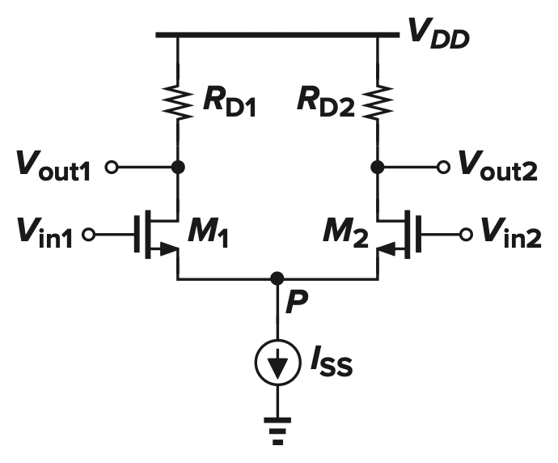
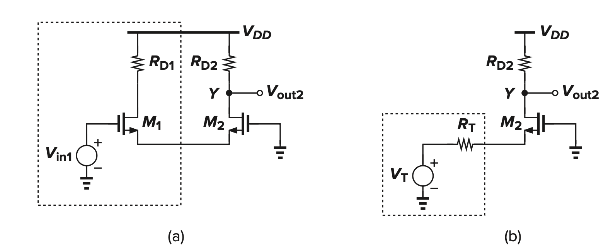
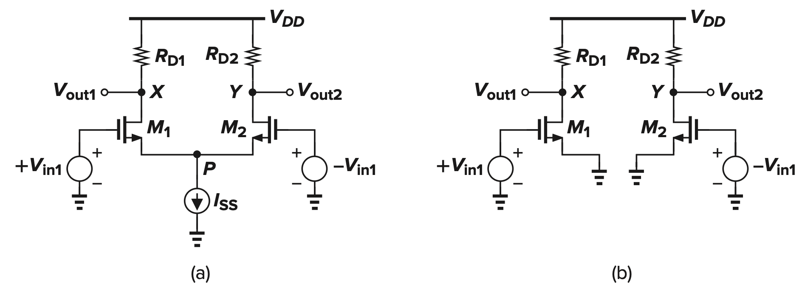
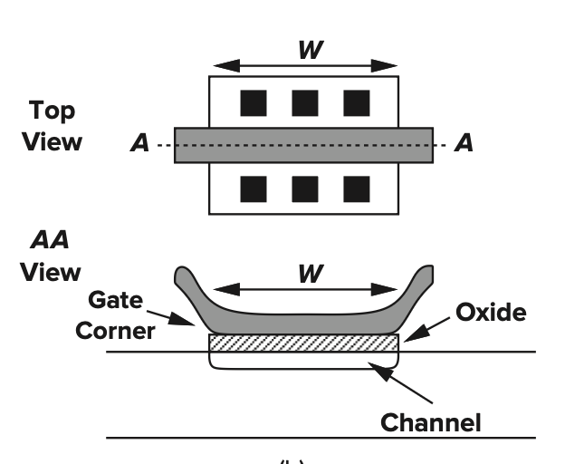
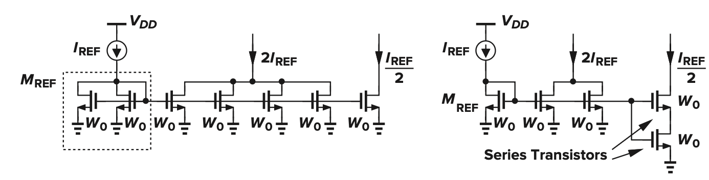

# Basic Differential Pairs

## Large-Signal Model

$$
\begin{equation}
\begin{aligned}
V_{in1} - V_{in2} &= V_{GS1} - V_{GS2} \\
&= \sqrt{\frac{2I_{D1}}{k_{n1}} } - \sqrt{\frac{2I_{D2}}{k_{n2}} }\\
\frac{1}{2} k_n ( V_{in1} - V_{in2} )^2 &=  (I_{SS} - 2 \sqrt{I_{D1} I_{D2}}) \\
4I_{D1}I_{D2} &= I_{SS}^2 - (I_{D1} - I_{D2}) \\
I_{D1} - I_{D2} &= \frac{1}{2}\mu_{n}C_{ox}\frac{W}{L}(V_{in1} - V_{in2})\sqrt{\frac{4I_{SS}}{\mu_{n}C_{ox}\frac{W}{L}} - (V_{in1} - V_{in2})^2} \\
&= \sqrt{\mu_{n}C_{ox}\frac{W}{L}I_{SS}}(V_{in1} - V_{in2})\sqrt{1 - \frac{\mu_{n}C_{ox}(W/L)}{4I_{SS}}(V_{in1} - V_{in2})^2} \\
G_m &= \frac{\partial (I_{D1} - I_{D2})}{\partial (V_{in1} - V_{in2})} \\
&= \sqrt{\mu_{n}C_{ox}\frac{W}{L}I_{SS}}\sqrt{1 - \frac{\mu_{n}C_{ox}(W/L)}{4I_{SS}}(V_{in1} - V_{in2})^2}
\end{aligned}
\end{equation}
$$

## Small-Signal Model

### SuperPosition (Neglecting CLM and body effect)

> $V_{out} = V_X$, the circuit acts as a common-source stage with source degeneration $R_S = 1/g_{m2}$. 

> $V_{out} = V_Y$, it acts as a source follower driving $M_2$, which after Thévenin equivalence becomes a common-gate stage.

$$
\begin{equation}
\begin{aligned}
V_X|_{by \ V_{in1}} &= \frac{-R_D}{g_{m1} + g_{m2}}  \\
V_Y|_{by \ V_{in1}} &= \frac{R_D}{g_{m1} + g_{m2}}  \\
( V_X-V_Y )_{by \ V_{in1}} &= \frac{-2R_D}{g_{m1} + g_{m2}} \\
( V_X-V_Y )_{by \ V_{in2}} &= \frac{2R_D}{g_{m1} + g_{m2}} \\
\therefore A_{dm} &= \frac{-R_D}{g_{m1} + g_{m2}} 
\end{aligned}
\end{equation}
$$

- Not a very high gain

### Half-Circuit

> Lemma: $V_P$ stays the same given any differential input

$$
\begin{equation}
\begin{aligned}
\frac{V_X}{V_{in1}} &= -g_m R_D \\
\frac{-V_Y}{V_{in1}} &= -g_m R_D \\
\therefore A_{dm} &= -g_m R_D
\end{aligned}
\end{equation}
$$

> DP with Degeneration

- Trade Gain for Linearity

- Less Voltage Headroom

- Split $I_{SS}$ in 2 to fix the problem (induce more noise)

## Common-Mode Response

> While ideal differential pairs exhibit zero common-mode gain, practical constraints such as the finite resistance $R_{SS}$ of the current source and manufacturing mismatches in $R_D$ introduce a non-zero common-mode response.

$$
\begin{equation}
\begin{aligned}
A_{v,cm} &= \begin{cases}
\dfrac{R_D / 2}{ \dfrac{1}{2g_m} + R_{SS}} & Normal \\
= A_{CM-DM} = -\dfrac{\Delta g_m R_D}{1 + (g_{m1} + g_{m2}) R_{SS}} & g_m \ Mismatch \\
-\dfrac{g_m}{1 + 2g_m R_{SS}} \Delta R_D & R_D \ Mismatch
\end{cases}
\end{aligned}
\end{equation}
$$

> CMRR

$$
\begin{equation}
\begin{aligned}
A_{v,dm} &= \frac{R_D}{2} \frac{g_{m1} + g_{m2} + 4g_{m1} g_{m2} R_{SS}}{1 + (g_{m1} + g_{m2}) R_{SS}}  \\
\therefore CMRR &= \frac{|A_{DM}|}{|A_{CM-DM}|}  \\
&= \frac{g_{m1} + g_{m2} + 4g_{m1} g_{m2} R_{SS}}{2 \Delta  g_m} \\
& \approx \frac{g_m}{ \Delta g_m} (1 + 2g_m R_{SS}) \\
& \approx \frac{2g_m^2 R_{SS}}{ \Delta g_m} 
\end{aligned}
\end{equation}
$$

# MOS Load

- Current-Source Load (Low Gain)

- Diode-Connected Load (Low Voltage Swing)

- Parallel $R_D$ with Current-Source Load solves the above 2 problems

- Cascode Stage has very high gain

# Current Mirror

## Basic Current Mirrors

> Start with a **known and stable** $I_{REF}$

- There must be s.t. a strong correlation to copy currents to avoid influence from PVT

$$
\begin{equation}
\begin{aligned}
I_{REF} &= f(V_{GS}) \\
\therefore V_{GS} &= f^{-1}(I_{REF}) \\
I_{copy} &= f(V_{GS}) = I_{REF}
\end{aligned}
\end{equation}
$$

> $L_{eff} = L_{drawn} - 2L_{D}$, $W$ is in a wierd shape

- Therefore, scaling $W,L$ on a single transistor is no reliable to bring multiple of $I_{REF}$

- Scaling $W$ is better than $L$ if necessary

- We use Parallel/series unit transistor to achieve that

- For right circuit, bottom device works in **triode region** to achieve $I_{REF}/2$ and reduce the number of transistors

## Cascode Current Mirror (...)

## Active Current Mirror
