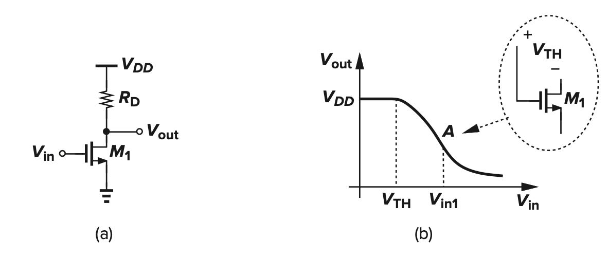
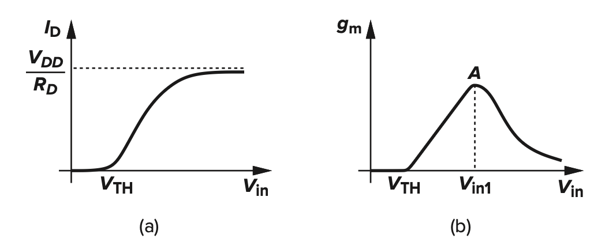
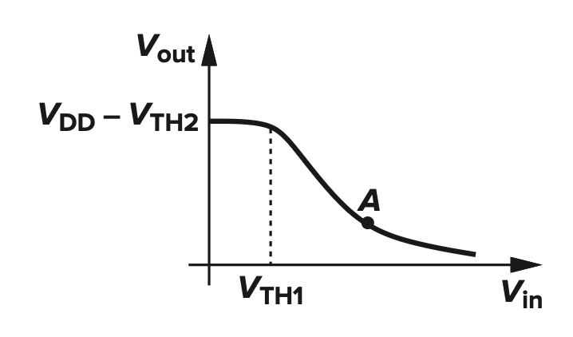

# Different Configurations

| Stage Type          | Configuration             |
| :------------------ | :------------------------ |
| Common-Source Stage | With Resistive Load (tradeoff: $R_D \uparrow A_v \uparrow, V_{out} Swing \downarrow$)       |
|                     | With Diode-Connected Load (tradeoff: High Gain, Large Device Dimension, Large Capacitance, Lower Output Swing) |
|                     | With Current-Source Load  |
|                     | With Active Load          |
|                     | With Source Degeneration  |
| Source Follower     | With Resistive Bias       |
|                     | With Current-Source Bias  |
| Common-Gate Stage   | With Resistive Load       |
|                     | With Current-Source Load  |
| Cascode             | Telescopic                |
|                     | Folded                    |

# Common-Source Stage

## With Resistive Load

### $V_{out} - V_{in}$

$$
\begin{equation}
\begin{aligned}
V_{out} &= \begin{cases}
0 & V_{in} \le V_{th} \\
V_{DD} - \dfrac{1}{2} k_n (V_{in} - V_{th})^2 R_D & V_{in} \gt V_{th}, V_{out} \ge V_{in} - V_{th} \\
V_{DD} - k_n (V_{in} - V_{th} - \dfrac{1}{2} V_{out})V_{out} R_D & V_{in} \gt V_{th}, V_{out} \lt V_{in} - V_{th} \\
\dfrac{R_{on}}{R_{on} + R_D}  V_{DD} & V_{in} \gt V_{th}, V_{out} \ll 2(V_{in} - V_{th})
\end{cases}
\end{aligned}
\end{equation}
$$

### Gain $A_v$

> Usually, we consider $r_o \gg \dfrac{1}{g_m}$

$$
\begin{equation}
\begin{aligned}
A_v &= \frac{\partial V_{out}}{\partial V_{in}} = -g_m R_D \\
&= -g_m (r_o || R_D), \text{CLM Considered} \\
& \lt -g_m r_o , \text{Intrinsic Gain} 
\end{aligned}
\end{equation}
$$

### $I_D - V_{in}, g_m - V_{in}$

$$
\begin{equation}
\begin{aligned}
I_D &= \begin{cases}
0 & V_{in} \le V_{th} \\
\dfrac{1}{2} k_n (V_{in} - V_{th})^2 & V_{in} \gt V_{th}, V_{out} \ge V_{in} - V_{th} \\
k_n (V_{in} - V_{th} - \dfrac{1}{2} V_{out})V_{out} & V_{in} \gt V_{th}, V_{out} \lt V_{in} - V_{th}
\end{cases}
\end{aligned}
\end{equation}
$$

$$
\begin{equation}
\begin{aligned}
g_m &= \begin{cases}
0 & V_{in} \le V_{th} \\
k_n (V_{in} - V_{th}) & V_{in} \gt V_{th}, V_{out} \ge V_{in} - V_{th} \\
k_n V_{out} & V_{in} \gt V_{th}, V_{out} \lt V_{in} - V_{th}
\end{cases}
\end{aligned}
\end{equation}
$$

## Diode-Connected Load

> Output Swing Limit: $V_{out-max} = V_{DD} - V_{th}$

### Resistance of Diode-Connected Load / Looking into Source of CS Stage

$$
\begin{equation}
\begin{aligned}
R_{dcl} &= \frac{1}{g_m + g_{mb} + r_o^{-1}} \approx \frac{1}{g_m + g_{mb}}  \\
R_{s-cs} &= \frac{1}{g_m + g_{mb}}  , \text{No CLM} 
\end{aligned}
\end{equation}
$$

### Small Signal Analysis

$$
\begin{equation}
\begin{aligned}
A_v &= -g_{m1} \frac{1}{g_{m2} + g_{m2b}} \\
&= \begin{cases}
 \sqrt{\dfrac{(W/L)_1}{(W/L)_2} } (1 + \eta) & \text{No CLM} \\
\dfrac{|V_{GS2} - V_{th2} |}{V_{GS1} - V_{th1}} & \text{No CLM, Body Effect}   \\
 -g_{m1} (g_{m2}^{-1} || r_{o2} || r_{o1}) & \text{Normal Case} 
\end{cases}
\end{aligned}
\end{equation}
$$

### Large Signal Analysis

## Current Source Load, Active Source Load, Triode Load

CSL Swing: $[V_{in} - V_{th}, V_{DD} - V_{OV2}]$

$$
\begin{equation}
\begin{aligned}
A_{v,cs} &= -g_{m1} (r_{o1} || r_{o2}) \\
A_{v,as} &= -(g_{m1} + g_{m2}) (r_{o1} || r_{o2}) \\
A_{v,tl} &= -g_{m1} R_{on2}
\end{aligned}
\end{equation}
$$

## With Source Degeneration

> A **2nd way of obtaining Gain**

$$
\begin{equation}
\begin{aligned}
A_v &= G_m R_{out} \\
G_m &= \begin{cases}
\dfrac{\partial I_{out}}{\partial V_{GS}} \dfrac{\partial V_{GS}}{\partial V_{in}} & LSM \\
\dfrac{i_{out}}{v_{in}} |_{v_{out} = 0} & SSM \\
\dfrac{1}{R_{eq}} |_{v_{out} = 0, i_{out} = i_{in}} & SSM
\end{cases}
\end{aligned}
\end{equation}
$$

- Also, $i_{out}$ can be considered as a branch of $i_{in}$ sometimes

> With Source Degeneration

- $R_s'$ is an **Important Property** to be remembered

$$
\begin{equation}
\begin{aligned}
G_m &= \frac{g_m r_o}{ R_s' } \\
R_{s'} &= r_o + R_S + g_mr_o R_S \\
R_{out} &= R_D || R_{s'} \\
A_v &= \frac{g_m r_o (R_D || R_{s'})}{R_{s'}} 
\end{aligned}
\end{equation}
$$

## Frequency Response

> Miller Approximation (& its shortcomings)

> Another Approximation

> Direct Analysis

> Dominant Poles and 2nd Pole

> Zero: $V_{out} = 0 \xRightarrow{}$ Out is **Grounded**

> Input Impedance Using both Miller Effect & Direct Analysis

# Source-Follower

## Gain

> $g_m \rightarrow 1/g_m$ between $V_{in}$ and $V_{out}$, $g_{mb} \rightarrow 1/g_{mb}$ from $V_{out}$ to GND

- Therefore, Gain of Source Follower can be calculated in the following way

$$
\begin{equation}
\begin{aligned}
R_{out} &= R_S || r_o || \frac{1}{g_m + g_{mb}}  \\
G_m &= g_m \\
A_v &= \frac{R_{eq}}{ R_{eq} + \dfrac{1}{g_m} } \\
&= G_m R_{out} \\
&= \frac{g_m R_S r_o}{R_S + r_o + (g_m + g_{mb}) R_S r_o} 
\end{aligned}
\end{equation}
$$

## Frequency Response

> Direct Analysis

$$
\begin{equation}
\begin{aligned}

\end{aligned}
\end{equation}
$$

> Dominant Pole

> Input/Output Impedance & Special Cases

# Common-Gate

## Only $R_D$ as output resistance

$$
\begin{equation}
\begin{aligned}
A_v &= (g_m + g_{mb} + r_o^{-1}) R_D
\end{aligned}
\end{equation}
$$

## With Source Degeneration

$$
\begin{equation}
\begin{aligned}
R_{out} &= [R_S + r_o + (g_m + g_{mb}) r_o R_S] || R_D \\
G_m &= \frac{1}{R_S + (\dfrac{1}{g_m + g_{mb}} || r_o )}  \\
A_v &= G_m R_{out} \\
&= \frac{1 + (g_m + g_{mb})r_o}{r_o + R_D + R_S + (g_m + g_{mb}) r_o R_S}  R_D
\end{aligned}
\end{equation}
$$

# Cascode

## Gain Calculation using current branch

> Telescopic Cascode with Current-Source Load

$$
\begin{equation}
\begin{aligned}
I_{out} &= I_{in} \frac{r_{o1}}{r_{o1} + (\dfrac{1}{g_{m2} + g_{mb2} + r_{o2}^{-1}} )} \\
G_m &= g_{m1} \frac{r_{o1}}{r_{o1} + (\dfrac{1}{g_{m2} + g_{mb2} + r_{o2}^{-1}} )} \\
R_{out} &= r_{o1} + r_{o2} + (g_{m2} + g_{mb2})r_{o1}r_{o2} \\
A_v &= g_{m1} r_{o1} [(g_{m2} + g_{mb2}) r_{o2} + 1]
\end{aligned}
\end{equation}
$$

# Transistor Frenquency

$$
\begin{equation}
\begin{aligned}
\omega_T &\approx \frac{g_m}{C_{GS}} 
\end{aligned}
\end{equation}
$$
