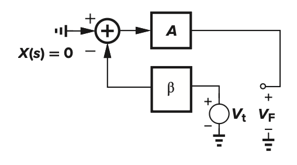
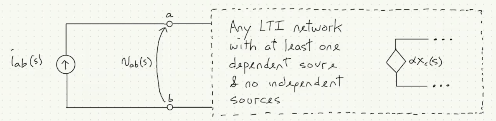

# Thevenin & Norton Theorems

| Feature | Thevenin Theorem | Norton Theorem |
| :--- | :--- | :--- |
| **Equivalent** | Linear network $\equiv$ $V_{th}$ (series) $R_{th}$ | Linear network $\equiv$ $I_N$ (parallel) $R_N$ |
| **Source Value** | $V_{th} = V_{oc}$ (Open-circuit voltage at A-B) | $I_N = I_{sc}$ (Short-circuit current through A-B) |
| **Resistance** | $R_{th}$ at A-B (V $\to$ short, I $\to$ open) | $R_N$ at A-B (V $\to$ short, I $\to$ open) |
| **Dep. Sources** | $R_{th} = V_{oc} / I_{sc}$ or use a test source | $R_N = V_{oc} / I_{sc}$ or use a test source |
| **Relationship** | $V_{th} = I_N R_{th}$ | $I_N = V_{th} / R_{th}$ |

# Blackman's Impedance Rule

## Loop Gain Calculation

> Insert a Test source at a break point of the loop, $-\dfrac{V_F}{V_{i}}$ thus is the loop gain $AF$ since feedback is default to be negative

## LTI Circuit With a at least reference source and a independent source input ***

> $i_{ab}$ is the **test current source** applied to the network

> Replace dependent source with an independent source $x_x$

$$
\begin{equation}
\begin{aligned}
V_{in} &= A I_{in} + Bx_x \\
x_c &= CI_{in} + Dx_x \\
\end{aligned}
\end{equation}
$$

> $T_{oc}, T_{sc}$ are defined as

$$
\begin{equation}
\begin{aligned}
T_{oc} &= \frac{- \alpha x_c}{x_x} |_{I_{in} = 0} = \frac{\alpha (BC-AD)}{A}  \\
T_{sc} &= \frac{- \alpha x_c}{x_x} |_{V_{in} = 0} = -\alpha D
\end{aligned}
\end{equation}
$$

> Blackman's Impedance Rule

$$
\begin{equation}
\begin{aligned}
Z_0 &= \frac{V_{in}}{I_{in}} |_{x_x = 0} = A \\
Z &= \frac{V_{in}}{I_{in}} = A + \frac{\alpha BD}{1 - \alpha D}  \\
&= Z_0 \frac{1 + T_{sc}}{1 + T_{oc}} 
\end{aligned}
\end{equation}
$$

# ZVTC

# Mason's Gain Formula

> Feedback $F$ is defined that if it is a negative feedback, it must be $-F$

| Symbol | Description |
| :--- | :--- |
| $r$ | Input |
| $x_i$ | Node Voltage $i$ |
| $g_i$ | Coefficient for circuit equation |
| $\Delta_i$ | $\Delta$ when other feedback paths which connect to it are deleted |
| $G_i$ | Forward Gain of path $i$ |
| $\Delta$ | $1 - \sum L_a + \sum L_a L_b - \ldots$ |
| $L_a$ | Every **loop gain** |
| $L_a L_b$ | Every 2 **unconnected** loop gains |

$$
\begin{equation}
\begin{aligned}
x_j &= \sum_{i=1}^{n} g_i x_i + r \\
(I - G) X &= R \\
x_{out} &= \frac{\det(A_k)}{\det(I-T)}  \\
&= \frac{ \sum_{i=1}^{n} G_i \Delta_i }{\Delta }
\end{aligned}
\end{equation}
$$

# Asymptotic Gain Relations (AGR)

> Construct an LTI circuit with at least one dependent source. Designate $\alpha x_c$ as the reference source and replace it with an independent source $x_x$, with no other independent sources present.

- We can come up with a equation group for this circuitt

$$
\begin{equation}
\begin{aligned}
\begin{bmatrix} x_{out} \\ x_c \end{bmatrix} &= \begin{bmatrix} A & B \\ C & D \end{bmatrix} \begin{bmatrix} x_{in} \\ x_x \end{bmatrix}
\end{aligned}
\end{equation}
$$

- Get the gain and Loop Gain, which is formed by a **open loop** of $x_x \rightarrow{} Circuit \rightarrow{} x_c \xrightarrow{Not \ Connected} \alpha x_c$

$$
\begin{equation}
\begin{aligned}
G &= \frac{x_{out}}{x_{in}}  = A + \frac{\alpha BC}{1 - \alpha D} \\
G_0 &= \underset{\alpha \xrightarrow{} 0}{lim}  G = A \\
G_\infty &= \underset{\alpha \xrightarrow{} \infty}{lim}  G = A - \frac{BC}{D} \\
T &= \frac{-\alpha x_c}{x_x} |_{x_{in} = 0} = - \alpha D \\
\therefore G &= \frac{G_0 + G_{\infty} T}{1  +T} 
\end{aligned}
\end{equation}
$$

# Phase & Magnitude Margin

## Asymptotic Approximation

### Poles

$$
\begin{equation}
\begin{aligned}
H(s) &= \frac{1}{1 + s/\omega_p} \\
|H(s)| &= \frac{1}{\sqrt{1 + (\dfrac{\omega }{\omega_p})^2 }}  \\
20 \lg |H(s)| &= -10 \lg \big\{ 1 + (\frac{\omega }{\omega_p})^2  \big\} \\
&\approx  -10 \lg (\frac{\omega }{\omega_p} )^2 \\
&= -20 \lg (\frac{\omega }{\omega_p} ) \\
\therefore 20 \log |H(10s)| - 20 \log |H(s)|  &= -20 dB
\end{aligned}
\end{equation}
$$

### Zeros

$$
\begin{equation}
\begin{aligned}
H(s) &= 1 + s/\omega_z \\
|H(s)| &= \sqrt{1 + (\dfrac{\omega }{\omega_z})^2 }  \\
20 \lg |H(s)| &= 10 \lg \big\{ 1 + (\frac{\omega }{\omega_z})^2  \big\} \\
&\approx  10 \lg (\frac{\omega }{\omega_z} )^2 \\
&= 20 \lg (\frac{\omega }{\omega_z} ) \\
\therefore 20 \log |H(10s)| - 20 \log |H(s)|  &= 20 dB
\end{aligned}
\end{equation}
$$

## Phase - Frequency Log Diagram

> Phase has maximum derivative ($-45^o$) when crossing poles, one pole leads to $-90^o$ decrease of phase; zeros are the opposite

| Symbol | Name | Description |
| :--- | :--- | :--- |
| $\omega_{gc}$ | Gain crossover Frequency | Frequency when Gain = 1 |
| $\omega_{pc}$ | Phase crossover Frequency | When Phase = $-180^\circ$ |
| $\omega_c$ | Cutoff Frequency | When $H=\dfrac{1}{\sqrt{2}}$, so power is $H^2 = half$ |

## Gain & Phase Margin

$$
\begin{equation}
\begin{aligned}
H(j \omega) &= \frac{\prod_{i=0}^{m} (1 + j \omega/\omega_{zi})}{\prod_{j=0}^{n} (1 + j \omega/\omega _{pj}) } \\
GM &= -20 \log |H(j \omega_{pc})| \\
PM &= \angle H(j \omega_{gc}) - (-180^\circ) \\
&= \angle H(j \omega_{gc}) + 180^\circ \\
&= \sum_{i=0}^{m} \angle z_i  - \sum_{j=0}^{n} \angle p_j + 180^\circ \\
&= \sum_{i=0}^{m} \tan^{-1}\frac{\omega}{\omega_{zi}} - \sum_{j=0}^{n} \tan^{-1}\frac{\omega}{\omega_{pi}}  + 180^\circ
\end{aligned}
\end{equation}
$$

# Stability

$$
\begin{equation}
\begin{aligned}
A(s) &= \frac{a(s)}{ 1 + a(s) f(s)} = \frac{a(s)}{1 + T(s)} 
\end{aligned}
\end{equation}
$$

> To be stable

- Poles are all in LHP

- For Nyquist Plot, net number of encirclement across (-1,0) equals to number of RHP poles of $T(S)$

> Ringing: Defined as oscillation that dies overtime

- System that rings are called marginally unstable

- Number of zeros - Number of poles = Number of clockwise encirclement

> Compensation: Adding or Adjusting components in a feedback system to improve stability margin

Decrease $T_0$ can also decrease $\omega_c$

# Important things

- Intrinsic Gain $g_m r_{ds} \gg 1$ **usually**

- 
