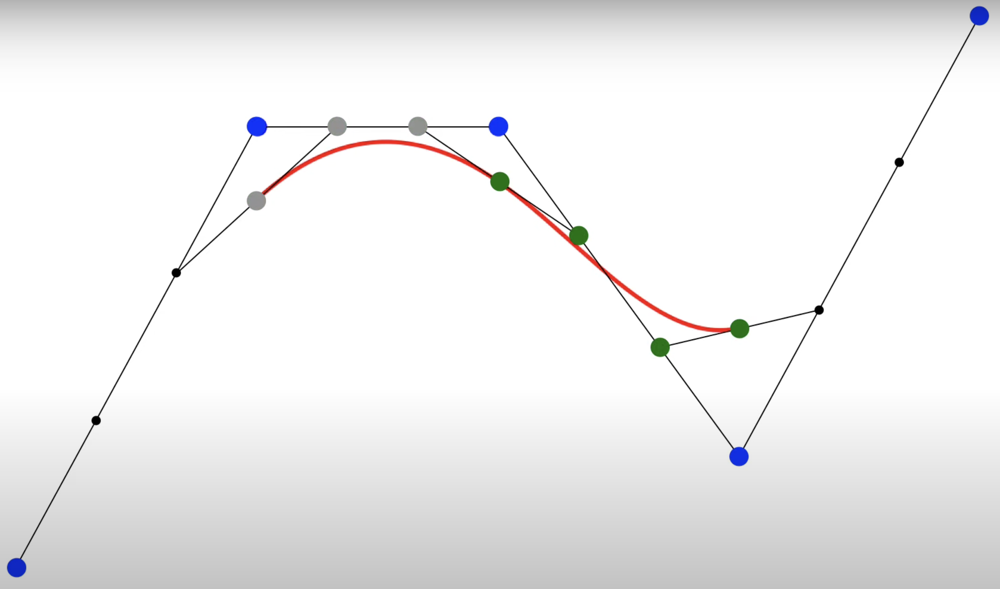

# Hutchinson Trace Estimator

## Deduction

 $v \in \mathbb{R}^D$，其分量 $v_i$ 是独立同分布 (i.i.d.) 的随机变量，且满足以下条件：
1. 均值为零：$E[v_i] = 0$
2. 方差为一：$E[v_i^2] = 1$

常用的随机变量包括：

* **Rademacher 分布**: $v_i \in \{-1, 1\}$，每个值以 $\dfrac{1}{2}$ 的概率出现。

* **标准正态分布**: $v_i \sim N(0, 1)$。

现在，我们考虑二次型 $v^T A v$ 的期望:

$$
\begin{equation}
\begin{aligned}
E[v^T A v] &= E \Big[  \sum_{i=1}^D \sum_{j=1}^D v_i A_{ij} v_j \Big] \\
&= \sum_{i=1}^{D} \sum_{j=1}^{D} A_{ij} E[v_i v_j] \\
E[v_i v_j] &= \begin{cases}
1 & i = j \\
0 & j \neq j
\end{cases} \\
\therefore  
E[v^T A v] &= \sum_{i=1}^D (A_{ii} \cdot E[v_i^2]) + \sum_{i \neq j} (A_{ij} \cdot E[v_i v_j]) \\
&= \sum_{i=1}^D (A_{ii} \cdot 1) + \sum_{i \neq j} (A_{ij} \cdot 0) \\
&= \sum_{i=1}^D A_{ii}
\end{aligned}
\end{equation}
$$

这正是矩阵 $A$ 的迹的定义：

$$
\begin{equation}
\begin{aligned}
E[v^T A v] &= \text{Tr}(A)
\end{aligned}
\end{equation}
$$

为了降低估计的方差，通常会使用 $M$ 个独立的随机向量 $v^{(1)}, v^{(2)}, \ldots, v^{(M)}$ 进行多次采样，并取其平均值作为迹的估计：

$$
\begin{equation}
\begin{aligned}
Tr(A) \approx \frac{1}{M} \sum_{k=1}^M (v^{(k)})^T A v^{(k)}
\end{aligned}
\end{equation}
$$

## Insights

1. **迹的几何意义**: 矩阵的**迹**可以看作是特征值的和，或者在坐标变换下，度量空间体积变化的缩放因子（通过行列式体现），亦或是矩阵对角线元素的总和，它反映了矩阵的“尺度”或“活跃度”。

2. **为什么 $v^T A v$ 可以估计迹？**

* **随机探测**: 想象随机向量 $v$ 像一个随机的“探针”。当我们计算 $v^T A v$ 时，我们实际上是在用这个随机探针去“探测”矩阵 $A$。

* **对角线权重**: 考虑 $v^T A v = \sum_{i,j} v_i A_{ij} v_j$。
    * 对于对角线元素 $A_{ii}$，对应的项是 $v_i^2 A_{ii}$。由于 $E[v_i^2] = 1$，这些项的期望值就是 $A_{ii}$。
    * 对于非对角线元素 $A_{ij}$ ($i \neq j$)，对应的项是 $v_i A_{ij} v_j$。由于 $v_i$ 和 $v_j$ 是独立的且均值为零，所以 $E[v_i A_{ij} v_j] = A_{ij} E[v_i] E[v_j] = A_{ij} \cdot 0 \cdot 0 = 0$。

* **“噪声”平均**: 尽管单个 $v^T A v$ 的值可能与真实的迹相差很大（因为 $v_i$ 是随机的），但是当 $M$ 足够大时，通过平均多个独立的 $v^T A v$ 值，非对角线项的随机波动会相互抵消（因为它们的期望为零），而对角线项的贡献则会累积起来并收敛到真实的迹。这就像在噪声中寻找信号，通过多次测量并平均，噪声（非对角线贡献的随机波动）会被抑制，而信号（对角线贡献）会显现出来。

3. **计算优势**:

- [ ] Hutchinson Trace Estimator 只需要**矩阵-向量乘积**操作，而无需显式构建整个矩阵 $A$，因此在处理大型矩阵时具有显著的计算优势和内存优势。

# Interpolation & Spline

## 基本概念

| 概念 (Concept) | 定义 (Definition) |
|---|---|
| Knots (节点) | 两条曲线的交点，若斜率不同，则称之为Knot。 |
| 曲率 (Curvature)| $\kappa = \dfrac{\det(P', P'')}{ \|P'\|^3}$, 一二阶导分别对参数$t$的缩放产生1次方、2次方的进一步缩放，因此分母要除以3阶导以抵消这种影响 |

## Cubic Interpolation

| 阶数 (Order) | 作用 (Effect) |
|---|---|
| 0次项 | 高度 |
| 1次项 | 斜率 |
| 2次项 | 曲率 (Curvature) |
| 3次项 | 形成波浪 |
| **要求** | 至少需要3次项 |
| **求解方式** | 通过4个点或者2个点向量(包含坐标点及其斜率)即可求解 |

### Catmull-Rom Spline

*   **描述 (Definition)**: 2条曲线，2个起点 和 1个交点坐标，交点处向量和起点连线向量同向

*  插值公式

$$
\begin{equation}
\begin{aligned}
C(t) = \frac{1}{2} 
\begin{bmatrix} 
t^3 & t^2 & t & 1 
\end{bmatrix} 
\begin{bmatrix} 
-1 & 3 & -3 & 1 \\ 
2 & -5 & 4 & -1 \\ 
-1 & 0 & 1 & 0 \\ 
0 & 2 & 0 & 0 
\end{bmatrix} 
\begin{bmatrix} 
P_0 \\ P_1 \\ P_2 \\ P_3 
\end{bmatrix}
\end{aligned}
\end{equation}
$$

### Natural Cubic Interpolation

- **描述 (Definition)**: 2条曲线，2个起点 和 1个交点坐标，交点处一二阶导数都相同，起点处二阶导都为0。该方法通过最小化 $\int_{}^{} (\frac{d^2f}{dt^2})^2 dt$ 来确定样条曲线
- 插值公式

- 对于区间 $[x_i, x_{i+1}]$，令 $t = \frac{x-x_i}{h_i}$ ($h_i = x_{i+1}-x_i$)：

$$
\begin{equation}
\begin{aligned}
S_i(t) &= \begin{bmatrix} (1-t) & t & \frac{h_i^2}{6}t(1-t)(2-t) & \frac{h_i^2}{6}t(t-1)(t+1) \end{bmatrix} \begin{bmatrix} y_i \\ y_{i+1} \\ M_i \\ M_{i+1} \end{bmatrix}
\end{aligned}
\end{equation}
$$

*   **优点 (Advantages)**: 满足C2连续性

*   **缺点 (Disadvantages)**: 需要先解一个三对角线性系统来确定所有 $M_i$

## Biezer Curve & B-Splines

### Biezer Curve

- 相比于 Natural Cubic Interpolation, 增加了起点处斜率为$\dfrac{1}{3} f'(x)$的**2个限制条件** 

- 这样插出来的样条总是能包在所有点内

1. Bernstein 公式(所有系数之和始终为1)

$$
\begin{equation}
\begin{aligned}
B(t) &= (1-t)^3 P_0 + 3(1-t)^2 t P_1 + 3(1-t) t^2 P_2 + t^3 P_3, t \in [0, 1]
\end{aligned}
\end{equation}
$$

2. de Castelja 算法

$$
\begin{equation}
\begin{aligned}
P_i^0(t) &= P_i \quad \text{for } i = 0, 1, \ldots, n \\
P_i^k(t) &= (1-t)P_i^{k-1}(t) + t P_{i+1}^{k-1}(t) \quad \text{for } k = 1, \ldots, n \text{ and } i = 0, \ldots, n-k \\
B(t) &= P_0^n(t)
\end{aligned}
\end{equation}
$$

$$
\begin{equation}
\begin{aligned}
P_0^1(t) &= (1-t)P_0 + t P_1 \\
P_1^1(t) &= (1-t)P_1 + t P_2 \\
P_2^1(t) &= (1-t)P_2 + t P_3 \\
\\
P_0^2(t) &= (1-t)P_0^1(t) + t P_1^1(t) \\
P_1^2(t) &= (1-t)P_1^1(t) + t P_2^1(t) \\
\\
B(t) &= P_0^3(t) = (1-t)P_0^2(t) + t P_1^2(t)
\end{aligned}
\end{equation}
$$

### B-Spline 

- 先三等分，再连接三等分点；再二等分                                                                    

- 然后对于图中所示灰绿点进行**Biezer**插值

