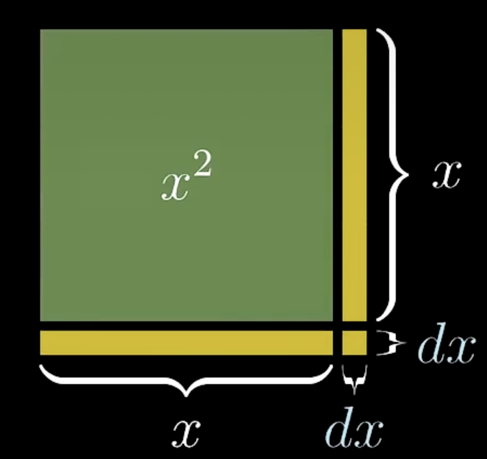
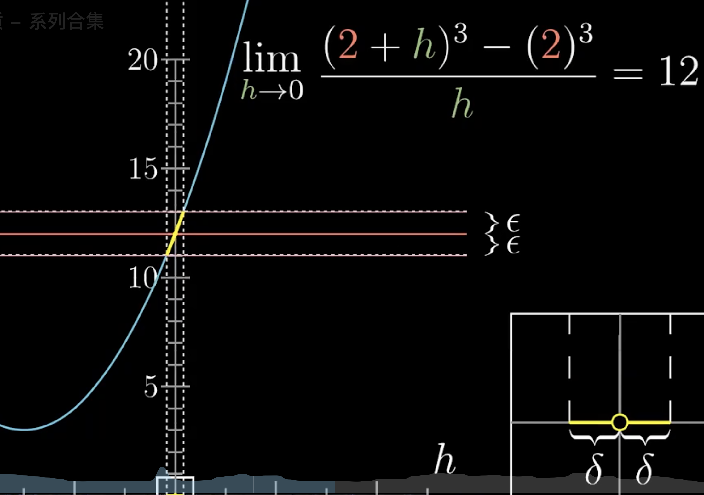

# Derivatives \& Limits

## Insights

- 用面积或者体积来解释涉及乘积的函数的导数会非常合适

- 

## Derivatives

### Definition

$$
\begin{equation}
\begin{aligned}
f'(x) &= \lim_{\Delta x \to 0} \frac{f(x+\Delta x) - f(x)}{\Delta x}
\end{aligned}
\end{equation}
$$

### Chain Rules

$$
\begin{equation}
\begin{aligned}
\frac{dy(x)}{dx} &= \frac{dy}{du} \cdot \frac{du}{dx} \
\frac{dz(x,y,t)}{dt} &= \frac{\partial z}{\partial x} \frac{dx}{dt} + \frac{\partial z}{\partial y} \frac{dy}{dt} \
\frac{\partial w}{\partial r} &= \frac{\partial w}{\partial x} \frac{\partial x}{\partial r} + \frac{\partial w}{\partial y} \frac{\partial y}{\partial r} \
\end{aligned}
\end{equation}
$$

## Limits

### Definition

$$
\begin{equation}
\begin{aligned}
\lim_{x \to c} f(x) &= L
\end{aligned}
\end{equation}
$$

if for every $\epsilon > 0$, there exists a $\delta > 0$ such that if $0 < |x - c| < \delta$, then $|f(x) - L| < \epsilon$.

### Lagrange Mean Value Theorem \& Cauchy Mean Value Theorem

- 前提: $f(x)$在$(a,b)$区间连续且可导

1. Lagrange

$$
\begin{equation}
\begin{aligned}
f'(c) = \frac{f(b) - f(a)}{b - a}
\end{aligned}
\end{equation}
$$

2. Cauchy

$$
\begin{equation}
\begin{aligned}
\frac{f'(c)}{g'(c)} = \frac{f(b) - f(a)}{g(b) - g(a)}
\end{aligned}
\end{equation}
$$

### L'Hopital's Law

Assume $\lim_{x \to c} f(x) = \lim_{x \to c} g(x) = 0$. Since $f$ and $g$ are differentiable near $c$, they are continuous near $c$. We can define $f(c) = 0$ and $g(c) = 0$. Thus, $f$ and $g$ are continuous on an interval containing $c$. 

Consider a point $x \neq c$ near $c$. By Cauchy's Mean Value Theorem on the interval between $c$ and $x$, there exists a point $\xi$ between $c$ and $x$ such that:

$$ 
\begin{equation}
\begin{aligned}
\frac{f(x) - f(c)}{g(x) - g(c)} = \frac{f'(\xi)}{g'(\xi)}
\end{aligned}
\end{equation}
$$

Since $f(c) = 0$ and $g(c) = 0$, this simplifies to:

$$ 
\begin{equation}
\begin{aligned}
\frac{f(x)}{g(x)} = \frac{f'(\xi)}{g'(\xi)}
\end{aligned}
\end{equation}
$$

As $x \to c$, the point $\xi$, which is between $c$ and $x$, must also approach $c$. Therefore,

$$ 
\begin{equation}
\begin{aligned}
\lim_{x \to c} \frac{f(x)}{g(x)} = \lim_{x \to c} \frac{f'(\xi)}{g'(\xi)} = \lim_{\xi \to c} \frac{f'(\xi)}{g'(\xi)}
\end{aligned}
\end{equation}
$$

This proves the case where the limit is of the form $0/0$. The case for $\pm \infty / \pm \infty$ can be proven using a similar approach or by rewriting the expression.

## Taylor's Series

### Deduction \& Definition

假设一个函数 $f(x)$ 可以在 $x=a$ 附近展开成一个幂级数形式：

$$
f(x) = c_0 + c_1(x-a) + c_2(x-a)^2 + c_3(x-a)^3 + \cdots + c_n(x-a)^n + \cdots
$$

$$
\begin{equation}
\begin{aligned}
f^{(n)}(x) &= n! c_n + (n+1)! c_{n+1}(x-a) + \cdots \\
f^{(n)}(a) &= n! c_n \\
c_n &= \frac{f^{(n)}(a)}{n!} \\
\therefore f(x) &= \sum_{n=0}^{\infty} \frac{f^{(n)}(a)}{n!}(x-a)^n
\end{aligned}
\end{equation}
$$

## ODE \& SDE

