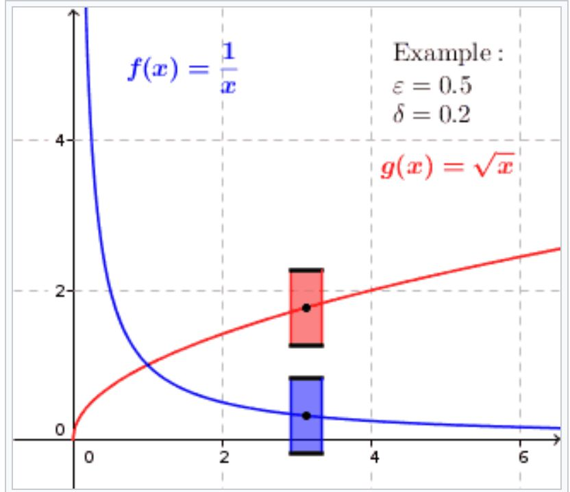
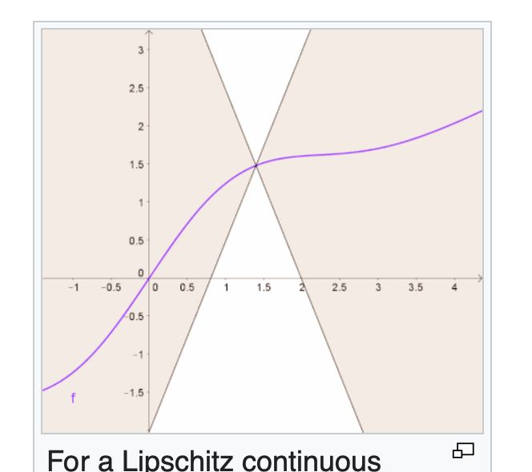

# Continuity

1. Continuity  

- $\underset{x \rightarrow c}{lim} f(x) = f(c)$  
      
2.  Uniform Continuity  

      
3.  Lipschitz Continuity  

- 满足 $\frac{|f(x_1 ) - f(x_2)|}{|x_1 - x_2|} \le K$ 的函数是 **Lipschitz continuous** 的
      
    
4.  Parametric Continuity  

- 满足$A^{(i)} (t_{end}) = B^{(i)}(t_{start}), i \in [0, n]$的两个函数是 %C^{(n)}$**continuous** 的  
      
5.  Geometric Continuity  
    
- $\exists g(t)$, 使得$A(t)$和(B(g(t))$是 $C^{(n)}$ continuous 的, 那么 $A(t) $和(B(t)$是geometric continuous的  

- **连接处的n阶导方向不变，大小可以变的Parametric Continuity**

# Continuity Equations

## 变量和解释

| Variable | Description         |
| -------- | ------------------- |
| t        | 时间        |
| x        | (高维)空间  |

- 单位时间单位面积内的变化量 = -密度关于时间的变化率

## Euler Form

$$
\begin{aligned}
\text{Total amount of quantity } M_V(t) &= \int_V \rho(x, t) \, dV \\
\text{Rate of change of total amount: } \frac{dM_V}{dt} &= \int_V \frac{\partial \rho}{\partial t} (x, t) \, dV \\
\text{Net outflow through boundary: } \oint_{\partial V} J(x, t) \cdot \mathbf{n} \, dS &= \int_V \text{div}(J(x, t)) \, dV  \\
\text{Conservation Law: } \frac{dM_V}{dt} &= - \oint_{\partial V} J(x, t) \cdot \mathbf{n} \, dS \\
\Rightarrow \int_V \frac{\partial \rho}{\partial t} (x, t) \, dV &= - \int_V \text{div}(J(x, t)) \, dV \\
\Rightarrow \int_V \left( \frac{\partial \rho}{\partial t} (x, t) + \text{div}(J(x, t)) \right) \, dV &= 0 \\
\frac{\partial \rho}{\partial t} (x, t) + \text{div}(J(x, t)) &= 0 \\
\frac{\partial \rho}{\partial t} (x, t) + \text{div}(\rho(x, t) v(x, t)) &= 0
\end{aligned}
$$

## Log Form

$$
\begin{equation}
\begin{aligned}
\frac{d \phi_t(x)}{dt} &= \pmb v[\phi_t(x)]  \\
\frac{\partial }{\partial  t} [ \log p_t(\phi_t(x))] \large|_{y = \phi_t(x)}\
&= \frac{1}{p_t(y)} \big[ \frac{dp_t(y)}{dt} + \frac{dp_t(y)}{dy} \frac{dy}{dt}  \big] \\
&= \frac{1}{p_t(y)}  \big[ - \nabla  p_t(y) \pmb v_t(y) - \nabla \pmb v_t(y) p_t(y) + \nabla  p_t(y) \pmb v_t(y) \big] \\
&= -\nabla \pmb v_t(y) \\
\frac{\partial }{\partial t} [ \log p_t(\phi_t(x))] &= -\nabla \pmb v_t(\phi_t(x))
\end{aligned}
\end{equation}
$$

