# Combinational Logic Circuits

## TriState Buffer

- **Enable**的时候是正常buffer, **Not Enable**的时候输出为$Z$

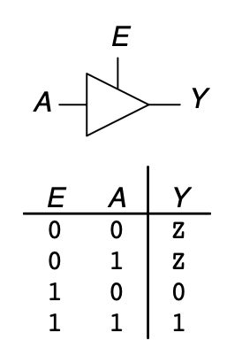

## Multiplexer

### 2-1 MUX

- RTL电路 和 Truth Table

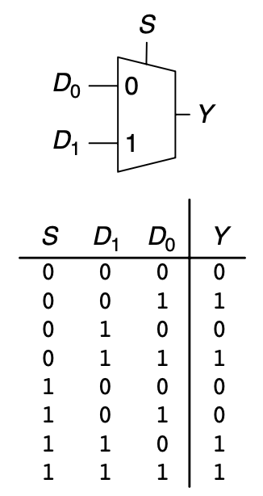

- 门级电路

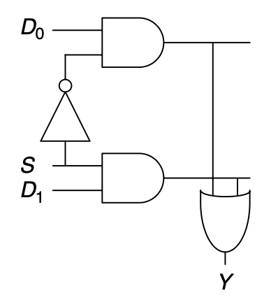

- 用TriState Buffer实现MUX

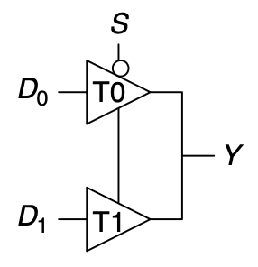

# Latch & Flip-Flops

# Adder

- 所有的$t_{FA}$指的都是**Single-Bit FA**的时间

## Simple Adders

1. Half Adder

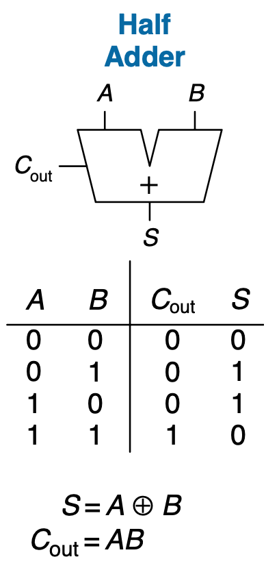

Ripple Carry Adder (RCA)

2. Full Adder

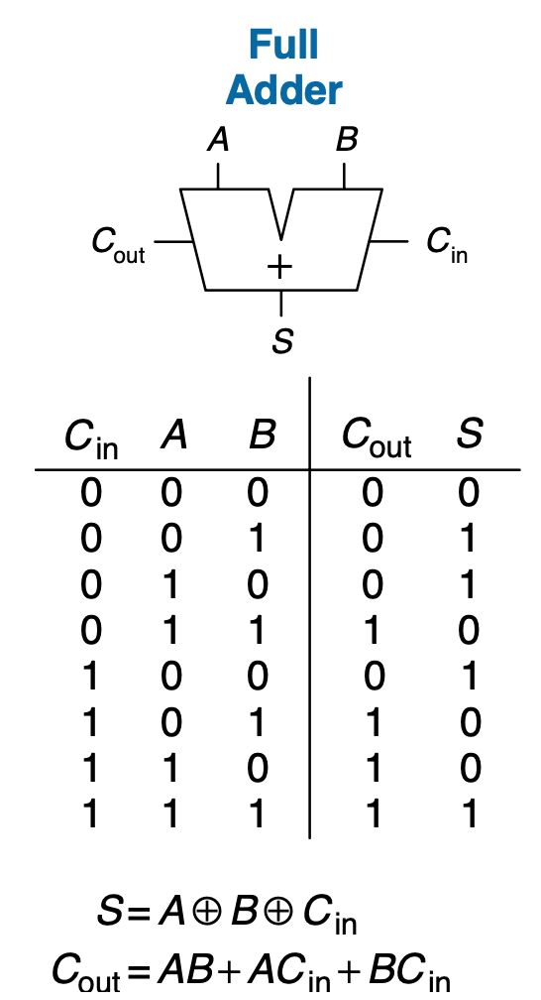

3. Ripple Carry Adder

$$
\begin{equation}
\begin{aligned}
t_{ripple} &= t_{FA}
\end{aligned}
\end{equation}
$$

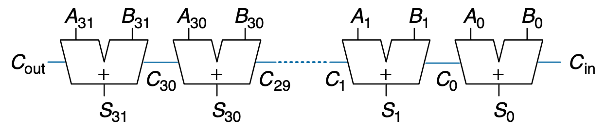

## Carry-Propogate Adder (CPA)

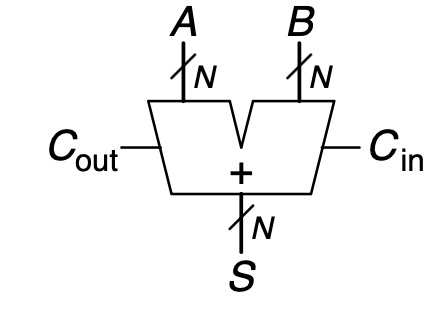

### Carry-Lookahead Adder (CLA)

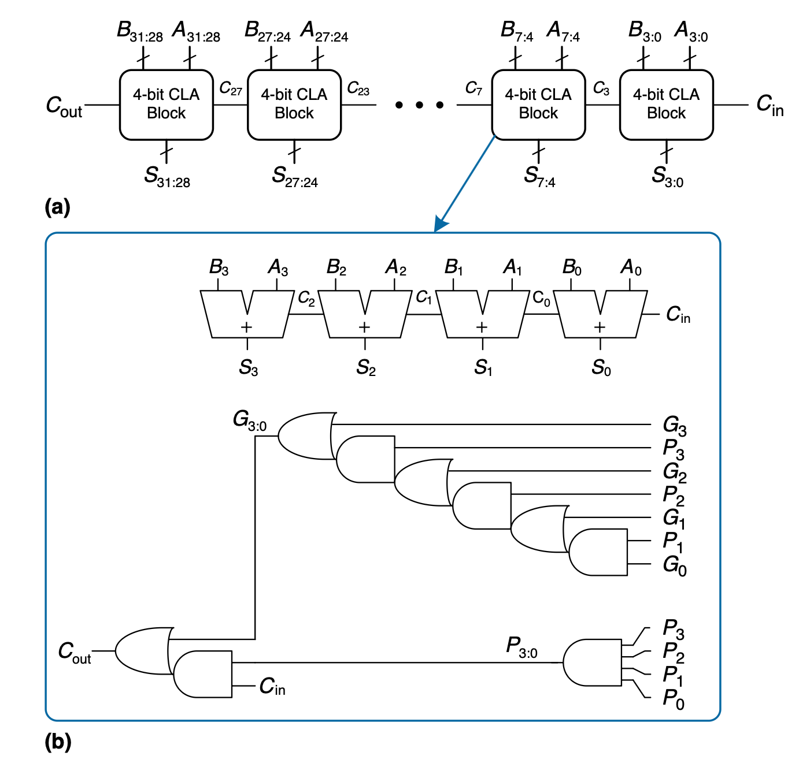

1. 定义

- **Propogate**: 有$C_{in}$情况输出$C_{out}$

- **Generate**: 不管有没有$C_{in}$都输出$C_{out}$

2. 单位加法的进位计算

$$
\begin{equation}
\begin{aligned}
P_i &= A_i + B_i \\
G_i &= A_i B_i \\
C_i &= G_i + P_i C_{i-1}
\end{aligned}
\end{equation}
$$

3. Block加法的进位计算(**4-bits为例**)

- 此时的$C_{in}$ 和 $C_{out}$是针对块而言的，**中间的不算**

$$
\begin{equation}
\begin{aligned}
P_{3:0} &= P_3P_2P_1P_0 \\
G_{3:0} &= G_3 + P_3(G_2 + P_2 (G_1 + P_1 G_0)) \\
C_i &= G_{i:j} + P_{i:j} C_{j}
\end{aligned}
\end{equation}
$$

4. 总时间

- 先算完所有**块之间的进位**，再在**块内部算Sum**

$$
\begin{equation}
\begin{aligned}
t_{CLA} &= t_{pg} + t_{pg\_blocks} +  (\frac{N}{k} - 1) t_{Logic} + kt_{FA}
\end{aligned}
\end{equation}
$$

### Prefix Adder

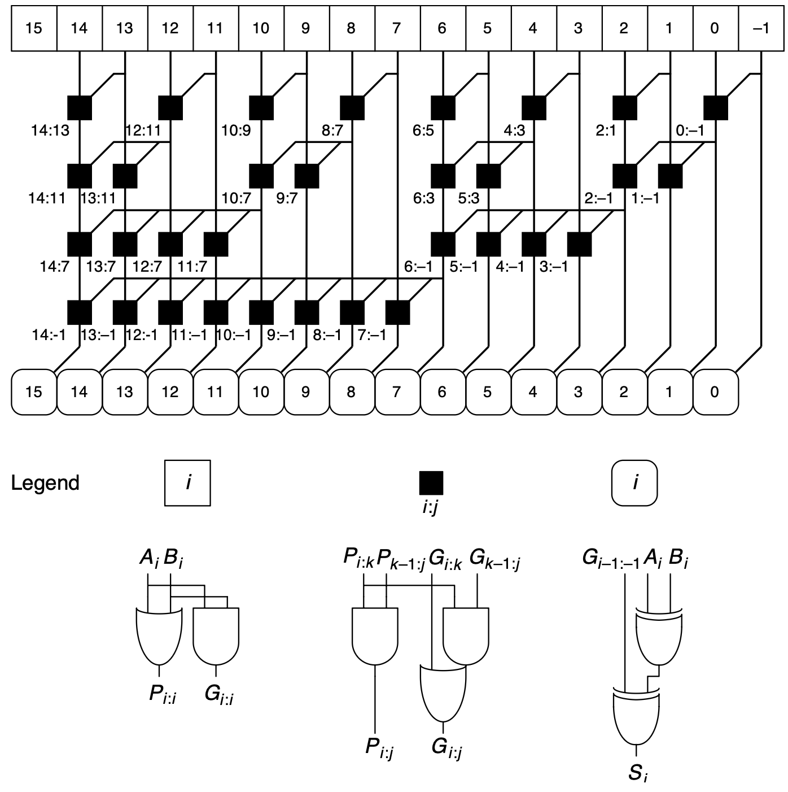

1. **核心: 加一个$-1$位，使得整个模块的$P_{in} = 0, P_{out}=0$; 这样利用$G$可以直接获得$C$**

2. 计算方式

$$
\begin{equation}
\begin{aligned}
P_{-1} &= 0 \\
G_{-1} &= C_{in} \\
C_{i-1} &= G_{i-1:-1} \\
S &= A \oplus B \oplus C_{i-1}
\end{aligned}
\end{equation}
$$

3. 总时间

$$
\begin{equation}
\begin{aligned}
t &= t_{pg} + t_{XOR} + \log_2 N + t_{black\_cell} \\
\end{aligned}
\end{equation}
$$

## Carry-Save Adder (For 3 Addings)

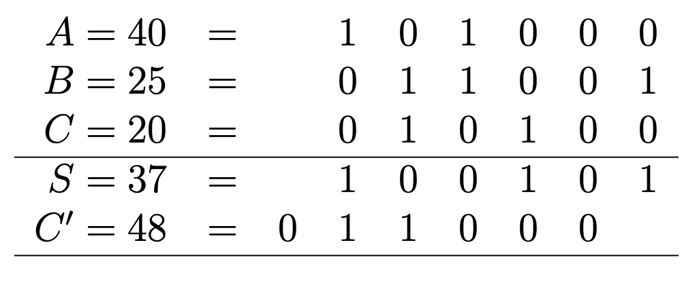

- 3个数加减变成2个数加减, 然后用普通Adder搞定

$$
\begin{equation}
\begin{aligned}
S_i &= A_i \oplus B_i \oplus C_i \\
C_{i+1} &= A_i B_i + A_i C_i + B_i C_i
\end{aligned}
\end{equation}
$$

# Divider
