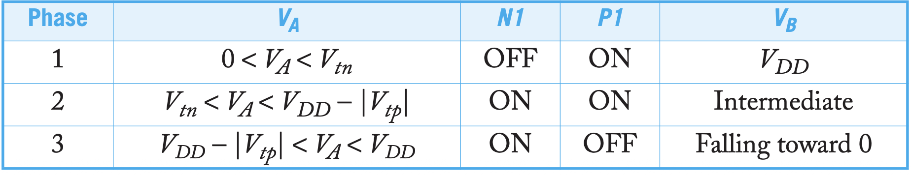
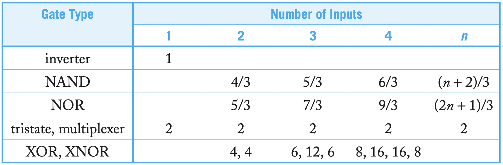
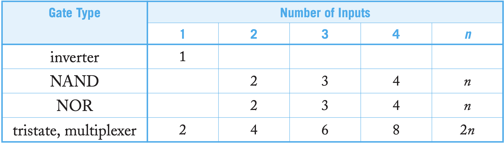

# Definitions of Delays

## Delays

| Parameter | Description | Notes |
|---|---|---|
| $t_{pdr}$ | propagate delay rise time | from input 0.5V to output 0.5V|
| $t_{pdf}$ | propagate delay fall time | from output 0.5V to input 0.5V|
| $t_{pd}$ | propagate delay time(**Max Time** from 0.5-0.5) |$t_{pd} = \dfrac{t_{pdr} + t_{pdf}}{2}$ |
| $t_{cd}$ | contamination delay time (**Min time** from 0.5 -0.5) |$t_{cd} = \dfrac{t_{cdr} + t_{cdf}}{2}$ |
| $t_r$ | rising time | between 0.2V - 0.8V|
| $t_f$ | falling time |between 0.8V - 0.2V  |
| $t_{rf}$ | Edge Rate | $t_{rf} = \dfrac{t_r + t_f}{2}$ |

## Transient Response

> Inverter Capacitance Simplification

- Take $X_2$ as if it is in its **saturation region**. In this case, **we don't consider $C_{gd}$**

$$
\begin{equation}
\begin{aligned}
\text{Phase I}&: V_B = V_{DD} \\
\text{Phase II} &: \frac{dV_B}{dt} = \frac{I_{dsp1} - I_{dsn1}}{C_{out}}  \\
\text{Phase III} &: \frac{dV_B}{dt}  = \frac{-I_{dsn1}}{C_{out}} 
\end{aligned}
\end{equation}
$$

## RC Delay Model

### Models

| Concept | Description |
|---|---|
| Capacitances connecting to Voltage Sources or GND | are not counted as switching capacitance (ignored in analysis) |
| PMOS takes holes as main carrier | which yields a higher resistance, denote as $2R$ |

- 此处串联NMOS采用**shared diffusion**

### Elmore Delay & Normalized Delay

$$
\begin{equation}
\begin{aligned}
\tau &= \sum_{i}^{} R_{is} C_i \\
d &= \frac{t_{pd}}{\tau}  \\
\tau &= 3RC
\end{aligned}
\end{equation}
$$

| Concept | Description |
|---|---|
| Normalized Delay | caculated relative to a unit inverter |
| FO-h inverter | $d = h + 1$ |
| Elmore delay | used in RC Trees with no Loops, starting from voltage source to each branch and node |

# Logical Efforts

## Linear Delay Model

$$
\begin{equation}
\begin{aligned}
d &= f (\text{effort}) + p(\text{parasitic} ) \\
&= g(\text{logical effort} ) h(\text{Electrical effort} ) + p
\end{aligned}
\end{equation}
$$

| Parameter | Description |
|---|---|
| $d$ | Normalized delay of a gate |
| $g$ | $C_{in-gate} / C_{in-inverter}$, in which the circuit and the inverter **delivers the same current (This is very important !!!)**, it describes the **complexity of the logic** |
|$h$|$C_{out}/C_{in}$. It is fan-out when **driver and loads are of same type**|
| $p$ | delay of the gate when it **drives zero load**, roughly estimated by $C_{out-diff}/C_{inv}$, in which the circuit and the inverter **delivers the same current**. Or by **Elmore Delay** to be more accurate|

## Common LG, PG

## Path Delay

### Path Efforts

| Parameter | Description | Formula/Notes |
|---|---|---|
| $F$ | Path Efforts | $F = \sum_{i}^{} f_i = \sum_{i}^{} g_i h_i = GBH$ |
| $G$ | Path Logical Efforts | $G = \prod_{i}^{} g_i$ |
| $H$ | Path Electrical Efforts | $H = \dfrac{C_{out-path}}{C_{in-path}}$ (Uncommon: $\sum_{i}^{} h_i$) |
| $B$ | Path Branching Efforts | $B = \sum_{i}^{} b_i, b = \dfrac{C_{in-path}}{C_{in-path} + C_{off-path}}$ |

### Path Effort Delay

$$
\begin{equation}
\begin{aligned}
D_F &= \sum_{i}^{} d_i \\
&= D_F + P \\
&= \sum_{i}^{} f_i + P \\
f_i &= g_ih_i \\
P &= \sum_{i}^{} p_i
\end{aligned}
\end{equation}
$$

### Minimum Delay

- Delay is minimumed when **each stage bears same efforts**

$$
\begin{equation}
\begin{aligned}
f_i &= F^{1/N} \\
D &= NF^{1/N} + P \\
C_{in \ i} &= \frac{C_{out \ i} \times g_i }{\hat{f} } 
\end{aligned}
\end{equation}
$$

# Others

## Noise Margin

$$
\begin{equation}
\begin{aligned}
NM_H &= V_{OH,min} - V_{IH,min} \\
NM_L &= V_{OL,min} - V_{IL,min} \\
NM &= \text{min} \Big\{ NM_H, NM_L \Big\}
\end{aligned}
\end{equation}
$$

## Important Concepts

| Name | Description |
|---|---|
| SPICE | Simulation Program with Integrated Circuits Emphasize Model|
| Slack | $\text{Slack} = \text{Arival Time} - \text{Actual Time}$ |
| Serial Transistor has less resitance than linear | $V_{ds}$ **is smaller**, and both are **less velocity saturated** |
