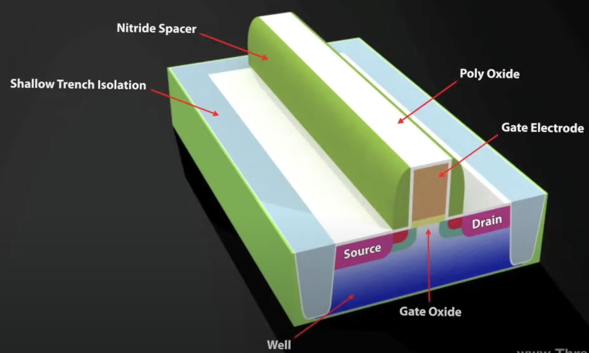
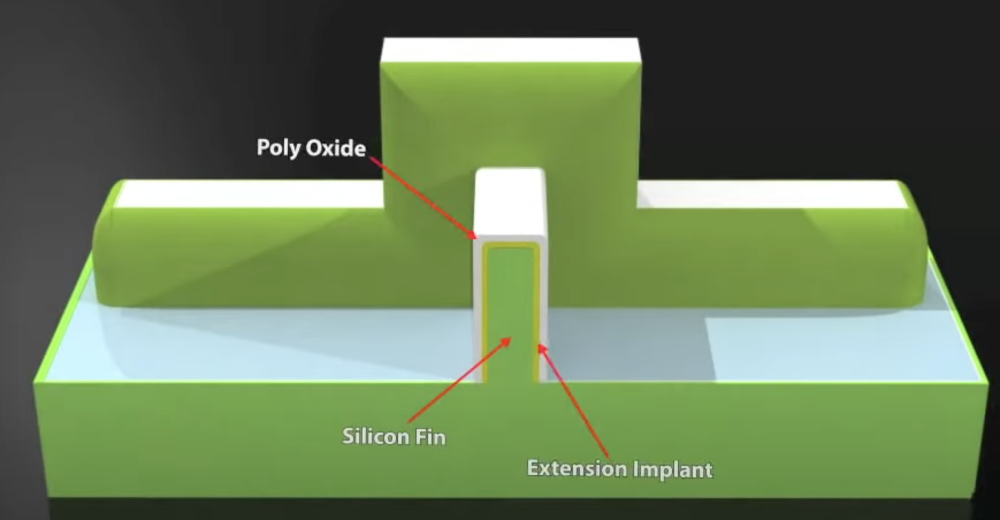
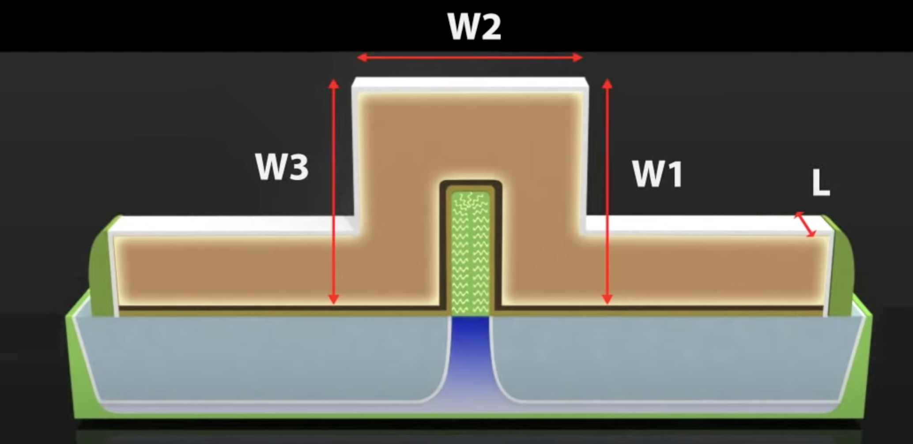

# CMOS (Metal-Oxide-Semiconductor)

## Structure

| Feature | Nitride Spacer | Shallow Trench Isolation (STI) | Poly Oxide |
|---|---|---|---|
| Main Function | Sidewall mask, defines LDD | Electrical isolation of devices | Interlayer dielectric (in floating-gate memory) |
| Main Material | Si$_{3}$N$_{4}$ | SiO$_{2}$ | SiO$_{2}$ |
| Location | Gate sidewall | In deep trenches on silicon substrate | Between or above polysilicon layers |
| Process Key | Anisotropic etching | Trenching, filling, CMP | Oxidation or deposition |

## Why does NMOS has higher conductivity compared with PMOS

NMOS (N-type Metal-Oxide-Semiconductor) transistors have higher conductivity compared to PMOS (P-type Metal-Oxide-Semiconductor) transistors primarily due to the difference in carrier mobility.

- **Carrier Type**: NMOS transistors use electrons as charge carriers, while PMOS transistors use holes.

- **Carrier Mobility**: Electrons in silicon have higher mobility than holes.

- **Impact on Current**: Since current is directly proportional to carrier mobility (I = nqµEA, where n is carrier concentration, q is charge, µ is mobility, E is electric field, and A is cross-sectional area), higher electron mobility in NMOS devices leads to a larger current for a given applied voltage and device geometry. This translates to higher conductivity.

2. Source and Drain are **identical**

# New Transistors

## FinFET

- $L \downarrow \xrightarrow{} R \uparrow$

- To enhance the **Gate Control over the channel** on voltage, we have **FinFET**

### Structure

1. FinFET

- 2 sides of the gate are independent gates, **exerting different voltages**, which adjusts $V_t$ dynamicly

2. Fin

3. FinFET-Width

## GAAFET

