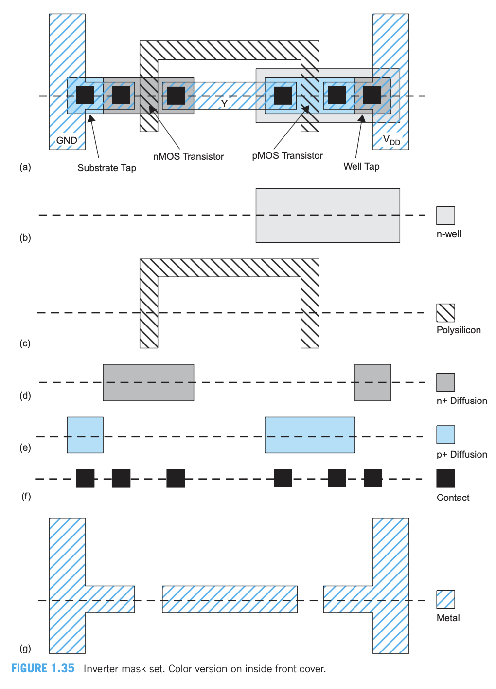
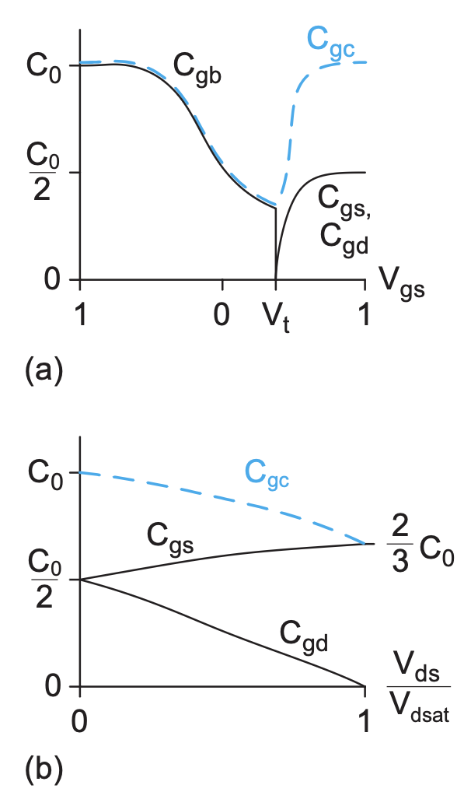
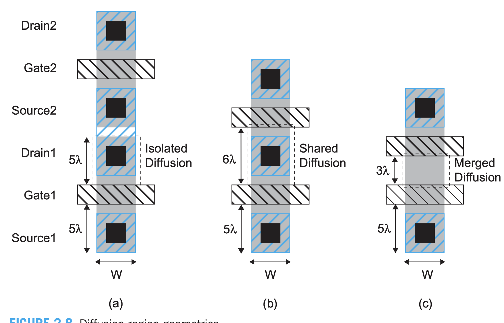
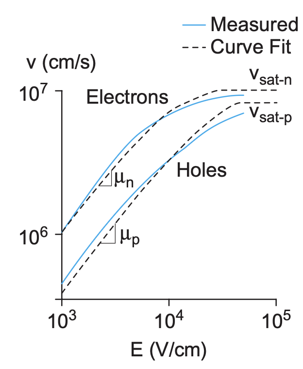

# CMOS (Complementary Metal-Oxide-Semiconductor)

## Structure

### 3D View of a **NMOS**

### Top View & Cross-Section of Inverter

## Long-Channel Model

### Current

1. Inference of Current Formula

$$
\begin{equation}
\begin{aligned}
Q_{channel} &= C_g(V_g - V_{th}) \\
&= k_0 \epsilon_0 \frac{WL}{t_{ox}}  (\frac{V_{gs} + V_{gd}}{2}- V_{th} ) \\
&= \epsilon_{ox} \frac{WL}{t_{ox}} (V_{gs} - \frac{V_{ds}}{2} - V_{th} ) \\
&= C_{ox} (V_{gs} - \frac{V_{ds}}{2} - V_{th} ) \\
v &= \mu E = \mu \frac{V_{ds}}{L}  \\
I_{ds} &= \frac{Q_{channel}}{t}  \\
&= \frac{C_{ox} (V_{gs} - \dfrac{V_{ds}}{2} - V_{th})}{L/v} \\
&= \beta  V_{ds} (V_{GT} - \frac{V_{ds}}{2} ) \\
\beta &= \mu C_{ox} \frac{W}{L} \\
V_{GT} &= V_{gs} - V_{th}
\end{aligned}
\end{equation}
$$

2. Current Formula

$$
\begin{equation}
\begin{aligned}
I_{ds} &=
\begin{cases}
0 & V_{gs}<V_t \quad \text{Cutoff} \\
I_{dsat}\dfrac{V_{ds}}{V_{dsat}} = \beta(V_{GT} - \dfrac{V_{ds}}{2}) V_{ds} & V_{ds}<V_{dsat} \quad \text{Linear} \\
I_{dsat} = \dfrac{\beta}{2} V_{GT}^2  & V_{ds}>V_{dsat} \quad \text{Saturation}
\end{cases} \\
V_{dsat} &= V_{gs} - V_{th}
\end{aligned}
\end{equation}
$$

### Operation Regions

## Gate Capacitance Model

> It **significantly overestimates** the capacitance

$$
\begin{equation}
\begin{aligned}
C_g &= C_{gb} + C_{gd} + C_{gs} \\
&\approx C_0 + 2 C_{gol}W
\end{aligned}
\end{equation}
$$

## Diffusion Capacitance Model

> Diffusion Capacitance is formed by the depletion region between substrate and source/drain, which is also called parasitic capacitance, denoted as $C_{sb}, C_{db}$

$$
\begin{equation}
\begin{aligned}
C_{sb} &= WD \times C_{jbs} + 2(W+D) C_{jbsw} \\
C_{jbs} &= C_J (1 + \frac{V_{db}}{\Phi_0} )^{M_J} \\
\Phi_0 &= v_T\frac{2 \ln (N_A N_D)}{n_i^2}  \\
v_T &= \frac{kT}{q} 
\end{aligned}
\end{equation}
$$

| Concept                                       | Description |
| :-------------------------------------------- | :------------------------------------------------------------------------------------------------------------------------- |
| Side wall & Side wall abuts gate              | Have different $C_J, M_J, \Phi$                                                                                            |
| $C_{db}$                                      | Has the same form as $C_{sb}$ (referring to the formula above)                                                             |
| Rough estimation for capacitances             | $C_g \approx C_{db} \approx C_{sb} = 1 \text{ fF}/\mu m$                                                                   |

$$
\begin{equation}
\begin{aligned}
C_d &= \frac{dQ}{dV} \\
&\approx \tau \frac{dI}{dV} \\
&= \tau g_d
\end{aligned}
\end{equation}
$$

- Empirically, $C_{sb} \approx C_{db} \approx C_{g}$

## Non-Ideal I-V Characteristics

### Mobility Degradation & Velocity Saturation

| Phenomenon             | Description                                                                                                                                                                                               |
| :--------------------- | :-------------------------------------------------------------------------------------------------------------------------------------------------------------------------------------------------------- |
| Mobility Degradation   | When fields are very large, more carriers collide with $SiO_2$ because of quantum mechanics, reducing mobility.                                                                                             |
| Velocity Saturation    | When velocity is very high, more carriers hit silicon, reducing velocity.                                                                                                                                 |

#### Empirical Formula for **effective mobility**

$$
\begin{equation}
\begin{aligned}
\mu_{\mathrm{eff}}^n &= \frac{540 \dfrac{\mathrm{cm}^2}{\mathrm{V} \cdot \mathrm{s}}}{1 + \left(\dfrac{V_{gs} + V_t}{0.54 \dfrac{V}{\mathrm{nm}} t_{\mathrm{ox}}}\right)^{1.85}} \\
\mu_{\mathrm{eff}}^p &= \frac{185 \dfrac{\mathrm{cm}^2}{\mathrm{V} \cdot \mathrm{s}}}{1 + \left(\dfrac{\left|V_{gs}\right| + 1.5\left|V_t\right|}{0.338 \dfrac{V}{\mathrm{nm}} t_{\mathrm{ox}}}\right)}
\end{aligned}
\end{equation}
$$

#### velocity formulas

$$
\begin{equation}
\begin{aligned}
v &= \begin{cases}
\dfrac{\mu_{eff} E}{1 + \dfrac{E}{E_c} } & E \le E_c \\
v_{sat} & E \gt E_c 
\end{cases} \\
E_c &= \frac{2v_{sat}}{\mu_{eff}} 
\end{aligned}
\end{equation}
$$

#### New Corrected Formulas for Current

$$
\begin{equation}
\begin{aligned}
I_{ds} &= \begin{cases} \dfrac{\mu_{eff} \frac{W}{L} C_{ox} (V_{GT} - V_{ds}/2) V_{ds}}{1 + \dfrac{V_{ds}}{V_{sat}}} & V_{ds} < V_{sat} \quad \text{Linear} \\ 
C_{ox} W (V_{GT} - V_{dsat}) V_{sat} & V_{ds} > V_{dsat} \quad \text{Saturation} \end{cases} \\
I_{ds} &= \begin{cases} 0 & V_{gs} < V_t \quad \text{Cutoff} \\ I_{dsat} \frac{V_{ds}}{V_{dsat}} & V_{ds} < V_{dsat} \quad \text{Linear} \\ I_{dsat} & V_{ds} > V_{dsat} \quad \text{Saturation} \end{cases}
\end{aligned}
\end{equation}
$$

$$
\begin{equation}
\begin{aligned}
V_{dsat} &= \frac{V_{GT} V_C}{V_{GT} + V_C} \\
&= \frac{V_{GT} E_C L}{V_{GT} + E_C L} \\
I_{dsat} &= \begin{cases}
W C_{ox} V_{sat} \dfrac{V_{GT}^2}{V_{GT} + V_{sat}} & V_{ds} > V_c \\
W C_{ox} V_{sat} V_{GT} & V_{GT} \gg V_c \\
\end{cases}
\end{aligned}
\end{equation}
$$

- $\alpha$-Power Model is between this one and Long-Channel Model

$$
\begin{equation}
\begin{aligned}
I_{dsat} &= P_c \frac{\beta}{2} V_{GT}^\alpha \\
V_{dsat} &= P_v V_{GT}^{\alpha /2}
\end{aligned}
\end{equation}
$$

### Channel-Length Modulation

- It only happens in **saturaion region**

$$
\begin{equation}
\begin{aligned}
L_{eff} &= L - L_{shorten} \\
I_{ds} &= \frac{1}{2} \beta V_{GT}^2(1 + \frac{V_{ds}}{V_A} ) \\
V_A &\propto L
\end{aligned}
\end{equation}
$$

### Threshold Voltage Effects

#### Body Effects

$$
\begin{equation}
\begin{aligned}
V_t &= V_{t0} + \gamma (\sqrt{\phi_s + V_{sb}} - \sqrt{\phi_s}) \\
&=  V_{t0} + k_{\gamma} V_{sb} , V_{sb} \ \text{is very small} \\
k_{\gamma} &= \frac{\gamma}{2 \sqrt{\phi_s}} \\
\phi_s &= 2 v_T \frac{\ln N_A}{n_i} \\
\gamma &= \frac{\sqrt{2q \epsilon_{si} N_A}}{C_{ox}} 
\end{aligned}
\end{equation}
$$

#### Drain-Induced Barrier Lowering (DIBL)

$$
\begin{equation}
\begin{aligned}
V_t &= V_{t0} - \eta V_{ds}
\end{aligned}
\end{equation}
$$

| Phenomenon            | Description                                                                                       |
| :-------------------- | :------------------------------------------------------------------------------------------------ |
| Drain-Induced Barrier Lowering (DIBL) | $V_t = V_{t0} - \eta V_{ds}$                                                                      |
| Short-Channel Effect  | When $L$ is too small, depletion region of diffusion capacitance might **extend into the channel** |

### Leakage

#### Category

| Phenomenon             | Description                                                                                       |
| :--------------------- | :------------------------------------------------------------------------------------------------ |
| Subthreshold Conduction | $I_{ds-off}$ caused by thermal carrier movements                                                 |
| Gate Leakage           | Leakage caused by quantum tunneling when the oxide is too thin                                    |
| Junction Leakage       | Leakage between source/drain and body because of diffusion in p-n junction (reverse-biased diode leakage)                        |

#### Subthreshold Current

$$
\begin{equation}
\begin{aligned}
I_{ds} &= I_{ds0} e^{\dfrac{V_{GS} - V_{t0} + \eta V_{ds} -k_{\gamma} V_{sb}}{nV_T} } (1 - e^{-\dfrac{V_{ds}}{V_T} }) \\
&= I_{\text{off}} 10^{\dfrac{V_{gs} + \eta (V_{ds} - V_{dd}) - k_{\gamma} V_{sb}}{S}} \left( 1 - e^{\dfrac{-V_{ds}}{v_T}} \right) \\
I_{ds0} &= \beta V_T^2 e^{1.8} \\
S &= \big\{ \frac{d (\log_{10}(I_{ds}))}{dV_{gs}}  \big\}^{-1} = nV_T
\end{aligned}
\end{equation}
$$

- $I_{ds0}$ is the current at threshold 

- $I_{off}$ is the current when $V_{ds} = V_{DD}, V_{gs} = 0$

#### To be continued...

# FinFET

- As transistors get smaller, which is $L \downarrow \xrightarrow{} R \uparrow$. To enhance the **Gate Control over the channel** on voltage, we have **FinFET**

### Structure

1. FinFET

- 2 sides of the gate are independent gates, **exerting different voltages**, which adjusts $V_t$ dynamicly

2. Fin

3. FinFET-Width

## GAAFET

## Transistor Functions

### Gates

1. Basic Logic for constructing logic gates using CMOS

| Network | Transistor Type | Implemented Logic | Series Connection | Parallel Connection |
|---|---|---|---|---|
| Pull-Down Network (PDN) | NMOS | Function F | AND | OR |
| Pull-Up Network (PUN) | PMOS | Dual of PDN structure | OR | AND |

2. Gates

| Gate Type | Description |
|---|---|
| Pass Transistor / Transmission Gates | Allow signal passage when enabled, acting as a switch. Transmission gates use parallel NMOS and PMOS for better signal integrity (strong '0' and '1'). |
| Restoring Gate | Regenerates logic levels, driving output strongly to $V_{DD}$ or $GND$ to prevent signal degradation. |

# Diodes

## Shockley Diode

$$
\begin{equation}
\begin{aligned}
I = I_S (e^{\dfrac{V_D}{nV_T}} - 1)
\end{aligned}
\end{equation}
$$

| Symbol | Description |
|---|---|
| $n$ | Quality factor: 1 (ideal) - 2 |
| $V_T$ | Thermal Voltage ($V_T = \dfrac{kT}{q}$) |
| $V_D$ | Diode voltage |
            alterChoice = firstChoice;
