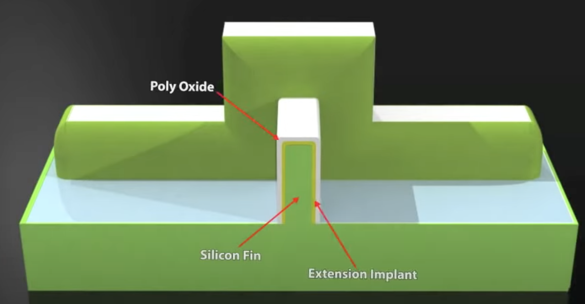

# FinFET

- As transistors get smaller, which is $L \downarrow \xrightarrow{} R \uparrow$. To enhance the **Gate Control over the channel** on voltage, we have **FinFET**

### Structure

1. FinFET

- 2 sides of the gate are independent gates, **exerting different voltages**, which adjusts $V_t$ dynamicly

2. Fin

3. FinFET-Width

## GAAFET

## Transistor Functions

### Gates

1. Basic Logic for constructing logic gates using CMOS

| Network | Transistor Type | Implemented Logic | Series Connection | Parallel Connection |
|---|---|---|---|---|
| Pull-Down Network (PDN) | NMOS | Function F | AND | OR |
| Pull-Up Network (PUN) | PMOS | Dual of PDN structure | OR | AND |

2. Gates

| Gate Type | Description |
|---|---|
| Pass Transistor / Transmission Gates | Allow signal passage when enabled, acting as a switch. Transmission gates use parallel NMOS and PMOS for better signal integrity (strong '0' and '1'). |
| Restoring Gate | Regenerates logic levels, driving output strongly to $V_{DD}$ or $GND$ to prevent signal degradation. |

# Diodes

## Shockley Diode

$$
\begin{equation}
\begin{aligned}
I = I_S (e^{\dfrac{V_D}{nV_T}} - 1)
\end{aligned}
\end{equation}
$$

| Symbol | Description |
|---|---|
| $n$ | Quality factor: 1 (ideal) - 2 |
| $V_T$ | Thermal Voltage ($V_T = \dfrac{kT}{q}$) |
| $V_D$ | Diode voltage |
