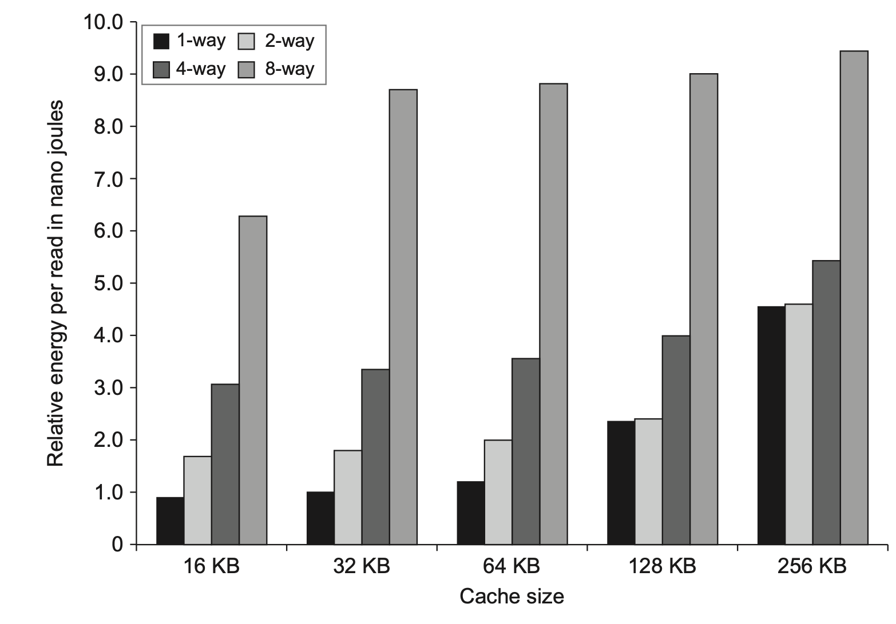
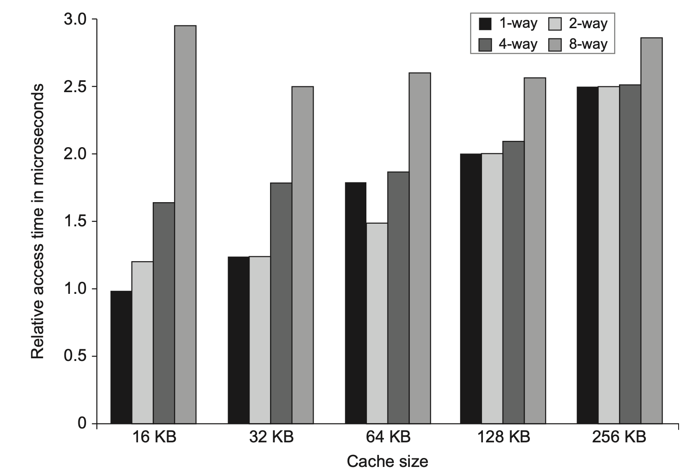
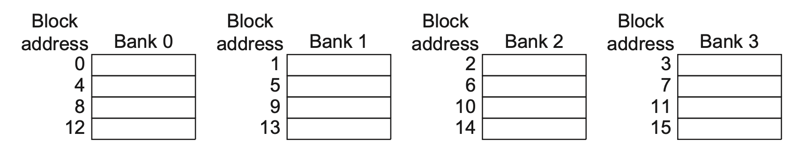
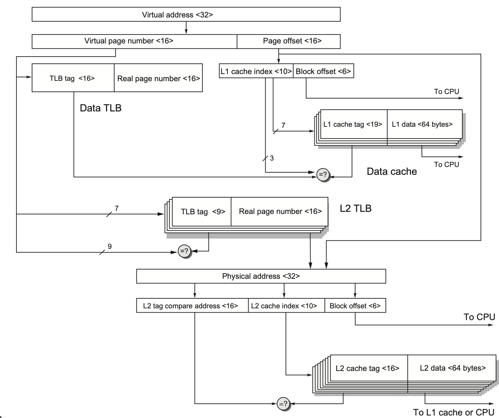

# Memory Hierarchy

## Memory Hierarchy for Devices

| Device | Memory Hierarchy |
|---|---|
| Phones | L1-L2-Disk |
| PC | L1-L2-L3-Disk |
| Server | L1-L2-L3-Disk/Flash |

- As caches get bigger, their **staic power** and **dynamic power** are huge!!

## Hierarchy Within Memories
 
- Word -> Blocks(Labelled by **tag**) -> Set -> Set Associative -> Cache

- How do CPU index a word: Tag(For Set) -> Index (For Block) -> Block Offset (**Wrong!!!!**)

|Concept | Definition|
|---|---|
|Fully Associative Set | 1 Set |
|Direct-Mapped Cache | Each set has only 1 block |
|n-way Associative Set | Each set has n blocks |
|TLB(Translation Lookaside Buffer)| Tranlate between virtual and physical memory, a part of MMU(Memoery Management Unit)|

## Efficiencies

| Miss Rate Cause | Description |
|---|---|
| Compulsory | First time access must be missed (no data in cache) |
| Capacity | Too many accesses, exceeding cache capacity |
| Conflict |  |

$$
\begin{equation}
\begin{aligned}
Access \ Time = Hit \ Time_{L1} \\
+ Miss \ Rate_{L1} (Miss \ Rate_{L2} * Miss \ Penalty_{L2} + Hit \ Time_{L2})
\end{aligned}
\end{equation}
$$

# Different Memories

## DRAM

### Operations and DRAM-Cell

| Operation | Steps |
|---|---|
| Write | Activate **Word Line**, then write data using bitline |
| Read | Charge Bitline to $V_{DD}/2$, then activate Word Line. **Sense Amplifier** amplifies the signal to determine **1** or **0**. Then write it back |

### Other DRAMs

| Concept | Description |
|---|---|
| DDR | Double Data Rate |
| Multiple banks | Used to increase data rate |
| RAS/CAS | Row/Column Access Strobe |
| SDRAM | All reads are controlled by clock |
| DIMM | Dual Inline Memory Modules |
| PC3200 | 200MHz x 2 x 8bytes |
| GDDR | Wider interface and higher clock frequency |
| HBM | Embedded with processor |

## Flash

| Concept | Description |
|---|---|
| Cost/Speed | SRAM >> Flash > Disk |
| Reading | Sequential, Slow! |
| Volatility | Nonvolatile! No Power to save info!!! |
| Overwriting | Must be erased before overwrite!! |
| Wear Leveling | Write Leveling to use each block more fair!! (Each block can only be used 100,000 times) |

# Optimize Caches

## Ways and Cache Size

- These images may vary according to different technologies!

- Way Prediction: Not suitable for pipelined access, but reduces power consumption

## Multiple Banks, Pipeline Caches 

- Use more banks to increase throughput

- Pipeline **increases miss penalty**, but **increases throughput**

## Others

| Concept | Description |
|---|---|
| Nonblocking Cache | Continue to load instructions while data is missed. So there will be "hit under miss", "miss under miss". Miss Status Handling Register(MSHR) is used once there is a miss. |
| Critical Word First | Put Critical word at the beginning of transfer queue. When it arrives, the processor starts next execution. |
| Early Restart | When the word we need arrives, the processor starts next execution. |
|Compiler Techniques| Blockify Matrix, Row frist access|
|instruction & data prefetch| - |
|HBM as additional cache| - |

# Virtual Memory & Virtual Machine Monitor(VMM)

## Virtual Memory Protection

| Concept | Description |
|---|---|
| Page Transfer | Transfers pages between memory and disk. |
| Process Sharing | Manages two processes sharing a single physical address space. |
| Operating Modes | Distinguishes between OS (Kernel) mode and User mode. |
| Access Control | Users can read and execute, but typically cannot write to OS memory in certain cases. |
| Mode Transitions | Kernel to User and User to Kernel transitions; the Program Counter (PC) stops during transition and resumes normally upon returning to the OS. |
| Memory Access Limits | Restricts memory access; only the OS can write pages, and each page has Read, Write, and Execute permissions along with process information. A process cannot access pages it is not assigned to. |

## VM Protection

| Concept | Description |
|---|---|
| Hardware Host | The underlying physical machine running the VMs. |
| Guest VMs | Virtual machines running on the hardware host. |
| Java VMs | Run their own Instruction Set Architectures (ISAs), allowing operation across different platforms. |
| System VMs | Guest VMs that run the same ISA as the host. |
| Direct Execution | Ideal scenario where VM instructions run directly on hardware without translation for efficiency. |
| Software Compatibility | VMs run all software exactly as the host OS does. |
| Server Utilization | VMs enable a single PC or server to run multiple virtual machines, optimizing resource usage. |
| VMM Control | The Virtual Machine Monitor (VMM) controls all VMs (which operate in User Mode) and ensures their separation for security and stability. |

## ISA Support, Virtual Memory in VMMs

| Concept | Description |
|---|---|
| **Virtualizable ISAs** | Some Instruction Set Architectures (ISAs) inherently support virtualization, simplifying VMM operations. |
| **VMM Challenges (without ISA support)** | When an ISA lacks native virtualization support, the Virtual Machine Monitor (VMM) faces significant challenges in handling page modification requests from VMs. |
| **Virtual Memory Translation (TLB Path)** | The translation process follows: Virtual Memory -> VM's TLB (copied from VMM) -> Real Memory -> VMM's TLB -> Physical Memory. |
| **Virtual Memory Translation (Shadow Page Table)** | An alternative translation mechanism where Virtual Memory maps to Physical Memory via a Shadow Page Table. |

## Design of Memory Hierarchy

| Concept | Description |
|---|---|
| Write-Through | Writes data to both the cache and main memory (DRAM) simultaneously. (**Almost Abadaoned**) |
| Write-Back | Writes data only to the cache; Data is written back to main memory only when it is replaced. |
| Virtualization Computation | Virtualization should require minimal computational overhead. |
| Interrupt Handling (VM/VMM) | Ideally, interrupts should be avoided; if an interrupt occurs, it should be delivered to the Virtual Machine (VM) rather than the Virtual Machine Monitor (VMM). |
| Speculation | Executes instructions before their necessity is confirmed (e.g., branch prediction); incorrect predictions lead to significant performance penalties. |
| Coherency of Cached Data | For I/O operations, use a memory buffer instead of the cache to avoid processor interruptions. |
| I/O Data in Cache | If I/O data resides in the cache, invalidate the stale data in the cache before proceeding. |

# Overall Hierarchy

## Access Path of ARM CortexA53

- VIPT(Virtual Memory, Physical Tag)

1. Data Access Path

2. Instruction Access Path

- off-chip cache: very rare nowadays

- LRU(Least-Recently Used): strategy for blocks to be replaced, like Not (Most) Recently Used, it takes $n \log n$ bits to store LRU in a set with $n$ blocks

- Bniary Tree??

- 

