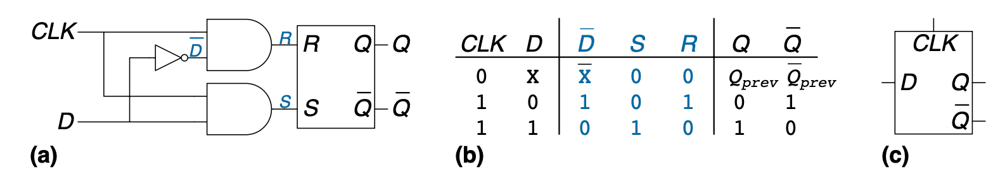
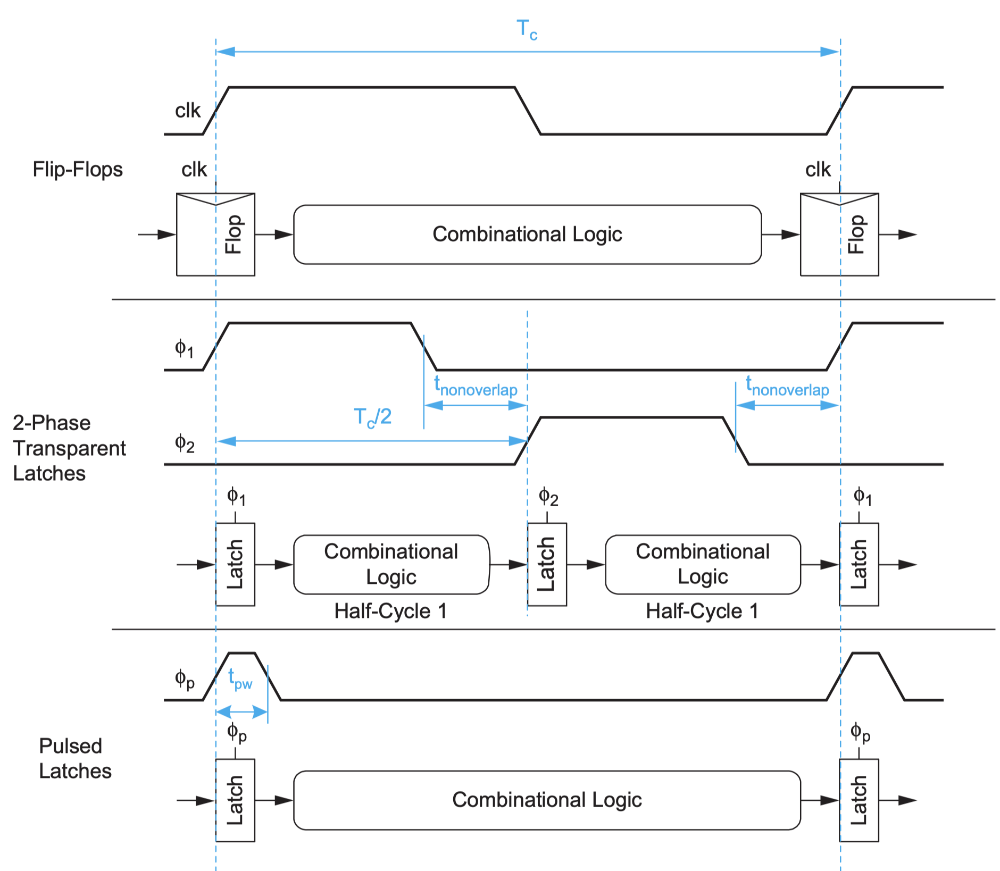
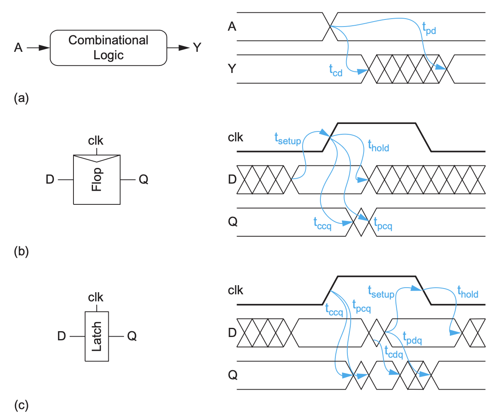
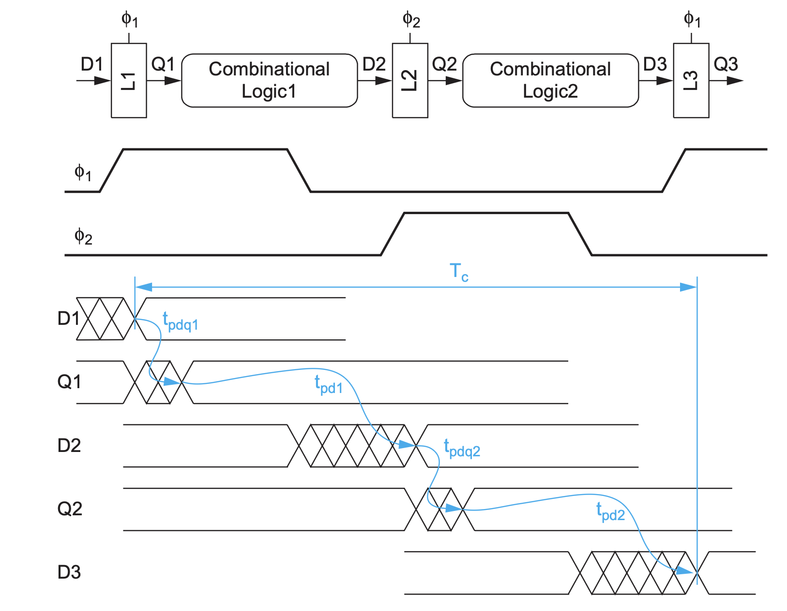
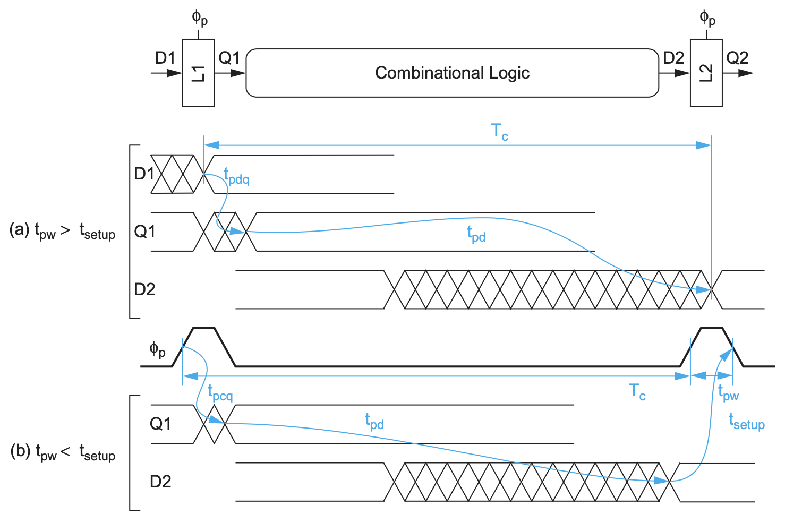
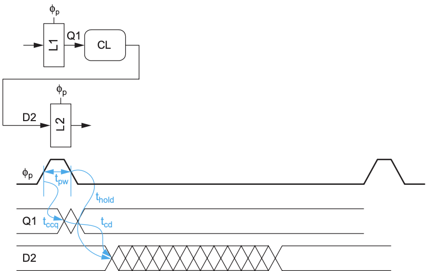
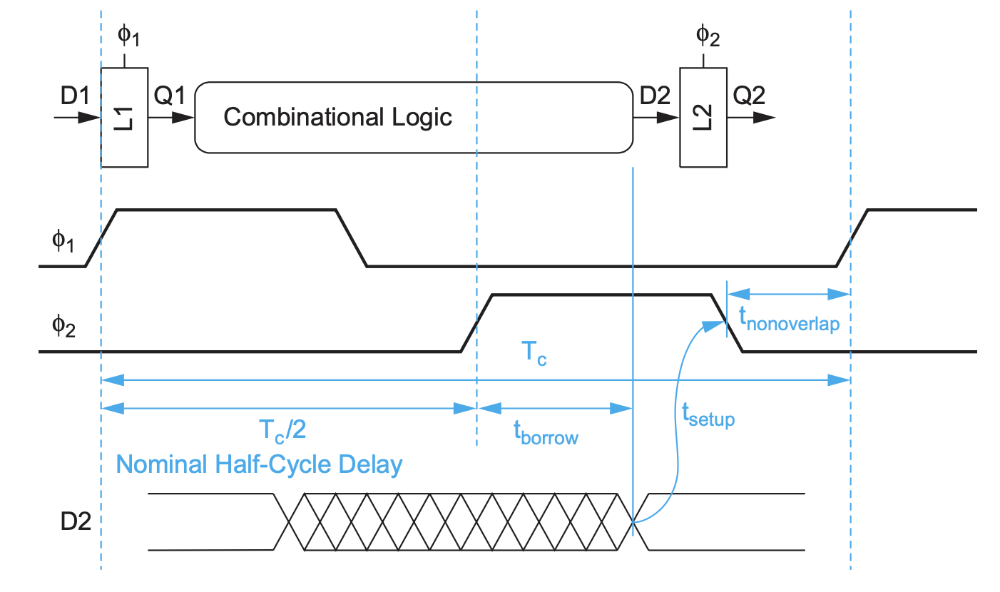

# Basic Concepts

| Term         | Definition |
| --- | --- |
| $t_{hold}$ | The minimum amount of time that the data signal must be stable after the clock active edge to ensure it is reliably sampled. |
| $t_{setup}$ | The minimum amount of time that the data signal must be stable and valid before the clock active edge to ensure it is reliably sampled. |
| Crosstalk | EM-Couple between singal lines |

# Sequencing Static Circuits

## Basic D-Latch & D-Flip-Flop

### D-Latch

- Voltage-Level Sensitive

### D-Flip-Flop

- Edge Sensitive

## Static Sequencing Methods

### Overall

1. 3 Different Methods

2. Timing Digrams for Combinational Circuits, Flip-Flips and Latches

### Max-Delay & Min-Delay Constraints & Clock Skew

#### Flip-Flops

$$
\begin{equation}
\begin{aligned}
t_{pd} &\le T_c - (t_{pcq} + t_{setup} + t_{skew}) \\
t_{cd} &\ge t_{hold} + t_{skew} - t_{ccq}
\end{aligned}
\end{equation}
$$

#### 2-Phase Latch

$$
\begin{equation}
\begin{aligned}
T_c &\ge t_{pdq1} + t_{pd1} + t_{pdq2} + t_{pd2} \\
t_{pd} &\le T_c - t_{pdq1} - t_{pdq2} + t_{skew} \\
t_{cd1}, t_{cd2} &\ge t_{hold} - t_{ccq} - t_{overlap}
\end{aligned}
\end{equation}
$$

#### Pulsed-Latch

$$
\begin{equation}
\begin{aligned}
T_c &\ge \max(t_{pdq} + t_{pd}, t_{pcq} + t_{pd} + t_{setup} - t_{pw})  \\
t_{pd} &\le T_c - \max(t_{pdq}, t_{pcq} + t_{pw} - t_{setup} + t_{skew}) \\
t_{cd} &\ge t_{hold} + t_{pw} - t_{ccq} + t_{skew}
\end{aligned}
\end{equation}
$$

### Time Borrowing

1. For 2-Phase Latch

$$
\begin{equation}
\begin{aligned}
t_{borrow} \le \frac{T_c}{2} - (t_{setup} + t_{overlap} + t_{skew})
\end{aligned}
\end{equation}
$$

2. For Pulsed Latch

$$
\begin{equation}
\begin{aligned}
t_{borrow} \le t_{pw} - (t_{setup} + t_{skew})
\end{aligned}
\end{equation}
$$
