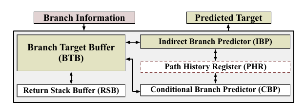
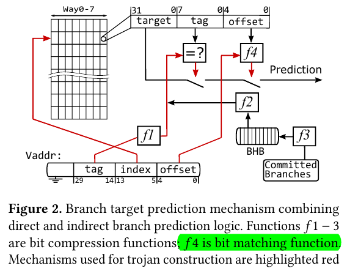

# TAGE (TAGged Geometric-Length) Predictor

> Geometric History Length of Partial Tables

- **Intuition**: Close History matters. Importance of long history decade in a geometric way

| Hash Function | Description |
|---------------|-------------|
| GF($2^8$) Multiplication | |
| Folded XOR | |
| Mod | |
| Bit Permutation | |

# Morden BPU Architecture - A Possible Case

> IBP and CBP are both TAGE-like Predictors

> BTB will decide to take which result, either from BTB or IBP based on whether this is a **indirect branch with multiple targets**

## BTB - A Simple Scenario

### Prediction

> BTB and BHB used for Simple Branch Prediction

- **Vaddr**: Virtual Address of the branch instruction, which can be considered as the program counter (PC).

- **BHB (Branch History Buffer)**: Branch addresses are hashed (using $f_3$) and stored in the BHB.

- **BTB (Branch Target Buffer)**: The **cache structure** on the left side, which only stores a partial address of the PC. The target address is **added to** the current branch instruction since they are usually close (especially for conditional and direct branches).

### Update

- Simply taking lower bits of PC and seperate them into target, tag, offset parts;

- Note that, BTB also has **more bits** for Core ID, Branch Type, Previlege Level etc.

## IBP - Indirect Branch Predictor

> A Tage Like Structure that replaces **taken counter** into a **full branch target**

## RSB - Return Stack Buffer

> Why not use BTB: BTB stores limited targets per branch, but function calls can return to many different locations.

- RSB (A **LIFO Buffer**) is dedicated for predicting return addresses of function calls

- When a function calls, its `call` address is pushed to RSB. When `ret`, the address is popped as the predicted target
