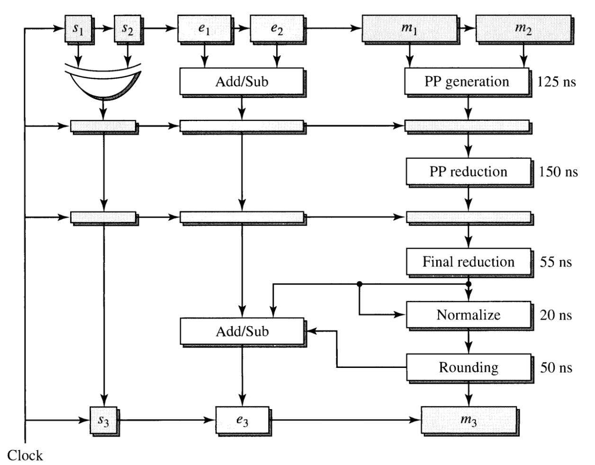
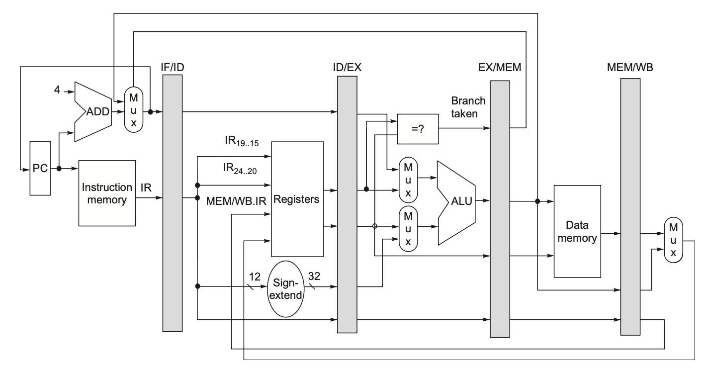
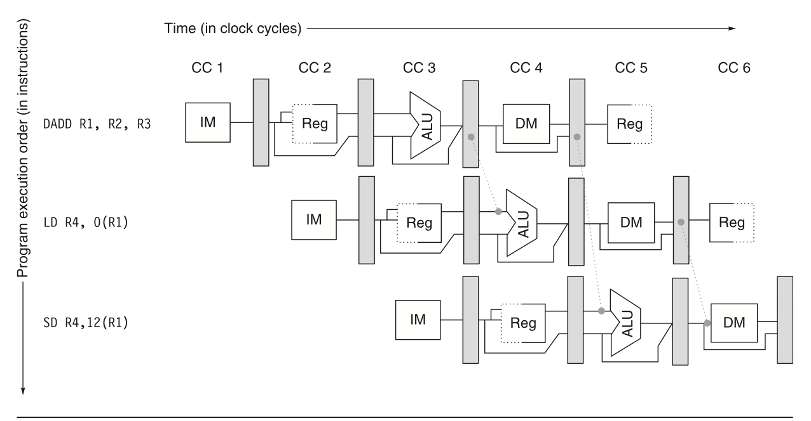

# Pipeline

## How Deep?

### Why can't Pipeline be so deep

| Symbol | Description |
|--------|-------------|
| $T_1$ | Input time of the first signal |
| $T_2$ | Input time of the consecutive second signal |
| $T_L$ | Additional time caused by Clock Distribution Network and Clock Skew |
| $T_M$ | Time for Maximum Path |
| $T_m$ | Time for Minimum Path |

$$
\begin{equation}
\begin{aligned}
T_2 + T_m &\gt T_1  + T_M + T_L \\
T_{clock} &= T_2 - T_1 \gt T_M - T_m + T_L
\end{aligned}
\end{equation}
$$

- Balance Different Path can reduce $T_M - T_m$

### How deep ?

| Symbol | Description |
|--------|-------------|
| $C$ | Total cost of the pipeline |
| $P$ | Performance (throughput) of the pipeline |
| $G$ | Fixed cost per pipeline stage |
| $L$ | Latency overhead per pipeline stage |
| $k$ | Number of pipeline stages (depth) |
| $T$ | Total execution time without pipelining |
| $S$ | Setup time overhead per stage |
| $k_{opt}$ | Optimal number of pipeline stages that minimizes cost per performance |

## A Pipelined FP Multiplexer

> 1 sign bit + 8 exponent bits + 57 Mantissa bits



| Step | Description |
|------|-------------|
| Sign Generation | $s_3 = s_1 \oplus s_2$ |
| Exponent Generation | $e_3 = e_1 + e_2 - 128$ |
| Partial Product Generation |  |
| Partial Product Reduction | |
| Final Reduction | Last stage of Sum Done by a fast CSA |
| Normalization | Since 1.x * 1.x -> 01.x or 1x.x, So it will be left shift by 1 bit and decrement 1 bit in exponent bit when MSB is 1 |
| Rounding | (Upper) Round by adding 1 to guarding bit (LSB of Mantissa) |

# Out-of-Order(OOO) Execution

## $\mu$op & Register Renaming

> 1 instruction can be decomposed into microoperations, namely $\mu op$ to increase parallelism between operations

```asm
push eax
; Can be decomposed into
sub esp, 4 
mov [esp], eax
```

> Register Renaming 

- **Every change** to a logical register will lead to a **new assignment of temporary register** to that register if available

- Done by Hardware or compiler

## Hazards, 

- Data Dependencies can be eliminated by hardward or compiler by reodring program. Or it stays there to cause stall dealt by interclock

- 

# Instruction Level Parallelism

## A Classic RISC-V Arch



> Classic 5-Level Pipeline

> IF(Instruction Fetch) -> ID(Instruction Decode) -> ***OF(Operand Fetch)*** -> EX(Execution) -> ***MEM(Memory Access)*** -> WB(Write Back) / OS(Operand Store)

- OF can be done in parallel with ID; MEM can be done in EX Stage

### Problems

> Data Hazard (RAW,WAR,WAW) caused by data dependency

- Use Bypass(Forward) to solve data dependency problem



- Sometimes, Forward is not enough. Need **Pipeline-Interclock** to stall the pipeline


> Branch Hazard

# Others

Load-Store: Only Load and Store can access memory (ARM, RISC-V)

Register-Memory: Can use both register value and memory in same instruction

orthogonal field: Fields in one instruction that are independent

# Key Formulas

$$
\begin{equation}
\begin{aligned}
\text{Throughput}  &= \text{Number of Tasks processed per Unit Time}  \\
\end{aligned}
\end{equation}
$$
