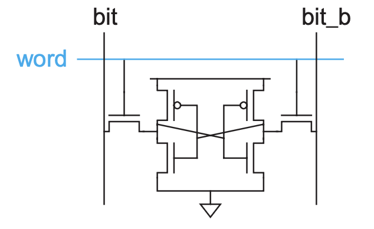
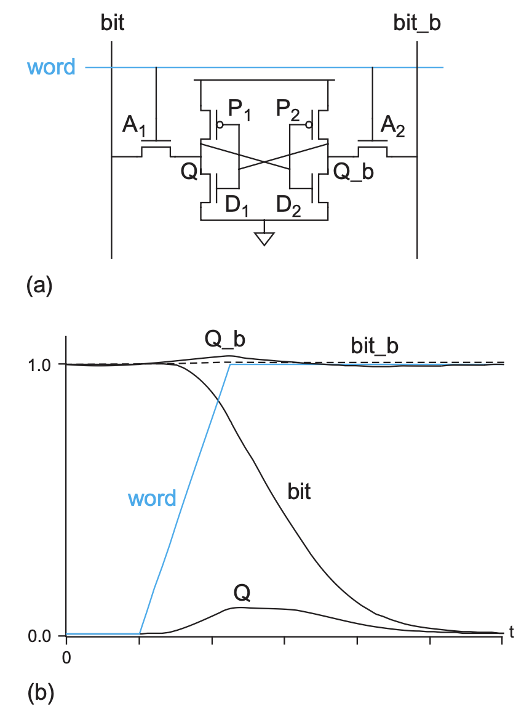
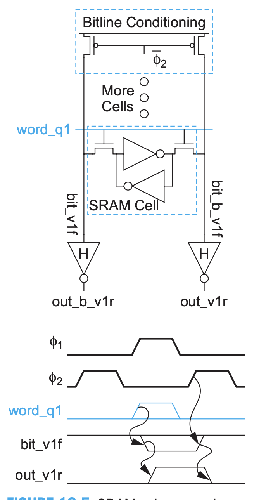
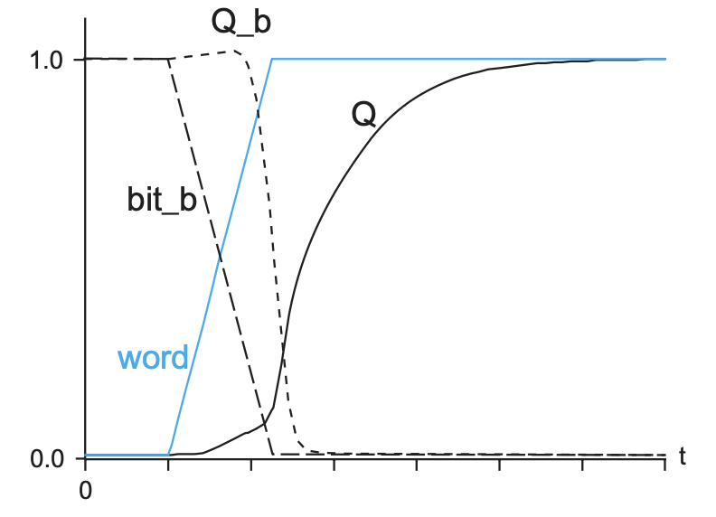
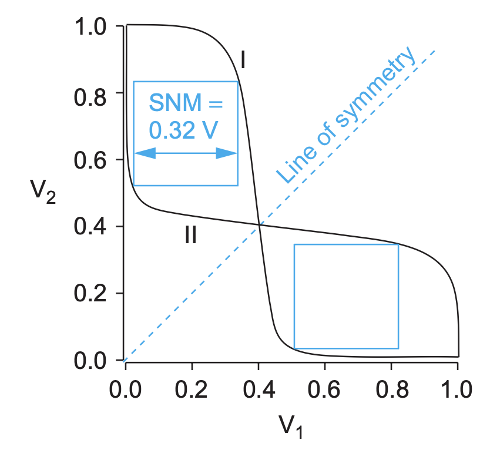
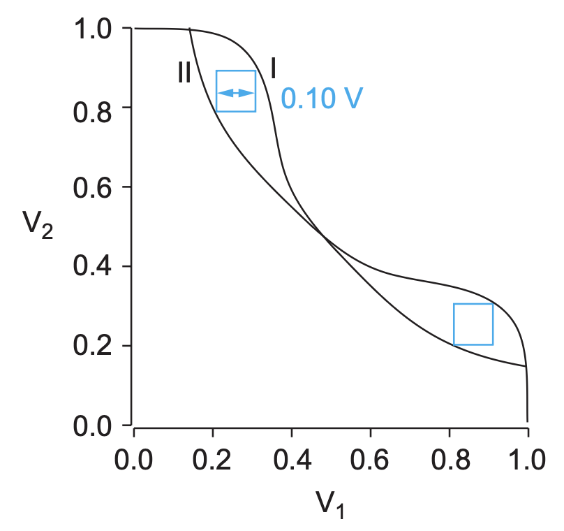
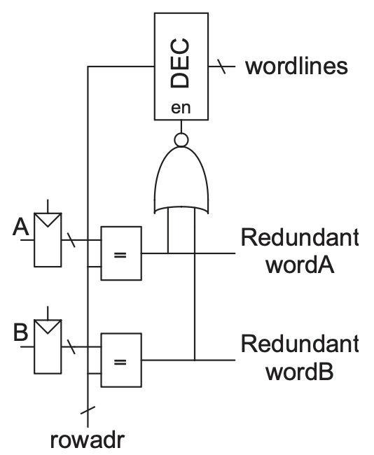

# SRAM

## Basic Cell

### Read

1. Circuit and DC Transfer

2. Column Read

### Write

1. DC Transfer

2. Column Write

### Cell Stability

#### Concepts

| Concept       | Condition/Description                                           |
|---------------|-----------------------------------------------------------------|
| Readability   | $D_1$ must be stronger than $A_1$ to pull it down               |
| Writability   | $A_2$ must be stronger than $P_2$ to pull it down               |
| P:A:N Ratio   | 1:2:4                                                           |
| Hold Margin   | Reduce $V_{DD}, V_t$ helps reduces hold margin                  |
| Read Margin   | Increase $V_{DD}, V_t$, reduce word line voltage helps reduces read margin |
| Write Margin  | Write margin is opposite of read margin                         |

#### Margins

> Hold Margin

> Read Margin

> Write Margin

## Decoder

- Simple Decoder

- Predecoder to reduce area

## Row Redundancy

