# Boolean Logic

## Duality

$$
\begin{equation}
\begin{aligned}
F'(X) &= F(X')
\end{aligned}
\end{equation}
$$

## XOR

### Basics

$$
\begin{equation}
\begin{aligned}
A \oplus 1 &= A' \\
A \oplus 0 &= A \\
A \oplus A &= 0 \\
A \oplus A' &= 1
\end{aligned}
\end{equation}
$$

### Inversion Law

$$
\begin{equation}
\begin{aligned}
\bigoplus_{i=1}^{n_{\text{odd}}} \overline{x_i} &= \overline{\bigoplus_{i=1}^{n_{\text{odd}}} x_i} \\
\bigoplus_{i=1}^{n_{\text{even}}} \overline{x_i} &= \bigoplus_{i=1}^{n_{\text{even}}} x_i \\
\end{aligned}
\end{equation}
$$

# Tristate Buffer & Multiplexer

## Tristate Buffer

## Multiplexer

### Transmission Gate Multiplexer

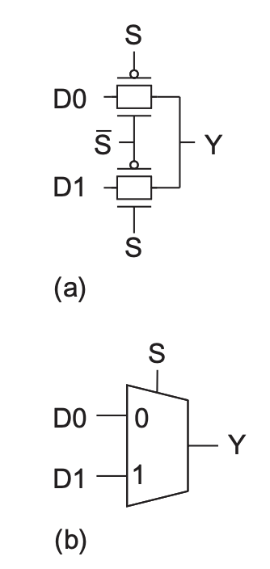

### Inverting Multiplexer

> Output is inverted

- $a$ and $b$ are only slightly different in **PUN**

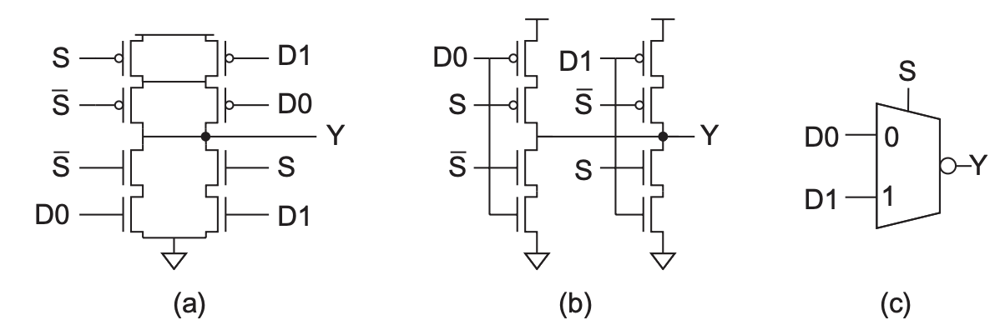

# Adder

## Single-Bit Addition

- Note that both $S$ and $C$ are **self-dual**

$$
\begin{equation}
\begin{aligned}
S &= A \oplus B \oplus C \\
&= P \oplus C \\
C &= AB + AC + BC \\
&= AB  + C(A + B) \\
&= \mathcal{MAJ}  (A,B,C) \\
\end{aligned}
\end{equation}
$$

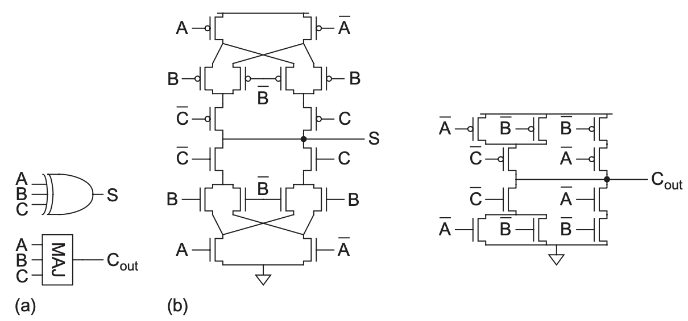

- Or we can get a **mirror adder** by the following equation

$$
\begin{equation}
\begin{aligned}
S &= \text{1 or 3 True}, C_{out} = \text{2 or 3 True}, C_{out}' = \text{0 or 1 True} \\
\therefore  S &= \text{1 True} + \text{3 True}  \\
&= ABC + (C_{out}' - \text{0 True})   \\
&= ABC + (A+B+C) C_{out}'
\end{aligned}
\end{equation}
$$

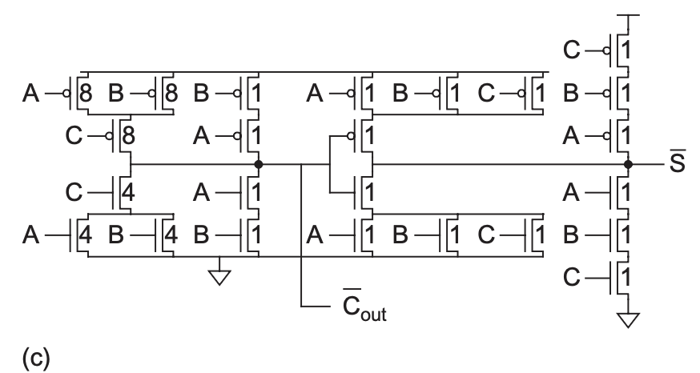

## Carry-Propogate Addition

### Carry Generation & Propogation

#### Propogation & Generation Logic

- Valency-2 PG Logic

$$
\begin{equation}
\begin{aligned}
G_{i:j} &= G_{i:k} + P_{i:k} G_{k-1:0} \\
P_{i:j} &= P_{i:k} P_{k-1:0} \\
\end{aligned}
\end{equation}
$$

- Valency-4 PG Logic

$$
\begin{equation}
\begin{aligned}
\left.
\begin{aligned}
G_{i:j} &= G_{i:k} + P_{i:k} \cdot G_{k-1:l} + P_{i:k} \cdot P_{k-1:l} \cdot G_{l-1:m} + P_{i:k} \cdot P_{k-1:l} \cdot P_{l-1:m} \cdot G_{m-1:j} \\
        &= G_{i:k} + P_{i:k} \left( G_{k-1:l} + P_{k-1:l} \left( G_{l-1:m} + P_{l-1:m} G_{m-1:j} \right) \right) \\
P_{i:j} &= P_{i:k} \cdot P_{k-1:l} \cdot P_{l-1:m} \cdot P_{m-1:j}
\end{aligned}
\right\}
\quad (i \ge k > l > m > j) \tag{11.8}
\end{aligned}
\end{equation}
$$

- Bitwise PG Logic

$$
\begin{equation}
\begin{aligned}
G_i &= A_i B_i \\
P_i &= A_i \oplus B_i \\
G_0 &= C_{in} \\
P_0 &= 0
\end{aligned}
\end{equation}
$$

#### Sum and Carry-in

> Warning: For **bit $i$**, $C_{out, i} = C_i, C_{in,i} = C_{i-1}$

$$
\begin{equation}
\begin{aligned}
C_i &= G_{i:0} \\
S_i &= P_i \oplus C_{i-1} \\
&= P_i \oplus G_{i-1:0}
\end{aligned}
\end{equation}
$$

### PG Carry-Ripple Addition

- $t_{pg}$ means propogation delay from input to bitwise $G_i/P_i$

$$
\begin{equation}
\begin{aligned}
C_{out} &= G_N + P_N G_{N-1:0} \\
t_{ripple} &= t_{pg} + (N-1) t_{AO} + t_{xor}
\end{aligned}
\end{equation}
$$

### Manchester Carry-Chain Adder

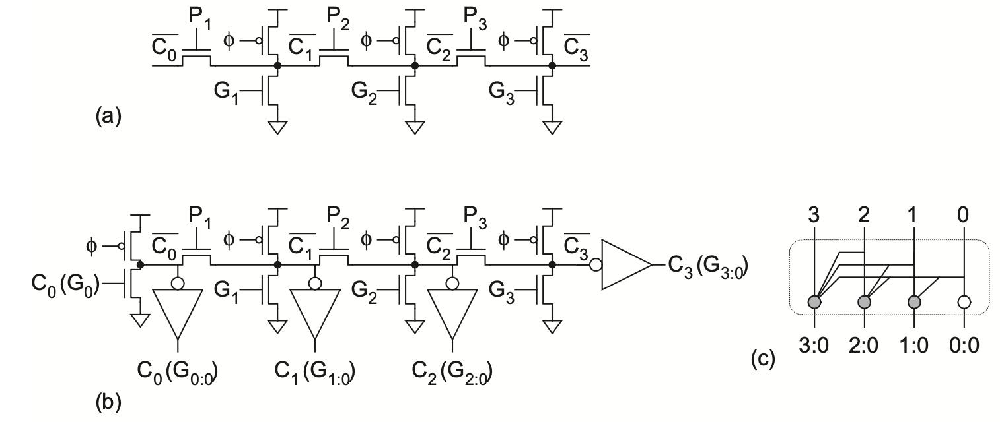

> Formula Inference: $C_1'$ is only True when $G_1 = 0$ and $P_1 = 1, C_0' = 1$ or both $P_1$ and $G_1$ are off

$$
\begin{equation}
\begin{aligned}
C_0 &= G_{0:0} = C_0 \\
C_1 &= G_{1:0} = G_1 + P_1 C_0 \\
C_2 &= G_{2:0} = G_2 + P_2 \left( G_1 + P_1 C_0 \right) \\
C_3 &= G_{3:0} = G_3 + P_3 \left( G_2 + P_2 \left( G_1 + P_1 C_0 \right) \right)
\end{aligned}
\end{equation}
$$

### Carry-Skip Adder

> Skip is selected when the $P_{g}$ is True

- Circuit

- Optimized PG Logic

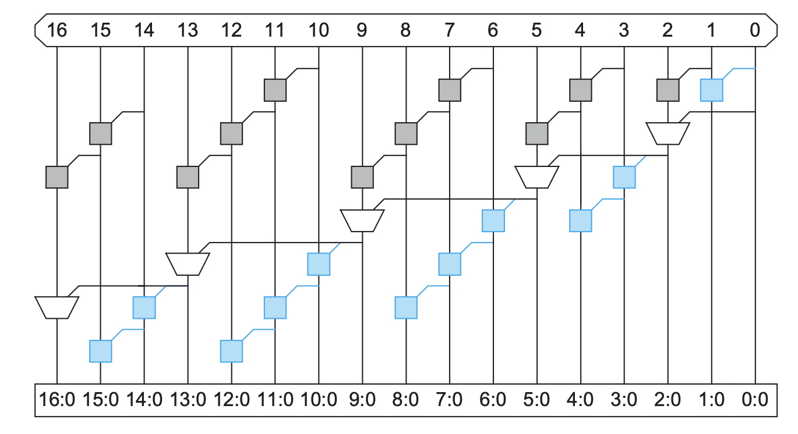

- General Time Computation

$$
\begin{equation}
\begin{aligned}
t_{skip} &= t_{pg} + 2(n-1) t_{AO} + (k-1) t_{mux} + t_{xor}
\end{aligned}
\end{equation}
$$

- Skip Circuit - Transistor Level

### Carry-Lookahead Adder

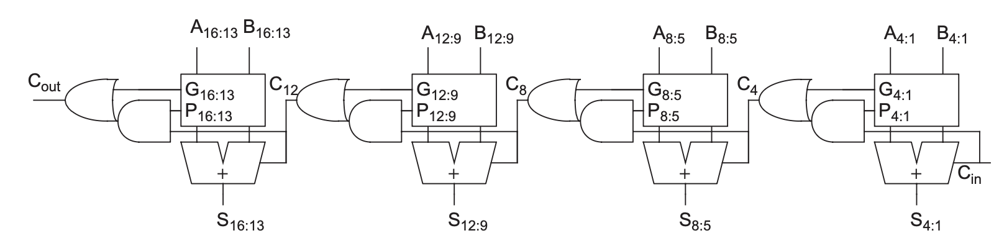

$$
\begin{equation}
\begin{aligned}
t_{cla} &= t_{pg(n)} + t_{pg} + [(k-1) + (n-1)] t_{AO} + t_{xor}
\end{aligned}
\end{equation}
$$

- Improved CLA using valency-n operations everywhere!

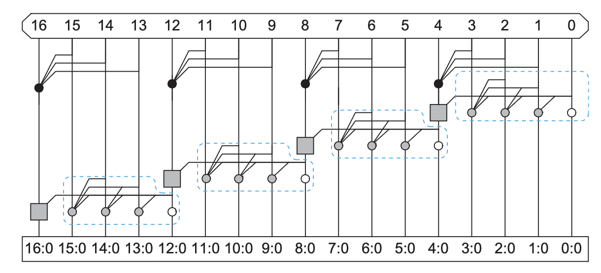

### Carry-Select, Increment & Conditional Sum Adder

#### Carry-Select Adder

> Select from both carry-in

$$
\begin{equation}
\begin{aligned}
t_{select} &= t_{pg} + t_{mux} + [n + (k-2)] t_{AO}
\end{aligned}
\end{equation}
$$

#### Carry-Increment Adder

- $S_{i,0} = A + B, S_{i,1} = S_{i,0} + 1$, greatly reduce the redundant circuit

$$
\begin{equation}
\begin{aligned}
t_{increment} &= t_{pg} + [(n-1) + (k-1)] t_{AO} + t_{xor}
\end{aligned}
\end{equation}
$$

- Variable-Length CIA With Manchester Carry Chain

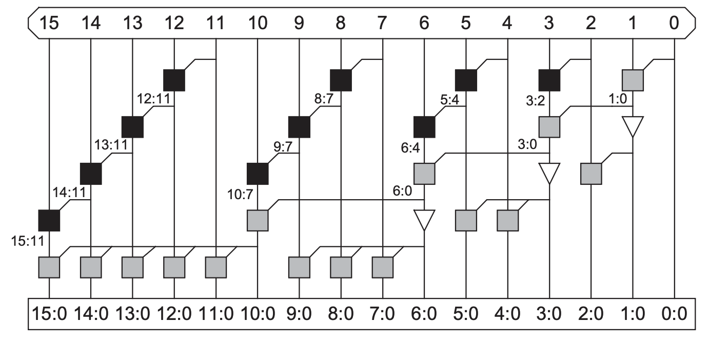

#### Conditional-Sum Adder

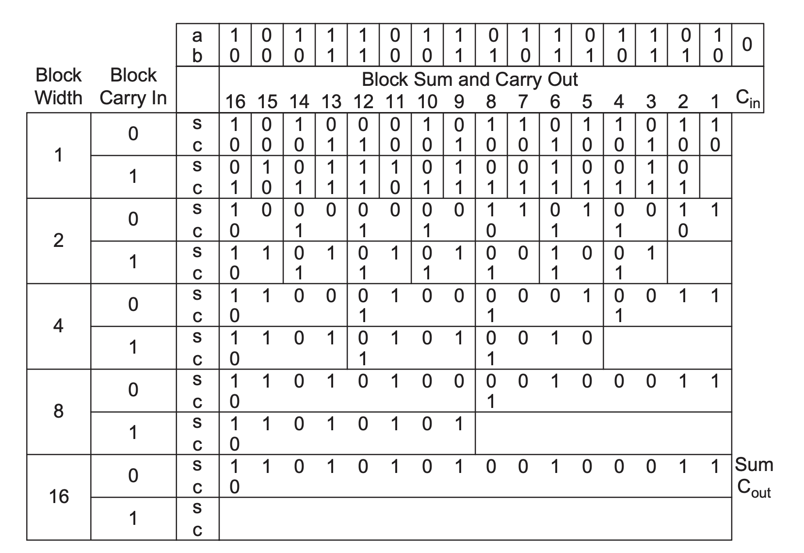

### Tree Adders

### Sparse Tree Adders

### Ling Adders

## Subtractor

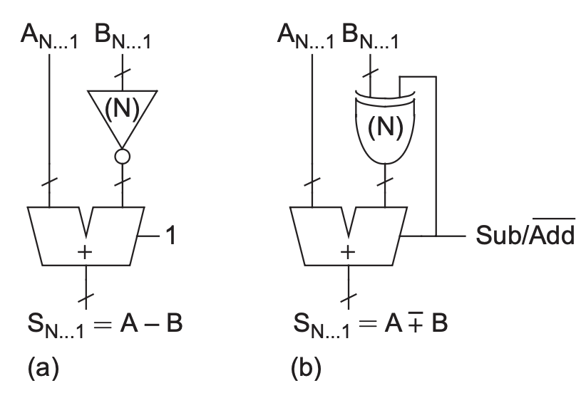

> $XOR$ inverts $B$

$$
\begin{equation}
\begin{aligned}
A - B &= A + B' + 1
\end{aligned}
\end{equation}
$$

## Multiple-Input Addition

> A typical $[3:2]$ Carry-Save Adder

$$
\begin{equation}
\begin{aligned}
\text{From (c)}  \\
X + Y + Z &= S + 2C
\end{aligned}
\end{equation}
$$

# One/Zero Detector

- Final Logic Function is $A_0 A_1 ... A_n$

$$
\begin{equation}
\begin{aligned}
G &= N^{0.415} \\
D &= [\log_4(H) + 0.415 \log_4(N)] t_{FO4}
\end{aligned}
\end{equation}
$$

# Magnitude Comparator

