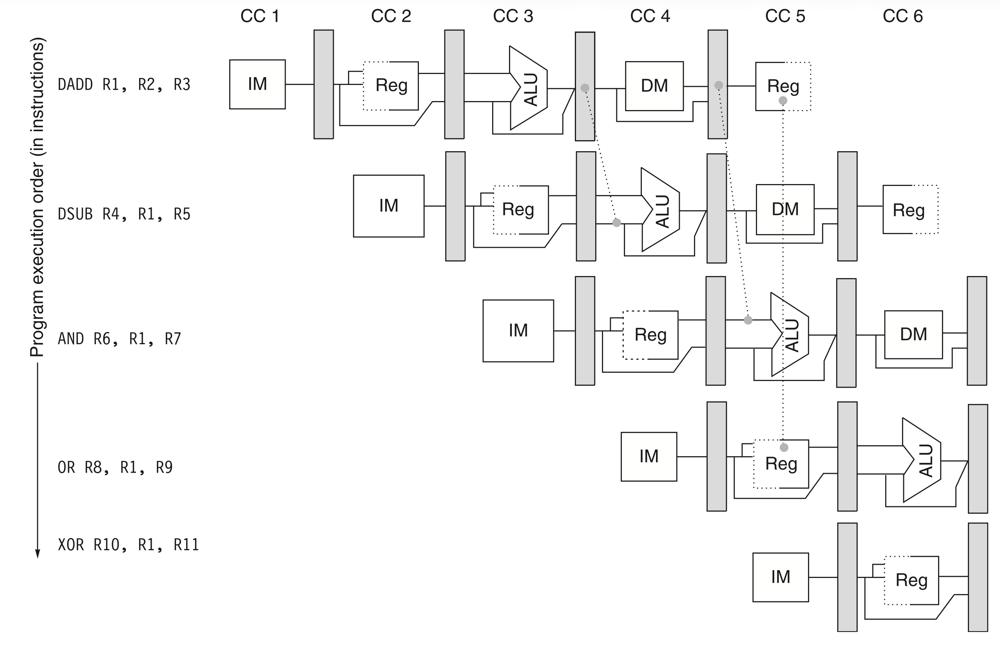
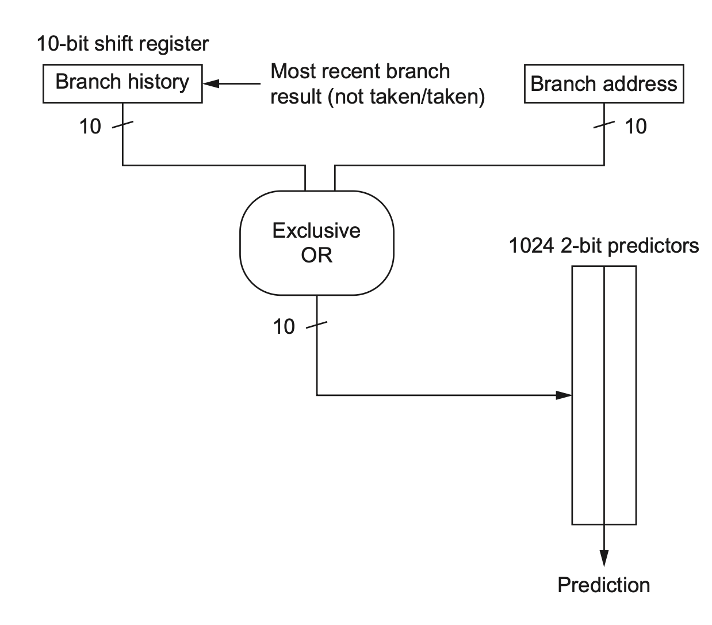
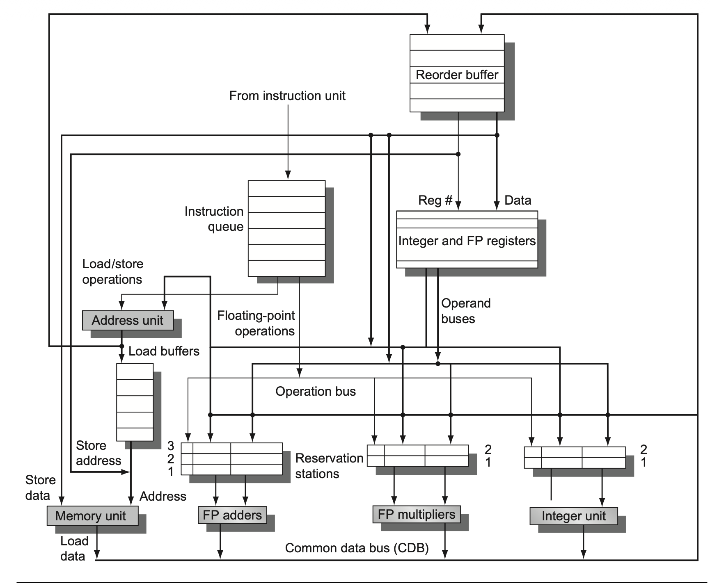

# Intro

## RISC-V Register

| Stage | Description |
|---|---|
| Register Files | Stored in ALU or other memories |
| Data / Instruction Caches (L1 Caches) | Separated to avoid data access/instruction fetch conflict |
| 5-stage Pipeline | Instruction Fetch(IF) -> Decode (Sign-Extend Instruction) and equality test for register -> Execution -> Memory Access -> Write Back |

## Important Concepts

| Concept | Definition |
|---|---|
| clock skew | maximum delay between a clock arrives 2 registers |
| Pipeline register delay | Setup time = Time for input to be stable + propogation delay |
| CPI | Cycles per Instruction, T = Cycles x Average CPI |
| IPC | Instruction Per Clock |
| PC | Program counter, storing the address of next instruction for CPU |
| Instruction-Level Parallelism (ILP)| Number of instructions that are independent |
| imprecise exception | pipeline complete more or less instructions **before or after** the original exception|
| Window Size | Size of ROB in Tomasulo |
| Memory Aliasing | Multiple pointers to same address in Heap |
| Indirect Branch | Branches that are predicted only during execution |

# Dependencies & Hazards

## Data Hazards

### Name Dependencies

- **Renaming** elminates data hazards below

| Hazard Type | Description |
|---|---|
| **RAW (Read After Write)** | A subsequent instruction tries to read a register or memory location before a prior instruction has written to it. |
| **WAR (Write After Read)** | A subsequent instruction tries to write to a register or memory location before a prior instruction has read its original value.|
| **WAW (Write After Write)** | A subsequent instruction tries to write to a register or memory location before a prior instruction has finished writing to the same location. |

### Data Dependencies

- Forward(Bypass) Unit to avoid this situation

- In some cases (like ld), forward doesn't help. We can only stall the pipeline, called **pipeline interclock**

## Branch Hazards

### Definition and Solutions

- taken / untaken branch: Branches that satisfy/not satisfy the branch condition

| Solution | Description |
|---|---|
| Flush/Freeze the pipeline | Simple but inefficient, as it causes significant stalls. |
| Predict taken | Assume the branch will be taken and speculatively execute instructions from the target. If mispredicted, flush. |
| Predict untaken | Assume the branch will not be taken and speculatively execute instructions sequentially. If mispredicted, flush. |
| Branch delayed slot (Early Tech) | Execute instructions that are independent of branch outcome in a fixed slot after the branch instruction|

# Branch Predictor

## Basics

- Has sth. to do with Branch Frequency, Prediction Accuracy, BTB(Branch Table buffer) Hit Rate(Low Impact)

- Prediction Entry = Prediction History Table = an entry of BTB

## Gshare BP

- **XOR latest history & current address** as **hash** to choose from history

## Tournament BP

- Select from either global predictor or local predictor based on its **recent performance**.

## Tagged Hybrid BP

- Choose from different parts of the history, and use **hash** to increase robustness

# Compiler Technique for ILP, Dynamic Scheduling

## Compiler Techniques

| Technique | Description |
|---|---|
| Loop Unrolling | Repeat loop body multiple times + termination code (Done in early compilation stage for further optimization to reduce redundant codes) |
| Strip Mining | Unroll loop(n) twice = $\dfrac{n}{k} \times k$, often used for vector computation |
| Scheduling | For OOO Execution |

## Dynamic Scheduling

### Tomasulo Algorithm

1. **Observation** of this architecture

| Component           | Description                                                               |
|---------------------|---------------------------------------------------------------------------|
| Load/Store buffer   | Stores awaited address, tracks outstanding addresses, stores awaited data |
| CDB                 | Writes data everywhere except **Load Buffers**                            |
|Operands Waiting|Waiting for operands for going into reservation station takes **tons of time**. Also, Tomasulo-Algorithm takes **a lot of hardware**|

2. Steps

| Step | Name   | Description                                                                                                                              |
|------|--------|------------------------------------------------------------------------------------------------------------------------------------------|
| 1st  | Issue  | Instructions are issued from IQ to reservation stations until it is empty, operands from registers are also sent there simultaneously (if operands from registers are not available, wait). |
| 2nd  | Execute| Wait for other operands from CDB and execute. If multiple executions are ready, randomly pick one.                                          |
| 3rd  | Write  | Write to moemory when it's free, then CDB writes data back. it adds **an additional cycle**.                                                                                                 |

3. **Composition of Reservation Stations**

| Field | Description |
|---|---|
| Op | Operation between 2 operands |
| Qj, Qk | Reservation stations where we find operands; whether the operand is ready |
| Vj, Vk | Value of operands; offset for loads |
| A | Load/Store Memory Address |
| Busy | This reservation station is occupied |

4. Composition of Others

| Component       | Field | Description                                                          |
|-----------------|-------|----------------------------------------------------------------------|
| Register File   | Qi    | The number of Reservation Station whose result is for this register      |
| Load/Store buffer | A     | Address for load/store operations                                    |

### Hardware-Based Speculation

1. Speculation: 

- Branch Prediction

- Exectution in advance **with Undo**. All results are stored in a buffer in case BP goes wrong.

- Dynamic Scheduling

2. Tomasulo-Algorithm With Speculation

- ROB Entry Fields

| Field             | Description                                  |
|-------------------|----------------------------------------------|
| Instruction Type  | Load/Store, Register Operations, Branch      |
| Destination Field | Address for the destination (register/memory)|
| Value Field       | Value of Instruction Results                 |
| Ready Field       | Is this result ready to be used              |

- Steps

| Step          | Description                                                                                                                                                                                                                             |
|---------------|-----------------------------------------------------------------------------------------------------------------------------------------------------------------------------------------------------------------------------------------|
| Issue         | Send an instruction to both ROB and RS. If they are full, wait. Take operands from registers and ROB.                                                                                                                                   |
| Execute       | Wait for operands from register, load buffer and ROB, then execute.                                                                                                                                                                     |
| Write Results | Write results to CDB, then to ROB and RS. If Store has to wait for the value to be stored, the value field of ROB will monitor CDB until it detects the required value.                                                              |
| Commit        | Normally, commit result to RS or Registers from head of ROB and delete it from ROB. If a branch is wrong, flush ROB and do it again in the right branch. If it's a store, write it to Memory. |

## Multiple Issue

### VLIW(Very Large Instruction Words)

| Aspect                 | Description                                                                                                                              |
|------------------------|------------------------------------------------------------------------------------------------------------------------------------------|
| **Instruction Packing**| A fixed number of instructions are packed and issued at once.                                                                             |
| **Operation Mode**     | Lockstep operation: All functional units have to be synchronized to execute VLIW instructions.                                           |
| **Stall Cost**         | Stall is very expensive! Potential unused instructions per cycle are wasted.                                                             |
| **Code Size Issue**    | Can result in large codes.                                                                                                                |
| **Code Size Solution** | Solved by clever encoding, or by putting some code in main memory.                                                                      |

- SuperScaler are main processors, vector processors are great extensions

### Multiple Issue Tumasulo

| Aspect                       | Description                                                                                                                                                                                                                                        |
|------------------------------|----------------------------------------------------------------------------------------------------------------------------------------------------------------------------------------------------------------------------------------------------|
| Reservation Table Updates    | Reservation tables are updated each cycle to indicate dependencies between instructions.|
| RS and ROB Entry Ordering    | RS and ROB entries are preordered to facilitate the issuing of multiple instructions in the subsequent cycle. |
| Handling Resource Shortages  | If a bundle contains multiple instructions of the same class and there are insufficient Reservation Stations (RS), only a portion of the bundle is processed, with the remaining instructions deferred to the next cycle.                               |

## Restrictions on Exploiting ILP

- Future addresses are usually not predictable and might be conflict

- **MIPS R10k**

- Speculation can take place on **Memory Aliasing**

## Trace Scheduling

- predicated execution: compile branch order into conditionally executed instructions (More Hardware)

- Apple dropped predicated execution in ARM

- Value Prediction: Induction Numbers, Constants, Sparse Matries
