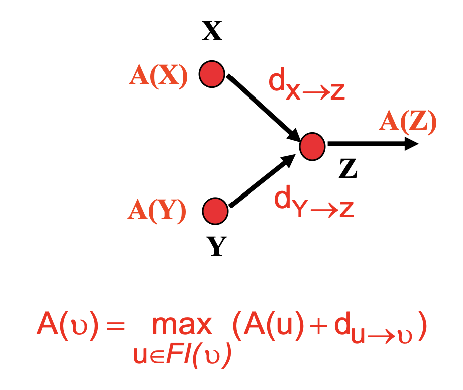
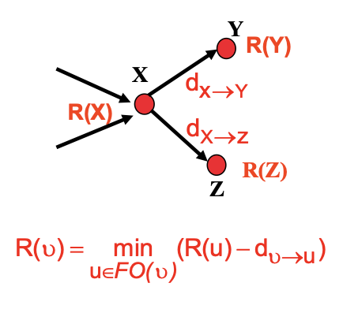

# Power & Interconnect

## Dynamic & Static Power

### Definition

> Caused by **charge/discharge** or even **short-circuit** (Dynamic), and **subthreshold leakage** (Static)

- Think of an inverter with a $C_L$ as load

- Energy charged/discharged to $C_L$ during a cycle are both

$$
\begin{equation}
\begin{aligned}
dE_C &=  QdV_C \\
E_C &= \int_{0}^{V_{DD}} C_L V_C dV_C \\
&= \frac{1}{2} C_L V_{DD}^2 \\
\therefore E_{total} &= C_L V_{DD}^2
\end{aligned}
\end{equation}
$$

### Activity factor

$$
\begin{equation}
\begin{aligned}
f_{sw} &= \alpha_{0 \xrightarrow{} 1}f_{clk} \\
P &= f_{sw} C_L V_{DD}^2 \\
&= \alpha_{0 \xrightarrow{} 1} f_{clk} C_L V_{DD}^2 \\
\end{aligned}
\end{equation}
$$

> Percentage of logic circuit is decreasing

## Interconnect

> Delay and Process: $nm \downarrow \xRightarrow{} \dfrac{\Delta T_d}{T_d} \uparrow, leakage \uparrow, Delay \downarrow$

- Analog Mixed-Signal(AMS) Simulation  

### Miller Coupling Effect


### Elmore Delay

- $RC$ circuit for SPICE Model

$$
\begin{equation}
\begin{aligned}
\tau &= \sum_{i}^{} R_{is} C_i
\end{aligned}
\end{equation}
$$

# Standard Cells

 ## File Names

`_rvt_ff_1p1v_125c.lib`: Regular $V_{th}$, fast(PMOS)-fast(PMOS), 1.1V, 125 $^{\circ}C$

- `.lef`: Library Exchange Format

- `.gds2`: Graphic **Data** System

## Process Variations

- **Spatial Granularity**: Variations are categorized across Wafer-to-Wafer, Inter-die, and Intra-die levels.

- **Scaling Impact**: Physical device parameters ($V_{th}, L, W$) exhibit significantly increased variance as manufacturing processes scale.

- **Statistical Analysis**: Monte-Carlo simulations are employed to characterize the impact of these fluctuations and verify design robustness across Gaussian parameter distributions.

$$
\begin{equation}
\begin{aligned}
\sigma_{\Delta V_{th}} &\propto \frac{N_a^{1/4}}{\sqrt{W L}} 
\end{aligned}
\end{equation}
$$

- Less Doping, thin oxide -> Less variations

## Process

- Planar, FD-SOI, FinFET

# Timing

> Bipolar Interpolation to calculate Delay using capcitance & transition time

> PVT has extreme impact on Delay

$$
\begin{equation}
\begin{aligned}
D &= D_N \times K_{PVT} \\
K_{PVT} &= K_P \times K_P \times K_T
\end{aligned}
\end{equation}
$$

> GBA to find worst case (WC) delay, PBA(huge calculation, more accurate) to specify WC path

> So many timing paths (exponential with path length) to calculate





> Timing Slack


# Synthesis

> sdc(Synopsys Design Constraints) file

- `tcl` is Tool Command Language

```tcl
create_block VBLK -period 5
create_generated_clock -name my_clk -source $out_clk -divide_by 4 [get_pins CLK_slow_regp/q]
set_input_delay -max 1.5 -clock CLK [get_ports input]
set_output_delay -max 1.5 -clock CLK [get_ports output]
set_clock_uncertainty T_uncertain [get_clocks <CLK>]
```

> 
