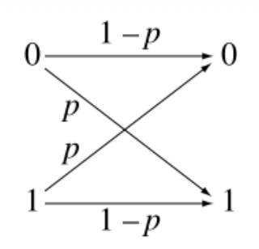
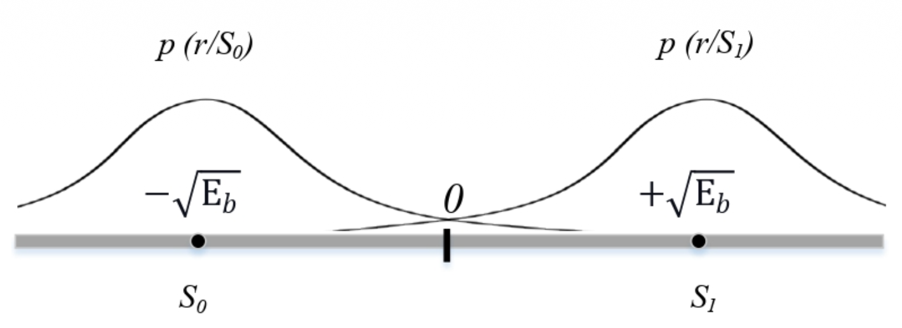

# Introduction

## Channel Model

# Flip Channel

## Binary Symmetric Channel

### Input, Output and Noise

> $p$ is the prob of noise occurence

$$
\begin{equation}
\begin{aligned}
Y &= (X+Z) \mod 2 \\
P(X) &= \begin{cases}
\alpha & x =0 \\
1 - \alpha & x = 1
\end{cases} \\
P(Z) &= \begin{cases}
p & z = 1 \\
1 -p & z = 0 
\end{cases} \\
P(Y = 0 | X = 0) &= 1 - p \\
P(Y = 1 | X = 1) &= 1 - p \\
\end{aligned}
\end{equation}
$$

### Prob of Right Outcome

> Model to determine the input using postrior prob

$$
\begin{equation}
\begin{aligned}
P(X=0|Y=b) &= \frac{P(Y=b|X=0) P(X=0)}{P(Y=b)} \\
P(X=1|Y=b) &= \frac{P(Y=b|X=1) P(X=1)}{P(Y=b)} \\
\widehat{X}  &= \begin{cases}
0 &  P(X=0|Y=b) > P(X=1|Y=b) \\
1 &  P(X=0|Y=b) < P(X=1|Y=b)
\end{cases} \\
\therefore L(b) &= \frac{P(Y=b | X = 0)}{P(Y=b | X =1)}  \overset{\hat{X}=0}{\underset{\hat{X}=1}{\gtreqqless}} \frac{\alpha }{1 - \alpha } \\
\end{aligned}
\end{equation}
$$

> Likelihood Ratio

$$
\begin{equation}
\begin{aligned}
L(1) &= \frac{p}{1-p} \\
L(0) &= \frac{1-p}{p}
\end{aligned}
\end{equation}
$$

### Improve Accuracy - Encoding

> Simpliest Encoding - Repetition Encoding

$X_i, i \in [1,n]$ are i.i.d random variables, sent same bit $n$ times

> New Log Likelihood

$$
\begin{equation}
\begin{aligned}
U &= \sum_{i=1}^{n} \mathbb{I} (b_i=0), V = \sum_{i=1}^{n} \mathbb{I} (b_i=1) \\
L(b) &= \frac{P(Y_1 =b_1 | X =0) P(Y_2=b_2 | X = 0) ... }{P(Y_1 =b_1 | X =1) P(Y_2=b_2 | X = 1) ... } \\
\sum_{i=1}^{n} LLR(b_i) &= \sum_{i=1}^{n} \log L(b_i) \\
&= U \log(\frac{p}{1-p} ) - V\log(\frac{p}{1-p} )  \\
&
\overset{\hat{X}=0}{\underset{\hat{X}=1}{\gtreqqless}} \frac{\alpha }{1 - \alpha } \\
U &\overset{\hat{X}=0}{\underset{\hat{X}=1}{\gtreqqless}}V, \alpha  = \frac{1}{2}  
\end{aligned}
\end{equation}
$$

### Evaluation (To be Continued)

# Bit Error Rate (BER)

## With Addition White Gaussian Noise (AWGN)

$$
\begin{equation}
\begin{aligned}
r &= s + w
\end{aligned}
\end{equation}
$$

## BPSK (Binary Phase Shift Keying)

> Error Function (Complement): Gaussian Distribution in positive domain where the area is $1$

$$
\begin{equation}
\begin{aligned}
erf(x) &= \sqrt{\frac{2}{\pi} } \int_{0}^{x} e^{ -t^2 } dt \\
erfc(x) &= 1 - erf(x) =\sqrt{\frac{2}{\pi} } \int_{x}^{\infty} e^{-t^2 } dt \\
erfc(0) &= 1
\end{aligned}
\end{equation}
$$

> BER

- AWGN, Input Signal

$$
\begin{equation}
\begin{aligned}
w &\sim \mathcal{N}(0, \sqrt{\frac{N_0}{2} }) \\
s = \pm \sqrt{E_b}
\end{aligned}
\end{equation}
$$

- BER

$$
\begin{equation}
\begin{aligned}
p(r|s_1) &= \frac{1}{\sqrt{\pi N_0}}  e^{-\dfrac{(r-\sqrt{E_b})^2}{ N_0} } \\
p(r|s_0) &= \frac{1}{\sqrt{\pi N_o}}  e^{-\dfrac{(r+\sqrt{E_b})^2}{N_0} } \\
p(e|s_1) &= \int_{- \infty }^{0}  p(r|s_1) dr \\
&= \frac{1}{\sqrt{\pi}} \int_{\sqrt{\dfrac{E_b}{N_0} }}^{\infty } e^{-z^2 } dz \ \ ( z^2 = \frac{(e-\sqrt{E_b})^2}{N_0} ) \\
&= \frac{1}{2} erfc( \sqrt{\frac{E_b}{N_0} }) \\
p(e|s_0)&= \frac{1}{2} erfc( \sqrt{\frac{E_b}{N_0} }) \\
\therefore P_b &= p(e|s_0) p(s_0) + p(e|s_1) p(s_1) \\
&= \frac{1}{2} erfc( \sqrt{\frac{E_b}{N_0} })
\end{aligned}
\end{equation}
$$

## Quadrature Phase Shift Keying (QPSK)

$$
\begin{equation}
\begin{aligned}

\end{aligned}
\end{equation}
$$
