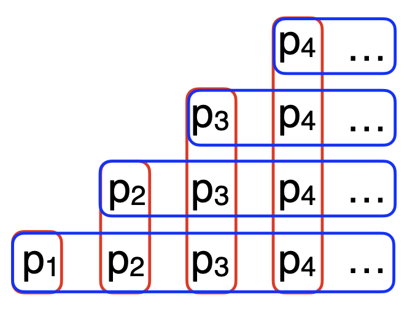

- --
id: Distributions
aliases: []
tags:
  - Math
---

# Important Distributions

## Table

| Distribution Name | Type | Parameters | Formula | Expectation | Variance | Notes |
|---|---|---|---|---|---|---|
| Uniform | Continuous | $a, b$ | $f(x) = \dfrac{1}{b-a}$ for $a \le x \le b$, and $0$ otherwise | $\dfrac{a+b}{2}$ | $\dfrac{(b-a)^2}{12}$ | |
| Bernoulli $B_n$ | Discrete | $p$ | $P(X=k) = p^k (1-p)^{1-k}$ for $k \in \{0, 1\}$ | $p$ | $p(1-p)$ | |
| Binomial $b_{p,n}(k)$ | Discrete | $n, p$ | $P(X=k) = \binom{n}{k} p^k (1-p)^{n-k}$ for $k \in \{0, 1, \dots, n\}$ | $np$ | $np(1-p)$ | Mode $\widehat{k} = \arg \max b_{p,n}(k)$ |
| Geometric | Discrete | $p$ | $P(X=k) = (1-p)^{k-1}p$ for $k \in \{1, 2, 3, \dots\}$ | $\dfrac{1}{p}$ | $\dfrac{1-p}{p^2}$ | Memoryless |
| Poisson | Discrete | $\lambda$ | $P(X=k) = \dfrac{e^{-\lambda} \lambda^k}{k!}$ for $k \in \{0, 1, 2, \dots\}$ | $\lambda$ | $\lambda$ | $F(x) = P(X \le x) = 1 - p^n$ |
| Exponential | Continuous | $\lambda$ | $f(x) = \lambda e^{-\lambda x}$ for $x \ge 0$, and $0$ otherwise | $\dfrac{1}{\lambda}$ | $\dfrac{1}{\lambda^2}$ | Memoryless |
| Normal (Gaussian) | Continuous | $\mu, \sigma^2$ | $f(x) = \dfrac{1}{\sqrt{2\pi\sigma^2}} e^{-\dfrac{(x-\mu)^2}{2\sigma^2}}$ | $\mu$ | $\sigma^2$ | |

## Poisson

> The Poisson distribution is a discrete probability distribution that expresses the probability of a given number of events occurring in a fixed interval of time or space. These events must occur at a known constant mean rate and independently of the time since the last event.

- It starts with Binomial Distribution with a **constant mean**, with $n \xrightarrow{} \infty, p \xrightarrow{} 0, \lambda = np$

$$
\begin{equation}
\begin{aligned}
P(X = k) &= C_n^k p^k (1-p)^{n-k} \\
&= \underset{n \xrightarrow{} \infty }{lim}  \frac{n(n-1)...(n-k+1)}{k!}  \frac{\lambda^k}{n^k} (1 - \frac{\lambda}{n} )^n ( 1 - \frac{\lambda }{n})^{-k} \\
&= \frac{\lambda^k}{k!}  e^{-\lambda}
\end{aligned}
\end{equation}
$$

## Geometric

### Property

> Right CDF can be easiliy deducted!

$$
\begin{equation}
\begin{aligned}
P(X \gt n) &= (1-p)^n \\
P(X \le n) &=1  - (1-p)^n \\
\end{aligned}
\end{equation}
$$

> Expectation Calculation

- Using Right CDF

$$
\begin{equation}
\begin{aligned}
E(X) &= \sum_{i=1}^{\infty } ip(x=i) \\
&= (p_1 + p_2 + ...) + (p_2 + p_3 + ...) + ... \\
&= \sum_{i=1}^{\infty } P(X \ge i) \\
&= \frac{1}{p} 
\end{aligned}
\end{equation}
$$

- Conditional Expectation $E(X|X \le n)$

$$
\begin{equation}
\begin{aligned}
E(X) &= E(X | X \le n) P(X \le n) + E(X | X \gt n) P(X \gt n) \\
\frac{1}{p} &= E(X | X \le n) (1 - (1-p)^n) + (\frac{1}{p}  + n) (1 - p)^n \\
\therefore E(X | X \le n) &= \frac{1}{p} - \frac{1-p^n}{1 - (1-p)^n} n
\end{aligned}
\end{equation}
$$

### Examples

#### Win a Die

> Two people take turns rolling a die; the first to roll a specific face wins. Regardless of the number of faces, the first player has a higher win rate.

$$
\begin{equation}
\begin{aligned}
P(odd) &= \sum_{i=1}^{\infty} P(X = 2i-1) \\
&= p (1 + q^2 +...) \\ 
&= \frac{1}{2-p} \gt \frac{1}{2} 
\end{aligned}
\end{equation}
$$

#### NASA Mishap

> $p$ is the mishap probability for each launch. After 10 launches, what is the probability of a mishap

$$
\begin{equation}
\begin{aligned}
P(x=n) &= p(1-p)^{n-1} \\
\frac{dP}{dp} &= (1-p)^{n-1} + p(n-1)(1-p)^{n-2} \\
&= (1-np) (1-p)^{n-2} \\
\therefore p &= \frac{1}{n}  \\
\therefore \max(P(x=n)) &= \frac{(1 - 1/n)^n}{n-1} \lesssim \frac{1}{e(n-1)}
\end{aligned}
\end{equation}
$$

#### Old & New Money

> Old Dad funds $n$ companies, then fund $n$ more companies

$$
\begin{equation}
\begin{aligned}
X &\sim G_{0.2} \\
E(X) &= 5 \\
\therefore P(Success) &= P(X \le n) \\
&= 1 - (0.8)^n \\
&= 49\% (n=3)
\end{aligned}
\end{equation}
$$

$$
\begin{equation}
\begin{aligned}
P(Success, more) &= P(n < X \le 2n) \\
&= F^R(2n) - F^R(n) \\
&= (1-p)^n [ 1 - (1-p)^n] \\
&= 25\% (n=3)
\end{aligned}
\end{equation}
$$

> New Dad funds **infinite** companies, keeps $2^X$ fraction of the company

$$
\begin{equation}
\begin{aligned}
X &\sim G_{0.2} \\
P(Success) &= \sum_{i=0}^{\infty} P_i = 1 \\
E(X) &= \sum_{i=0}^{\infty} r^i P(X=k) \\
&= \frac{rp}{1 - (1-p)r} 
\end{aligned}
\end{equation}
$$

#### Mean Times to Get specific face when rolling a die

> Get $ht$ to win

$$
\begin{equation}
\begin{aligned}
E(ht) &= P(h) \times (1 + G_{1/2}) + P(t) \times \big[ E(ht) + 1 \big] \\ 
&= 2 + 0.5 E(ht) \\
\therefore E(ht) &= 4
\end{aligned}
\end{equation}
$$

> Get $hh$ to win

$$
\begin{equation}
\begin{aligned}
E(hh) &= P(hh) \times 1 + P(h,t) (2 + E) + P(t) (1 + E) \\
\therefore E(hh) &= 6
\end{aligned}
\end{equation}
$$

## Exponential

### Definition

> From Geometric (Discrete) to Exponential (Continuous), $X$ is the seconds taken till 1st success

$$
\begin{equation}
\begin{aligned}
\lambda = np \\
P(X \ge x) &= (1 - p)^{-nx} \\
&= (1 - \frac{\lambda}{n} )^{-nx} \\
&= e^{-\lambda x} \\
\therefore F(x) &= 1 -e^{-\lambda x} \\
f(x) &= \lambda e^{\lambda x}, x \ge 0
\end{aligned}
\end{equation}
$$

### Properties

> Median

$$
\begin{equation}
\begin{aligned}
P(x \le m) &= P(x \ge m) \\
\therefore m &= \frac{\ln 2}{\lambda } 
\end{aligned}
\end{equation}
$$

> Scaling

$$
\begin{equation}
\begin{aligned}
Y &= aX \\
f_Y(y) &= \frac{\lambda e^{-\lambda y/a}}{ a}  \\
\therefore y &\sim Ex(\frac{\lambda }{a} )
\end{aligned}
\end{equation}
$$

## Normal

### Properties

> Linear, Standard Normal, Normal Deviation, $3\sigma$ rule

$$
\begin{equation}
\begin{aligned}
X &\sim \mathcal{N}(\mu, \sigma^2 ) \\
aX + b &\sim \mathcal{N} (a\mu + b, a^2 \sigma^2) \\
Z &\sim \mathcal{N}  (0, 1) \\
P(| X - \mu | \le \alpha \sigma ) &= P(-\alpha \le Z \le \alpha ) \\
&= \Phi(\alpha ) - \Phi(- \alpha ) \\
&= \Phi(\alpha ) - (1 - \Phi (\alpha )) \\
&= 2 \Phi(\alpha) - 1 \\
\hat{P}(X \le \alpha ) &= \Phi (\frac{\alpha - \mu}{\sigma / \sqrt{n}} )
\end{aligned}
\end{equation}
$$

- $3 \sigma$ for Gaussian Distribution: 68.27%, 95.45%, 99.73%

> Approximation to Binomial With Continuity Correction

$$
\begin{equation}
\begin{aligned}
B_{n,p} (k) &\approx \mathcal{N}_{np, npq} (k) \\
& \approx \int_{k-1/2  }^{k+1/2}  \mathcal{N}_{np, npq} (x) dx \\
&= P ( \frac{k - np - 1/2}{npq} \le Z \le \frac{k - np + 1/2}{npq}) \\
P_B( k \le X \le l) &= P_N (k - \frac{1}{2} \le X \le l+\frac{1}{2}  )
\end{aligned}
\end{equation}
$$

### Correction

$$
\begin{equation}
\begin{aligned}
\text{Continuous Correction Factor } CCF = \frac{\Delta x}{2} 
\end{aligned}
\end{equation}
$$

- $\Delta x$ 是离散变量的最小间隔

# Important Properties

## Memoryless

$$
\begin{equation}
\begin{aligned}
P(X = m + n | X > n) &= P(X = m) \\
f(x = a + b | x \ge b) &= f(a) \\
E(X | X > n) &= \sum_{i=n+1}^{\infty } i P(X = i | X > n) \\
&= \sum_{j=1}^{\infty } (j+n) P(X=j) \\
&= n + E(X)
\end{aligned}
\end{equation}
$$

- Experiment Time has to be $\ge 1$

## Gaussian Integral

$$
\begin{equation}
\begin{aligned}
I &= \int_{0}^{\infty}  e^{-a x^2} dx \\
I^2 &= \iint_{0}^{\infty}  e^{-a (x^2 + y^2)} dx dy \\
&= \int_{0}^{2 \pi} \int_{0}^{\infty}  e^{-ar^2} r dr d \theta \\
&= 2 \pi \big[ - \frac{1}{2a} e^{-a r^2}  \big]_0^{\infty } \\
&= \frac{\pi}{a} \\
\therefore I &= \sqrt{\dfrac{\pi}{a} }
\end{aligned}
\end{equation}
$$

## Stirling's Approximation

- $n$ should be big enough!!

> Starting from $\Gamma (n) = \int_{0}^{\infty } t^{n-1} e^{-t} dt$

$$
\begin{equation}
\begin{aligned}
\Gamma (n+1) &= \int_{0}^{\infty }  t^n e^{-t} dt \\
&= n \int_{0}^{\infty } e^{-t} t^{n-1} dt \ \text{(Partial Integral)}  \\
&= n \Gamma (n) \\
\therefore n! &= \Gamma (n+1) \\
&= \int_{0}^{\infty } e^{n \ln t - t}dt
\end{aligned}
\end{equation}
$$

> Get Max, $e^{nf(t)}$ is almost concentrated around $f(t)_{max}$

$$
\begin{equation}
\begin{aligned}
f(t) &= n \ln t - t \\
f'(t) &= \frac{n}{t} - 1 = 0 \\
\therefore t &= n \ \text{is the max}  \\
f(t) &\approx f(n) + f'(n) (t-n) + \frac{1}{2} f''(n) (t-n)^2 \\
&= n \ln n - n - \frac{(t-n)^2}{2n}
\end{aligned}
\end{equation}
$$

> Get Result, A total of 3 Approximations

$$
\begin{equation}
\begin{aligned}
n! &\approx \int_{0}^{\infty} e^{n \ln n - n - \dfrac{(t-n)^2}{2n} } dt \\
&= \Big( \frac{n}{e} \Big)^n \int_{0}^{\infty} e^{-\dfrac{(t-n)^2}{2n} } dt \\
&= \Big( \frac{n}{e} \Big)^n \int_{-n}^{\infty}  e^{-\dfrac{x^2}{2n} }dx \\
& \approx  \Big( \frac{n}{e} \Big)^n \int_{-\infty }^{\infty}  e^{-\dfrac{x^2}{2n} }dx \\
& = \Big( \frac{n}{e} \Big)^n \sqrt{2 \pi n} \\
\end{aligned}
\end{equation}
$$
