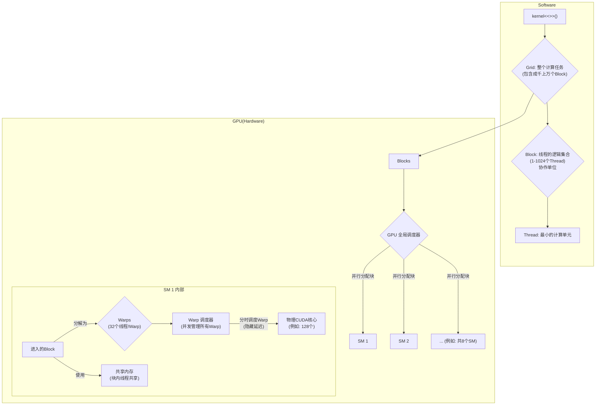

# Block \& Threads

## 概念


| 概念                     | 最大数量 (NVIDIA GPU)                               | 备注                                                                                   |
| :--------------------- | :---------------------------------------------- | :----------------------------------------------------------------------------------- |
| Warp Size              | 32                                              | 一个warp由32个并行执行的线程组成。                                                                 |
| Threads per Block      | 1024                                            | 一个线程块中最多可以包含1024个线程。通常以$x \times y \times z$的形式组织，限制是$x \times y \times z \le 1024$。 |
| BlockDim.x             | 1024                                            | 线程块在X维度上的最大线程数。                                                                      |
| BlockDim.y             | 1024                                            | 线程块在Y维度上的最大线程数。                                                                      |
| BlockDim.z             | 64                                              | 线程块在Z维度上的最大线程数。                                                                      |
| GridDim.x (BlockIdx.x) | $2^{31}-1$                                      | 网格在X维度上的最大线程块数。                                                                      |
| GridDim.y (BlockIdx.y) | 65535                                           | 网格在Y维度上的最大线程块数。                                                                      |
| GridDim.z (BlockIdx.z) | 65535                                           | 网格在Z维度上的最大线程块数。                                                                      |
| SM                     | 128个CUDA核, 可管理128*12 = 1536个并发驻留线程, 含有100kB(Jetson)的共享内存               | 流处理器                                                                                 |
| CUDA核                  | 最多可模拟出12个线程(Ampere架构)                           |                                                                                      |
| 瞬时物理并行                 | 在同一个时钟周期内，真正同时执行计算指令的线程数。由物理核心数决定               | 1024个线程                                                                              |
| 并发驻留线程 (Concurrent)    | 同时加载在所有SM上、处于活跃状态（执行中或等待中）的总线程数。用于隐藏延迟，最大化核心利用率 | 最高12,288 (1024*8)个线程                                                                 |

## 关系



# CUDA核函数

## 常用类型

| 类型         | 描述                                                                                           |
| :----------- | :--------------------------------------------------------------------------------------------- |
| `__global__` | 定义一个既可以由CPU发出指令，又可以由GPU在另一个核函数中发出指令的全局核函数。                   |
| `__device__` | 定义一个只能由核函数调用的核函数。                                                             |
| `__share__`  | 定义一个SM内的共享内存变量, 该内存有32个bank, 连续的 32-bit word (4 bytes) 会依次映射到 32 个不同的 Bank 上 (Bank 0, Bank 1, ..., Bank 31) |
| `inline`     | 定义一个**行内使用的函数**, 即省去了**函数调用时间**。                                          |

## 核函数启动

| 参数                       | 描述                                                                                             |
| :------------------------- | :----------------------------------------------------------------------------------------------- |
| `grid_dimensions`          | **必须参数**，表示**线程块数**。                                                                 |
| `block_dimensions`         | **必须参数**，表示**线程数**。                                                                   |
| `shared_memory_size_bytes` | 可选参数，表示动态共享内存大小。定义共享内存变量时就不用声明大小，例如： `extern __shared__ float myExternArray[];` |
| `stream`                   | 可选参数，表示流。一般是自定义的异步流，可以实现**数据传输和计算**的异步进行。                     |

```
kernel_name<<< grid_dimensions, block_dimensions, shared_memory_size_bytes, stream >>>(argument1, argument2, ...);
```

# 图

- CUDA图会省去**CPU调度时间**

- CUDA图节点更新是十分耗时的
